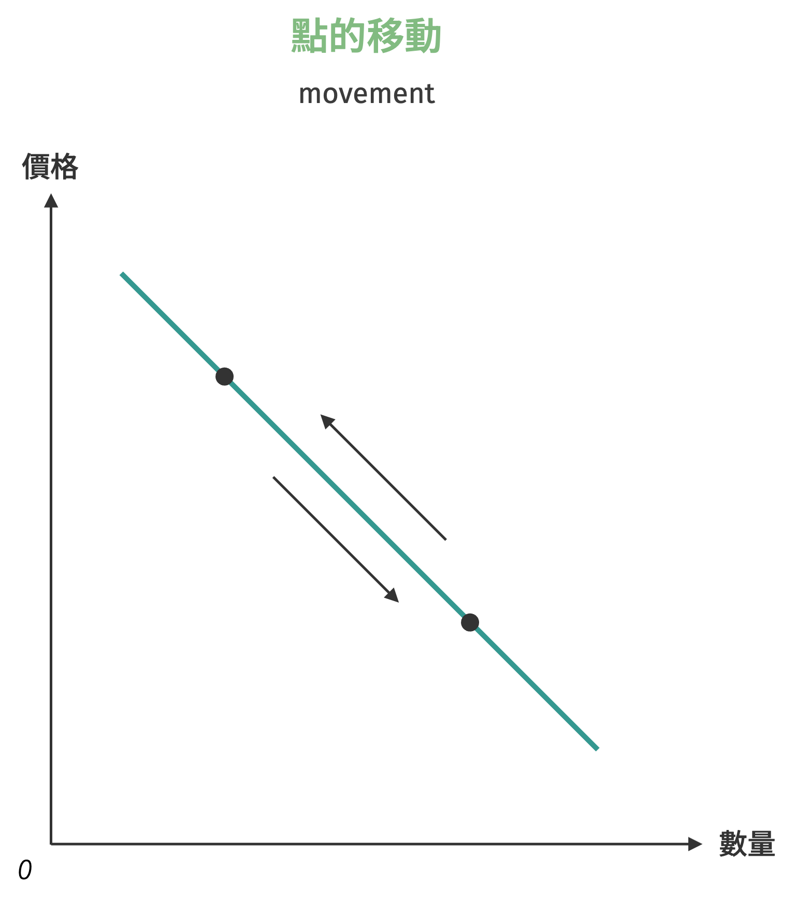
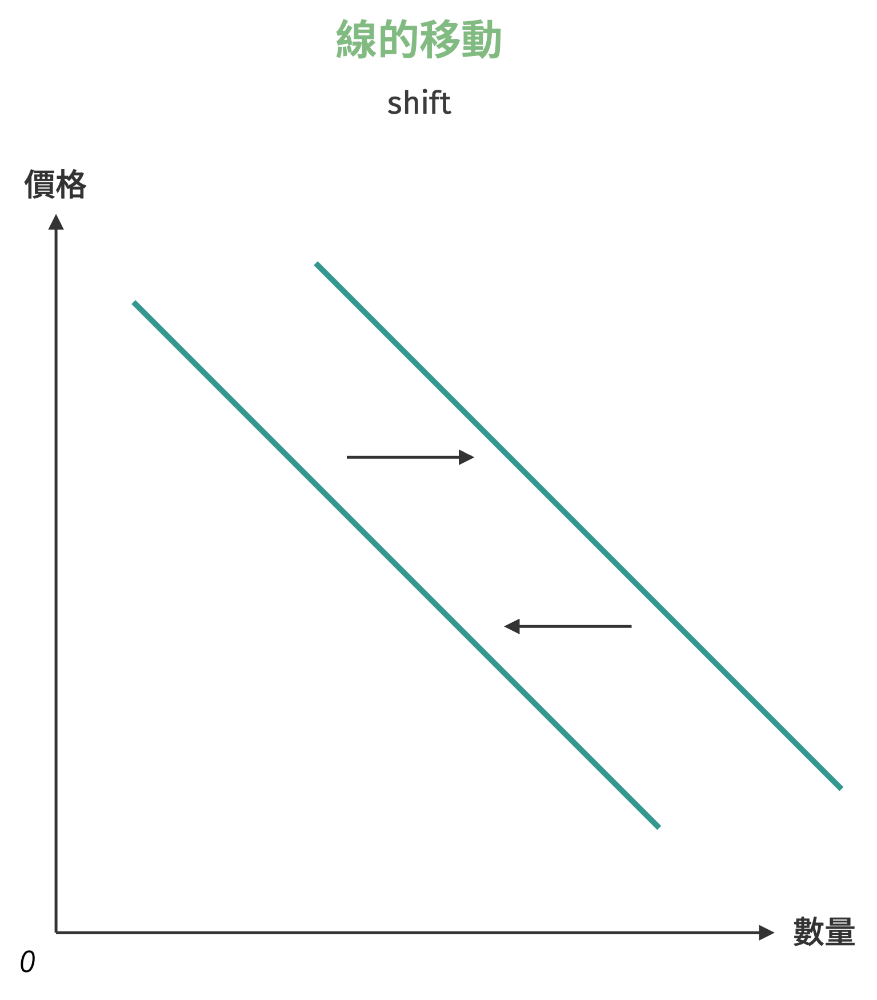
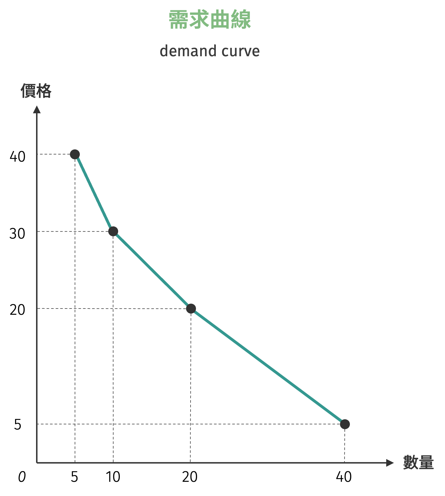
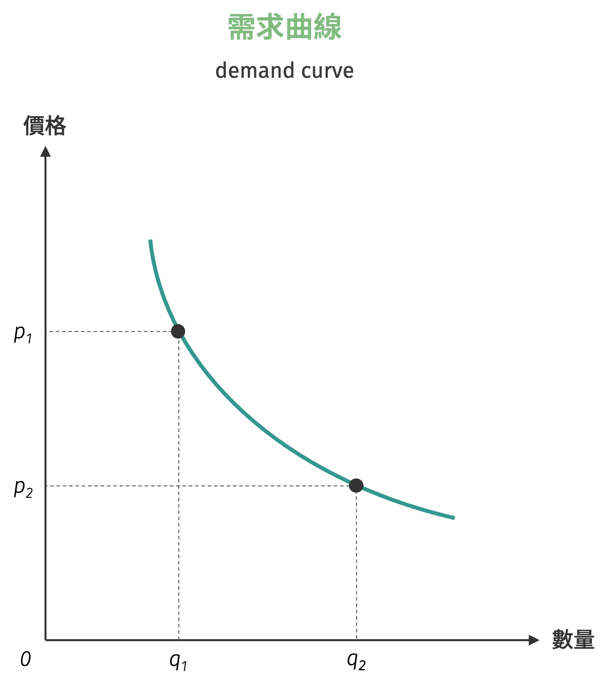
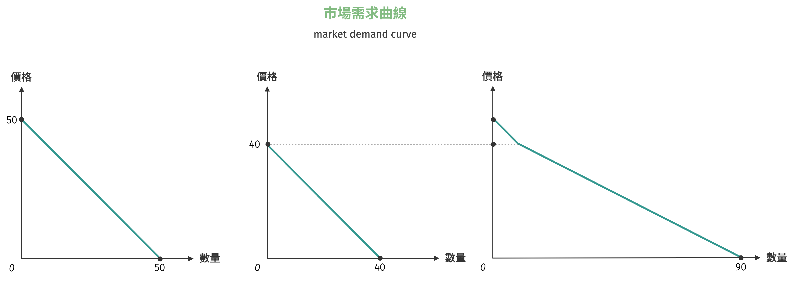
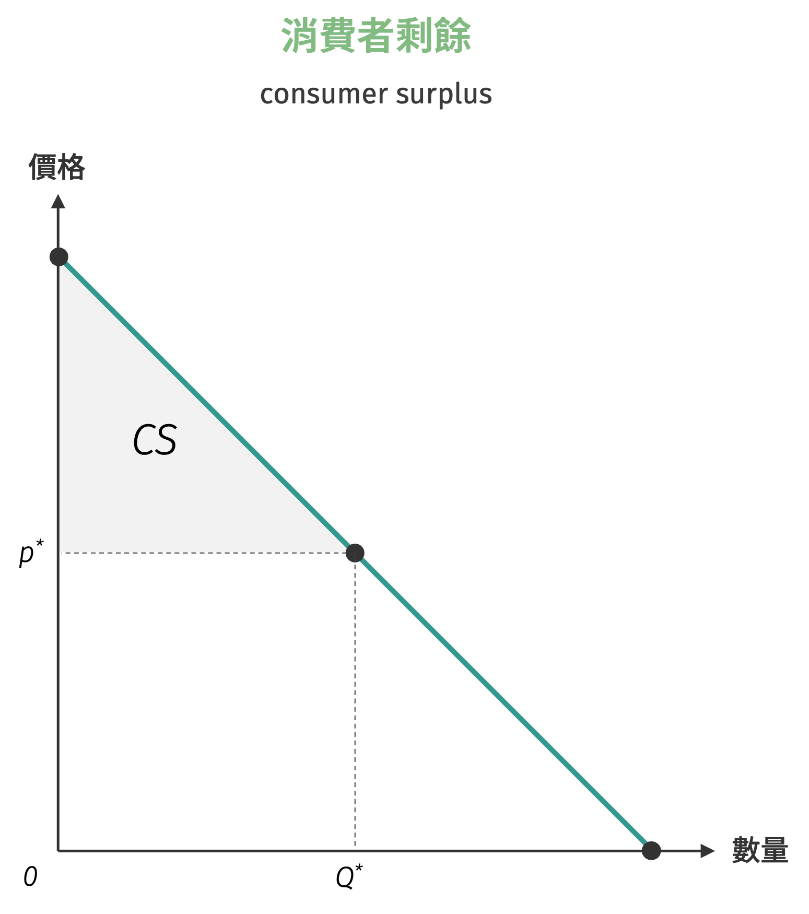

# 需求

需求 (demand) 的定義是：假設其他條件不變 (*ceteris paribus*) 的情況下，在特定期間內個別消費者消費特定商品或勞務，面對各種不同價格下，**願意且有能力**購買的數量，稱為**需求量** (quantity demanded)。言下之意，需求即是衡量在一個特定價格面對需求數量的一對一關係。

Table: 需求表範例 {#demand-schedule}

||||||
|---------|-------|-------|-------|-------|
| $p_{d}$ (價格) | $\$5$ | $\$20$ | $\$30$ | $\$40$ |
| $Q^{d}$ (需求量) | 40    | 20    | 10    | 5     |

在進一步討論前，有必要釐清「需求」與「需求量」兩個概念的區別：

- 需求：指整個價格與數量的對應關係，代表消費者在不同價格水準下願意購買的完整數量組合。
- 需求量：指在特定價格水準下，消費者願意且有能力購買的具體數量，為需求關係中的一個特定點。

經濟分析中，區分「需求的變動」與「需求量的變動」兩個不同概念非常重要。
需求的變動是指當消費者所得、偏好、相關財貨價格、預期等非價格因素發生改變時，整個需求關係產生位移，導致需求曲線本身向左或向右移動。
相對地，需求量的變動則純粹因為商品本身價格的上升或下降所引起，消費者僅是沿著既有的需求曲線在不同價格點之間移動，需求關係本身並未改變。

=== "需求量的移動"
    { width="350" }

=== "需求的變動"
    { width="350" }

## 需求的呈現

最簡潔呈現需求的方式就是如表 [(1)](#demand-schedule) 所示，稱為**需求表** (demand schedule)。
透過需求表，可以將消費者（通常是一位）在一定時間、一定市場、各種價格水準上願意且能夠購買的商品的各種數量表。
需求表的組成要素包含價格 (price) 與需求量。需求表較常用於簡化的情況，若模型考慮到更複雜的變數，如所得、偏好、預期價格等，就需要更細緻的工具。

### 需求曲線

表示特定商品價格與需求量的關係曲線圖，稱之為**需求曲線** (demand curve)。需求曲線表達特定價格下，消費者願意且能夠購買的最大需求量，更進一步描述特定需求量下消費者願意支付的**最高價格**，或稱**保留價格** (reservation price)。
因此，需求曲線圖上，只有位於需求曲線左下方（含線上）才有意義。

例如將表 [(1)](#demand-schedule) 中的每個價量組合繪制在二維的座標平面上，並將每個點連線，即可得到由需求表繪製而成的需求曲線。

{ width="350" }

如果描述需求的方法並非離散而是連續，則繪製的需求曲線是一個平滑的曲線。

{ width="350" }

一般而言，大部分的商品或是勞務，在其他條件不變之下，當價格高時需求量較低，價格低時需求量較高，此現象稱為**需求法則** (the law of demand)。需求曲線表達特定價格下，消費者願意且能夠購買的最大需求量，更進一步描述特定需求量下消費者願意支付的

!!! note "需求法則"
    在其他條件不變的情況下，消費者對某一特定商品的需求量與價格呈現反向變動的情形。  
    若給定需求函數為 $Q^{d} = Q^{d}(p)$，其中 $p$ 為商品自身價格，$Q^{d}$ 為需求量，則滿足需求法則的條件為：
    $$
    \dfrac{d Q^{d}}{dp} < 0
    $$
    這代表當價格上升時，需求量會下降；反之，價格下降時，需求量會增加。[^1]

### 需求函數

描述特定商品價量關係除了用圖表外，另一個最常見的方式是使用數學函數，稱為**需求函數** (demand function)。一般來說，需求函數可表達為顯函數 (explicit function) 與隱函數 (implicit function) 的形式。如描述產品 $X$ 的需求價量關係，隱函數表達方式為：
$$
Q_{x}^{d} = Q(p_{x}; p_{y}, p_{x}^{e}, I, N_{x}^{d}, \text{pre}, \cdots)
$$
其中 $p_{x}$ 為 $X$ 商品價格，$p_{y}$ 為 $Y$ 商品價格，$p_{x}^{e}$ 為 $X$ 商品的預期價格，$I$ 為消費者所得，$N_{x}^{d}$ 為消費者人數，$\text{pre}$ 為消費者偏好。

在其他條件（自身價格以外的變數）不變的情況下，需求函數可以改寫為簡潔的形式：
$$
Q_{x}^{d} = Q(p_{x})
$$
亦可將表達為反需求函數 (inverse demand function) 的形式：
$$
p_{x} = p(Q_{x}^{d})
$$
而反需求函數表達的即是各特定需求量下，消費者願意支付的最高價格。

!!! question
    試繪製下列各小題的需求曲線。若情況允許，請嘗試寫出需求函數。

    1. 小宋最多只願意支付 50,000 元購買一台鋼琴。
    2. 無論油價如何變化，溫老師每個月皆固定加 3,000 元的汽油。

## 商品類別——需求面

經濟學依據產品的需求特性，將商品分為不同類別。這些分類不僅是理論概念，更反映了日常消費行為的差異。想像一下，當你最喜歡的珍珠奶茶漲價時，你的反應可能和汽油漲價時完全不同——這正是不同產品種類在需求面的重要區別。

### 正常財與劣等財

根據消費者所得變化對需求量的影響，商品可分為**正常財** (normal goods) 與**劣等財** (inferior goods)。**正常財**是指當消費者所得增加時，對該商品的需求量也會增加的商品。以手搖飲料為例，當你打工收入增加後，可能會更頻繁地購買星巴克咖啡。數學上，正常財滿足：

$$
\frac{\partial Q^{d}}{\partial I} > 0
$$

其中 $I$ 代表消費者所得。

相對地，**劣等財**是指當消費者所得增加時，對該商品的需求量反而會減少的商品。典型例子是泡麵——當收入提高後，你可能會減少泡麵消費，改選擇更昂貴的餐廳用餐。劣等財滿足：

$$
\frac{\partial Q^{d}}{\partial I} < 0
$$

### 替代財、互補財與獨立財

根據相關商品價格變化對需求的影響，可將商品分為**替代財** (substitute goods)、**互補財** (complementary goods) 與**獨立財** (independent goods)。**替代財**是指當某商品價格上升時，會增加對另一商品需求的商品組合。例如，當可口可樂漲價時，消費者可能轉向購買百事可樂。對於商品 $X$ 和 $Y$，若為替代財關係，則：
$$
\frac{\partial Q_x^d}{\partial p_y} > 0
$$
**互補財**則是指當某商品價格上升時，會減少對另一商品需求的商品組合。汽車與汽油就是典型的互補財——當汽油價格大幅上漲時，人們對汽車的需求也會下降。互補財滿足：
$$
\frac{\partial Q_x^d}{\partial p_y} < 0
$$
**獨立財**是指兩商品之間無相關性，當某商品價格變化時，對另一商品的需求量不會產生影響。例如，牙刷價格的變動通常不會影響對電影票的需求。獨立財的特徵為：
$$
\frac{\partial Q_x^d}{\partial p_y} = 0
$$
在現實生活中，多數商品對之間都存在某種程度的相關性，純粹的獨立財較為少見，不過此一概念仍有助於理解商品間關係的完整光譜。

!!! question "商品類別"
    設商品 $X$ 的需求函數為：
    $$
    Q_{x} = 20 - 2p_{x} + 0.5 p_{y} - 0.1 I
    $$
    其中 $p_{x}$ 為商品 $X$ 的價格，$p_{y}$ 為商品 $Y$ 的價格，$I$ 為所得。

    1. $X$ 與 $Y$ 是互補關係，$X$ 是正常財。
    2. $X$ 與 $Y$ 是替代關係，$X$ 是劣等財。
    3. $X$ 與 $Y$ 是互補關係，$X$ 是劣等財。
    4. $X$ 與 $Y$ 是替代關係，$X$ 是正常財。

## 市場總合需求

到目前為止，需求曲線一詞僅指涉個人的需求曲線，但對於生產者而言，其關心的是整體市場在各個不同價格下的「總需求量」。
例如一個生產者在預估自己該生產多少商品時，必定希望能掌握在各個不同價格下的市場需求量，配合自身產能加以衡量進而達到最大利潤的銷量。

因此，我們可以將個別消費者的需求曲線進行**水平加總** (horizontal aggregation)[^2]，求得**市場需求曲線** (market demand curve)。
所謂水平加總，係指對於某商品特定價格下，將每個個人需求量相加的結果，如此便可得到該價格下的市場需求量。

### 需求表的水平加總

透過需求表可以清楚說明水平加總的概念。假設市場中僅有兩位消費者 A 和 B，其個別需求表如下所示：

Table: 個別消費者需求表 {#individual-demand-schedule}

| 價格 | 消費者A需求量 | 消費者B需求量 |
|------|---------------|---------------|
| $\$10$ | 30 | 20 |
| $\$20$ | 20 | 15 |
| $\$30$ | 10 | 10 |
| $\$40$ | 5 | 5 |

通過水平加總，我們將相同價格下兩位消費者的需求量相加，得到市場需求表：

Table: 市場需求表 {#market-demand-schedule}

| 價格 | 消費者A需求量 | 消費者B需求量 | 市場需求量 |
|------|---------------|---------------|------------|
| $\$10$ | 30 | 20 | 50 |
| $\$20$ | 20 | 15 | 35 |
| $\$30$ | 10 | 10 | 20 |
| $\$40$ | 5 | 5 | 10 |

從表格中可以觀察到，在每個價格水準下，市場需求量都等於個別消費者需求量的總和。這種加總方式反映了市場上所有消費者的集體購買行為。

### 需求函數的水平加總

從數學角度來看，市場需求函數是個別需求函數的水平加總。假設市場中有 $n$ 位消費者，第 $i$ 位消費者的需求函數為 $q_i^d = q_i(p)$，則市場需求函數為：

$$
Q = \sum_{i=1}^{n} Q_i^d = \sum_{i=1}^{n} q_i(p)
$$

以前述兩位消費者為例，若消費者A的需求函數為 $Q_A^d = 50 - p$，消費者B的需求函數為 $Q_B^d = 40 - p$，則市場需求函數為：

$$
Q = Q_A^d + Q_B^d = (50 - p) + (40 - p) = 90 - 2p
$$

需要注意的是，水平加總必須考慮每位消費者的**有效需求量**。當價格超過某位消費者的最高保留價格時，該消費者的需求量為零，不應納入市場需求的計算中。因此，市場需求函數在某些價格區間可能會出現結構性變化，形成分段函數的特徵，如下圖所示：

{ width="700" }

!!! question "水平加總之一"
    假設某特定商品的市場上存在兩位消費者，兩位消費者的需求函數分別為：
    $$
    \begin{cases}
        p_{1} = 10 - \dfrac{1}{2} q_{1}\\\\
        p_{2} = 20 - 2 q_{2}
    \end{cases}
    $$
    請求出市場需求函數。

## 消費者剩餘

消費者剩餘 (consumer surplus) 是衡量消費者從市場交易中獲得福利的重要指標。這個概念反映了消費者實際獲得的利益超過其支付成本的部分，是微觀經濟學中評估市場效率和消費者福利的核心工具。

### 消費者剩餘的基本概念

消費者剩餘的核心概念可以用簡單的公式表達：

$$
\text{消費者剩餘} = \text{願意支付價格} - \text{實際支付價格}
$$

**願意支付價格** (willingness to pay) 是指消費者對某商品的最高保留價格，亦即消費者認為該商品對其而言的最大價值。**實際支付價格** (actual payment) 則是消費者在市場上真正支付的市場價格。

舉例來說，假設你非常渴望購買一杯手搖飲料，內心認為這杯飲料價值 $80 元，但市場價格僅為 $50 元。在這種情況下，你獲得的消費者剩餘就是 $80 - $50 = $30 元。這 $30 元代表你從這次交易中獲得的「額外利益」或「消費者福利」。

需求曲線在此扮演關鍵角色，因為它不僅表示各價格下的需求量，更重要的是反映了消費者對不同數量商品的邊際評價。需求曲線上的每一點都代表消費者對該單位商品願意支付的最高價格。

{ width="350" }

### 離散型商品的消費者剩餘

對於**離散型商品** (discrete goods)，即無法細分的整數單位商品（如汽車、手機、書籍等），消費者剩餘的計算相對直觀。

假設某消費者對商品的需求函數為離散形式，其對第 $i$ 單位商品的保留價格為 $p_i$，市場價格為 $p^*$。若該消費者購買 $n$ 單位商品，則消費者剩餘為：

$$
CS = \sum_{i=1}^{n} (p_i - p^*) = \sum_{i=1}^{n} p_i - n \cdot p^*
$$

考慮以下情境：小宋對教科書的需求如下表所示：

Table: 離散型商品需求 {#discrete-demand-schedule}

| 商品單位 | 願意支付價格 | 市場價格 | 個別消費者剩餘 |
|----------|--------------|----------|----------------|
| 第1本書  | $\$1,000$      | $\$600$     | $\$400$          |
| 第2本書  | $\$800$        | $\$600$     | $\$200$          |
| 第3本書  | $\$600$        | $\$600$     | $\$0$            |
| 第4本書  | $\$400$        | $\$600$     | $-\$200$ (不購買) |

在市場價格 $\$600$ 的情況下，張同學會購買3本書，總消費者剩餘為：
$$
CS = (1000 - 600) + (800 - 600) + (600 - 600) = 400 + 200 + 0 = 600 \text{元}
$$

### 連續型商品的消費者剩餘

對於**連續型商品** (continuous goods)，即可以任意細分的商品（如汽油、電力、水等），消費者剩餘的計算需要運用積分概念。

假設需求函數為 $p = p(Q)$（反需求函數形式），市場價格為 $p^*$，對應的均衡數量為 $Q^*$，則消費者剩餘為需求曲線下方、市場價格上方的面積：

$$
CS = \int_{0}^{Q^*} p(Q) \, dQ - p^* \times Q^*
$$

!!! note "線性需求函數消費者剩餘"
    考慮最常見的線性需求函數 $p = a - bQ$，其中 $a > 0$, $b > 0$。在市場價格 $p^*$ 下，均衡數量為 $Q^* = \frac{a - p^*}{b}$。

    消費者剩餘的計算如下：

    $$
    \begin{aligned}
    CS &= \int_{0}^{Q^*} (a - bQ) \, dQ - p^* \times Q^* \\
    &= \left[ aQ - \frac{bQ^2}{2} \right]_{0}^{Q^*} - p^* \times Q^* \\
    &= aQ^* - \frac{b(Q^*)^2}{2} - p^* \times Q^* \\
    &= (a - p^*)Q^* - \frac{b(Q^*)^2}{2}
    \end{aligned}
    $$

    將 $Q^* = \frac{a - p^*}{b}$ 代入上式：

    $$
    CS = \frac{(a - p^*)^2}{2b}
    $$

    上述結果可得知，線性需求曲線下的消費者剩餘呈現三角形面積，底邊為均衡數量 $Q^*$，高為最高保留價格與市場價格的差額 $(a - p^*)$。

[^1]: 需求函數對價格的一階偏微分為負值，即隱含了需求曲線為負斜率。
[^2]: 水平加總是相對於垂直加總而言，垂直加總是將相同數量下的價格相加，通常用於成本或供給分析。