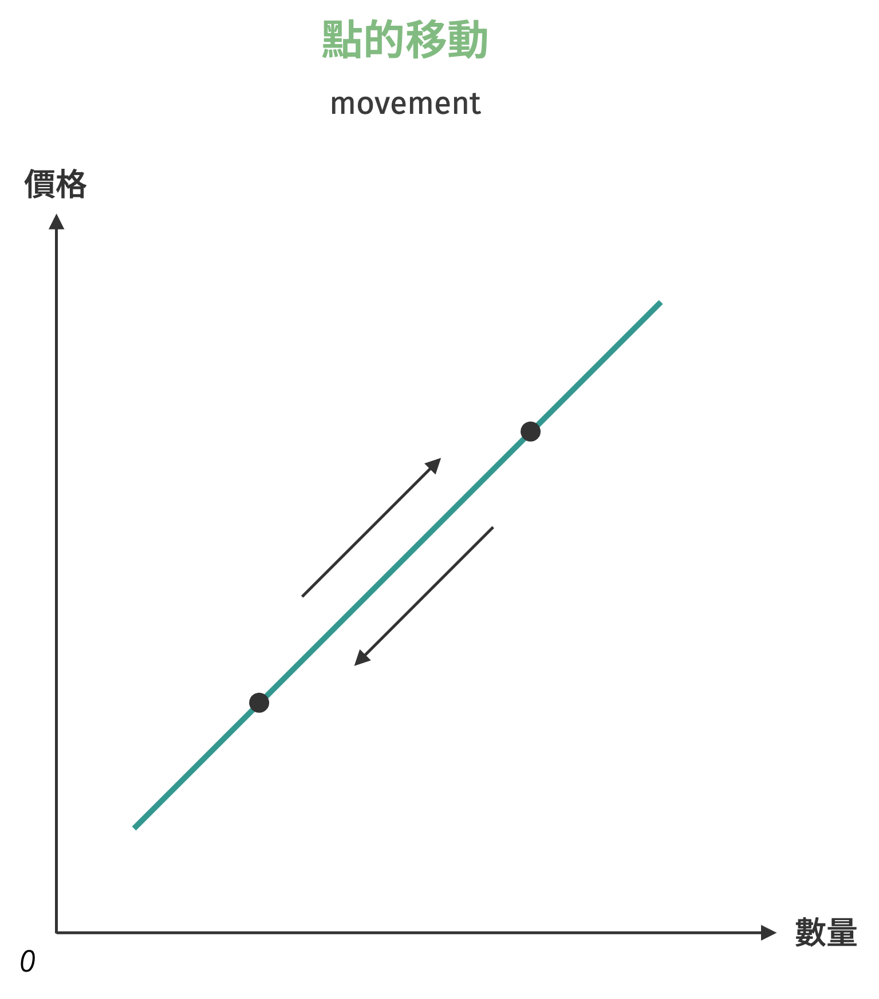
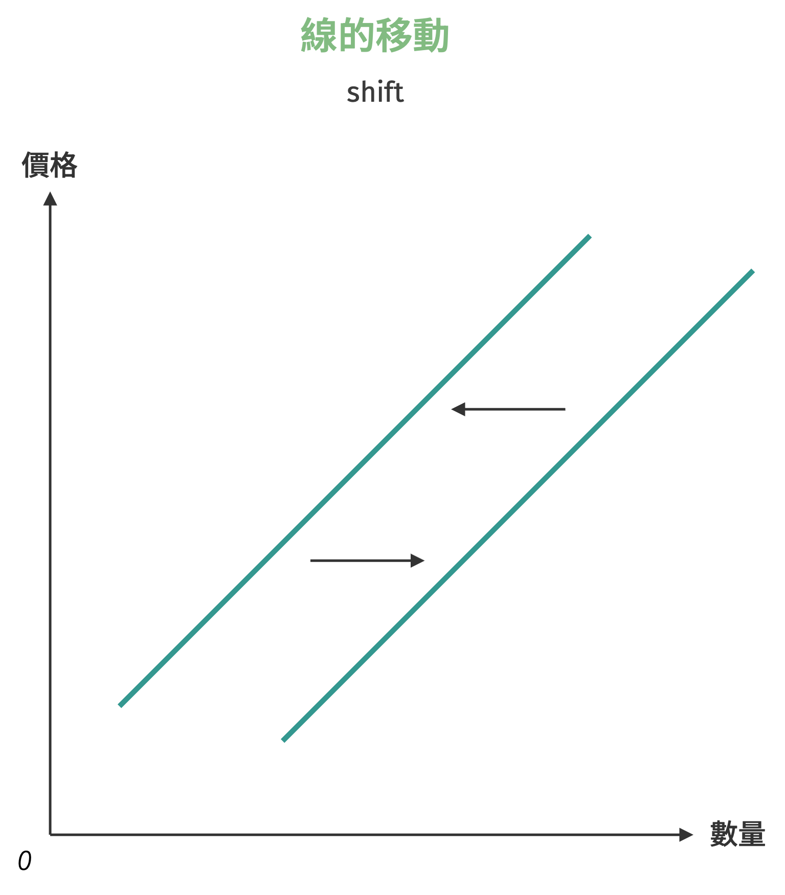
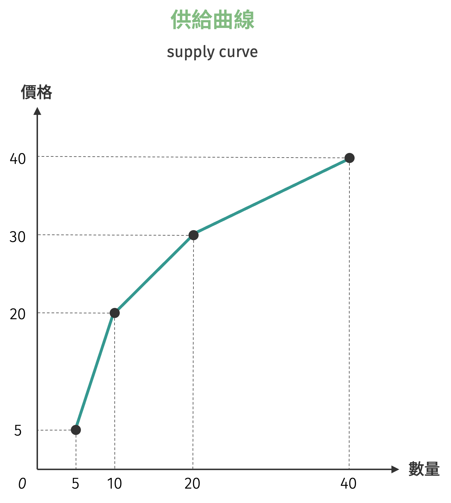
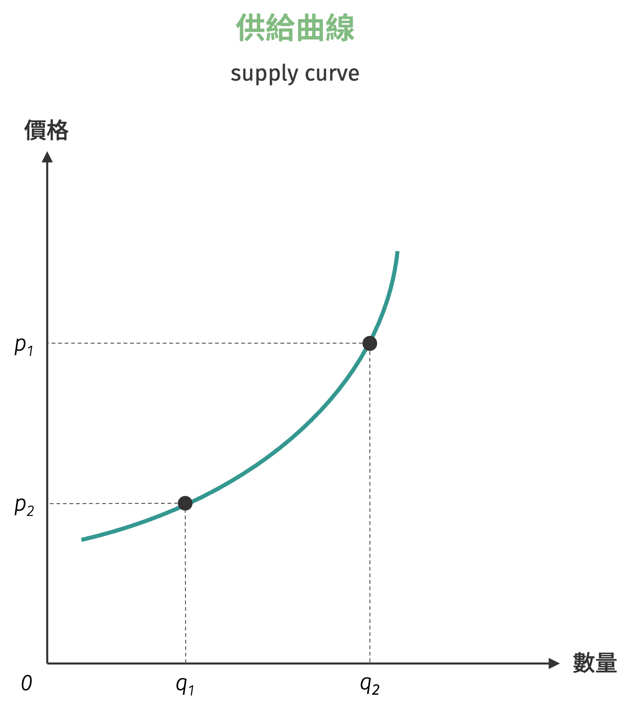
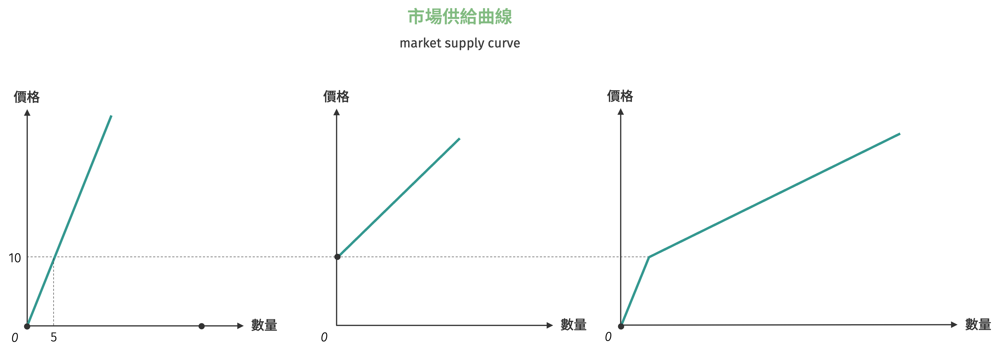
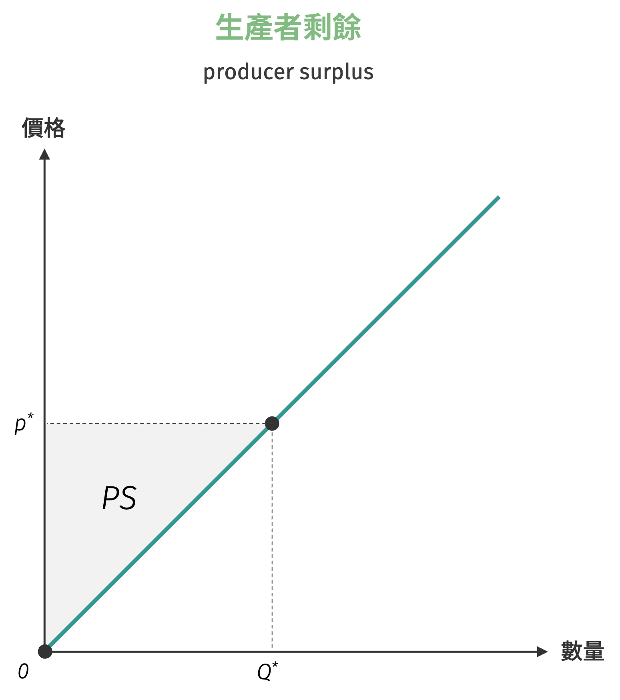

# 供給

供給 (supply) 的定義與需求相似：假設其他條件不變 (*ceteris paribus*) 的情況下，在特定期間內個別生產者生產特定商品或勞務，面對各種不同價格下，**願意且有能力**供應的數量，稱為**供給量** (quantity supplied)。換句話說，供給即是衡量在一個特定價格面對供給數量的一對一關係。

Table: 供給表範例 {#supply-schedule}

||||||
|---------|-------|-------|-------|-------|
| $p_{s}$ (價格) | $\$10$ | $\$20$ | $\$30$ | $\$40$ |
| $Q_{s}$ (供給量) | 5     | 15    | 25    | 35    |

與需求概念相似，在進一步討論前，有必要釐清「供給」與「供給量」兩個概念的區別：

- 供給：指整個價格與數量的對應關係，代表生產者在不同價格水準下願意供應的完整數量組合。
- 供給量：指在特定價格水準下，生產者願意且有能力供應的具體數量，為供給關係中的一個特定點。

類似於需求分析，經濟分析中區分「供給的變動」與「供給量的變動」兩個不同概念同樣重要。
供給的變動是指當生產成本、技術水準、相關商品價格、預期等非價格因素發生改變時，整個供給關係產生位移，導致供給曲線本身向左或向右移動。
相對地，供給量的變動則純粹因為商品本身價格的上升或下降所引起，生產者僅是沿著既有的供給曲線在不同價格點之間移動，供給關係本身並未改變。

=== "供給量的移動 (movement)"

    <figure class="img-center" markdown>
    { width="350" }
    <figcaption>圖 A：沿既有供給曲線移動</figcaption>
    </figure>

=== "供給的變動 (shift)"

    <figure class="img-center" markdown>
    { width="350" }
    <figcaption>圖 B：供給曲線橫移</figcaption>
    </figure>

## 供給的呈現

與需求表類似，最簡潔呈現供給的方式就是如表 [(1)](#supply-schedule) 所示，稱為**供給表** (supply schedule)。
透過供給表，可以將生產者（通常是一家廠商）在一定時間、一定市場、各種價格水準上願意且能夠供應的商品的各種數量表。
供給表的組成要素包含價格 (price) 與供給量。供給表較常用於簡化的情況，若模型考慮到更複雜的變數，如生產成本、技術水準、預期價格等，就需要更細緻的工具。

### 供給曲線

表示特定商品價格與供給量的關係曲線圖，稱之為**供給曲線** (supply curve)。供給曲線表達特定價格下，生產者願意且能夠供應的最大供給量，更進一步描述特定供給量下生產者願意接受的**最低價格**，或稱**保留價格** (reservation price)。
因此，供給曲線圖上，只有位於供給曲線右下方（含線上）才有意義。

與需求相同，將表 [(1)](#supply-schedule) 中的每個價量組合繪制在二維的座標平面上，並將每個點連線，即可得到由供給表繪製而成的供給曲線。

{ width="350" }

如果描述供給的方法並非離散而是連續，則繪製的供給曲線是一個平滑的曲線。

{ width="350" }

一般而言，大部分的商品或是勞務，在其他條件不變之下，當價格高時供給量較高，價格低時供給量較低，此現象稱為**供給法則** (the law of supply)。供給曲線表達特定價格下，生產者願意且能夠供應的最大供給量，更進一步描述特定供給量下生產者願意接受的最低價格。

!!! note "供給法則"
    在其他條件不變的情況下，生產者對某一特定商品的供給量與價格呈現正向變動的情形，此即為供給法則 (law of supply)。若給定供給函數為 $Q_s = Q_s(p)$，其中 $p$ 為商品自身價格，$Q_s$ 為供給量，則滿足供給法則的條件為：
    $$
    \dfrac{d Q_{s}}{dp} > 0
    $$
    上式隱含供給量對價格的一階偏微分為正值[^1]，亦即當價格上升時，供給量會增加；反之，當價格下降時，供給量會減少。

### 供給函數

與需求函數相似，描述特定商品價量關係除了用圖表外，另一個最常見的方式是使用數學函數，稱為**供給函數** (supply function)。一般來說，供給函數可表達為顯函數 (explicit function) 與隱函數 (implicit function) 的形式。如描述產品 $X$ 的供給價量關係，隱函數表達方式為：
$$
Q_{x}^{s} = Q(p_{x}; w, r, T, p_{x}^{e}, N_{x}^{s}, \cdots)
$$
其中 $p_{x}$ 為 $X$ 商品價格，$w$ 為工資水準，$r$ 為利率，$T$ 為技術水準，$p_{x}^{e}$ 為 $X$ 商品的預期價格，$N_{x}^{s}$ 為生產者家數。

在其他條件（自身價格以外的變數）不變的情況下，供給函數可以改寫為簡潔的形式：
$$
Q_{x}^{s} = Q(p_{x})
$$
亦可將表達為反供給函數 (inverse supply function) 的形式：
$$
p_{x} = p(Q_{x}^{s})
$$
而反供給函數表達的即是各特定供給量下，生產者願意接受的最低價格。

## 市場總合供給

與市場需求概念相似，**市場總合供給** (market supply) 是將個別生產者的供給曲線進行**水平加總**所得到的結果。對於生產者而言，了解市場總供給有助於制定產量和定價策略。

### 供給表的水平加總

假設市場中有兩家廠商 A 和 B，其個別供給表如下所示：

Table: 個別生產者供給表 {#individual-supply-schedule}

| 價格 | 廠商A供給量 | 廠商B供給量 |
|------|-------------|-------------|
| $\$10$ | 5 | 0 |
| $\$20$ | 10 | 5 |
| $\$30$ | 15 | 10 |
| $\$40$ | 20 | 15 |

通過水平加總，我們將相同價格下兩家廠商的供給量相加，得到市場供給表：

Table: 市場供給表 {#market-supply-schedule}

| 價格 | 廠商A供給量 | 廠商B供給量 | 市場供給量 |
|------|-------------|-------------|------------|
| $\$10$ | 5 | 0 | 5 |
| $\$20$ | 10 | 5 | 15 |
| $\$30$ | 15 | 10 | 25 |
| $\$40$ | 20 | 15 | 35 |

需要注意的是，不同廠商可能有不同的**最低供給價格**。例如上表中，廠商B在價格低於 $\$20$ 時不願意供給，這反映了廠商間成本結構的差異。

### 供給函數的水平加總

與需求函數的水平加總相似，市場供給函數是個別供給函數的水平加總。假設市場中有 $n$ 家廠商，第 $i$ 家廠商的供給函數為 $q_i^s = q_i(p)$，則市場供給函數為：

$$
Q^S = \sum_{i=1}^{n} Q_i^s = \sum_{i=1}^{n} q_i(p)
$$

以前述兩家廠商為例，若廠商A的供給函數為 $Q_A^s = 0.5p$，廠商B的供給函數為 $Q_B^s = - 10 + p$，則市場供給函數為：

$$
Q^S = Q_A^s + Q_B^s = 
\begin{cases}
    -10 + \dfrac{3}{2}p, &\quad p \geq 10\\
    \dfrac{1}{2}p, &\quad p < 10
\end{cases}
$$

這個例子說明市場供給函數可能呈現分段函數的特徵，反映不同價格區間內參與市場的廠商數量不同。

{ width="700" }

!!! question "水平加總之二"
    假設某特定商品的市場上存在兩家廠商，兩家廠商的供給函數分別為：
    $$
    \begin{cases}
        p_{1} = 5 + 2q_{1}\\\\
        p_{2} = 10 + q_{2}
    \end{cases}
    $$
    請求出市場供給函數。

## 生產者剩餘

**生產者剩餘** (producer surplus) 與消費者剩餘概念相似，是衡量生產者從市場交易中獲得福利的重要指標。這個概念反映了生產者實際獲得的收益超過其最低供給意願的部分。

### 生產者剩餘的基本概念

生產者剩餘的核心概念可以用簡單的公式表達：

$$
\text{生產者剩餘} = \text{實際獲得價格} - \text{願意接受最低價格}
$$

**願意接受最低價格** (willingness to accept) 是指生產者對某商品的最低保留價格，亦即生產者認為該商品供給的最低成本。**實際獲得價格** (actual revenue) 則是生產者在市場上真正獲得的市場價格。

舉例來說，假設某農夫願意以最低 $\$15$ 的價格出售一公斤有機蔬菜，但市場價格為 $\$25$。在這種情況下，農夫獲得的生產者剩餘就是 $\$25 - \$15 = \$10$。這 $\$10$ 代表農夫從這次交易中獲得的「額外利益」或「生產者福利」。

{ width="350" }

### 離散型商品的生產者剩餘

對於離散型商品，生產者剩餘的計算與消費者剩餘相似。假設某生產者對商品的供給函數為離散形式，其對第 $i$ 單位商品的最低接受價格為 $p_i$，市場價格為 $p^*$。若該生產者供給 $n$ 單位商品，則生產者剩餘為：

$$
PS = \sum_{i=1}^{n} (p^* - p_i) = n \cdot p^* - \sum_{i=1}^{n} p_i
$$

考慮以下情境：某小型製造商對產品的供給狀況如下表所示：

Table: 離散型商品供給 {#discrete-supply-schedule}

| 商品單位 | 願意接受最低價格 | 市場價格 | 個別生產者剩餘 |
|----------|------------------|----------|----------------|
| 第1單位  | $\$100$         | $\$150$  | $\$50$         |
| 第2單位  | $\$120$         | $\$150$  | $\$30$         |
| 第3單位  | $\$150$         | $\$150$  | $\$0$          |
| 第4單位  | $\$180$         | $\$150$  | $-\$30$ (不供給) |

在市場價格 $\$150$ 的情況下，該製造商會供給3單位產品，總生產者剩餘為：
$$
PS = (150 - 100) + (150 - 120) + (150 - 150) = 50 + 30 + 0 = 80 \text{元}
$$

### 連續型商品的生產者剩餘

對於連續型商品，生產者剩餘的計算同樣需要運用積分概念。假設供給函數為 $p = p(Q)$（反供給函數形式），市場價格為 $p^*$，對應的均衡數量為 $Q^*$，則生產者剩餘為市場價格線下方、供給曲線上方的面積：

$$
PS = \underbrace{p^* \times Q^*}_{\text{實得價格}} - \underbrace{\int_{0}^{Q^*} p(Q) \, dQ}_{\text{願受價格}}
$$

!!! note "線性供給函數生產者剩餘"
    考慮最常見的線性供給函數 $p = c + dQ$，其中 $c \geq 0$, $d > 0$。在市場價格 $p^*$ 下，均衡數量為 $Q^* = \frac{p^* - c}{d}$。

    生產者剩餘的計算如下：

    $$
    \begin{aligned}
    PS &= p^* \times Q^* - \int_{0}^{Q^*} (c + dQ) \, dQ \\
    &= p^* \times Q^* - \left[ cQ + \frac{dQ^2}{2} \right]_{0}^{Q^*} \\
    &= p^* \times Q^* - cQ^* - \frac{d(Q^*)^2}{2} \\
    &= (p^* - c)Q^* - \frac{d(Q^*)^2}{2}
    \end{aligned}
    $$

    將 $Q^* = \frac{p^* - c}{d}$ 代入上式：

    $$
    PS = \frac{(p^* - c)^2}{2d}
    $$

    上述結果可得知，線性供給曲線下的生產者剩餘同樣呈現三角形面積，底邊為均衡數量 $Q^*$，高為市場價格與最低供給價格的差額 $(p^* - c)$。

[^1]: 供給函數對價格的一階偏微分為正值，即隱含了供給曲線為正斜率。