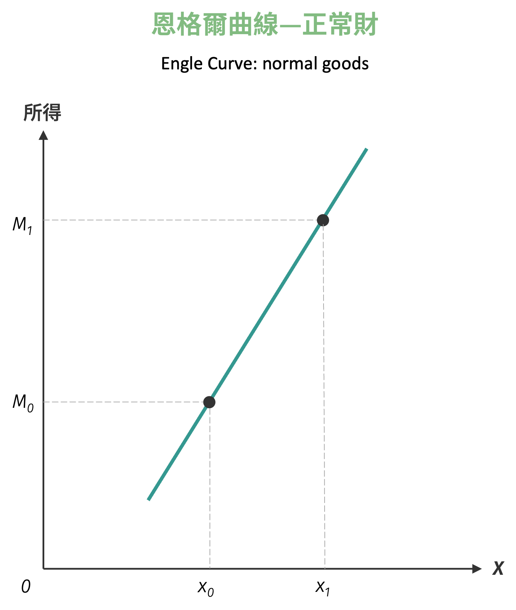
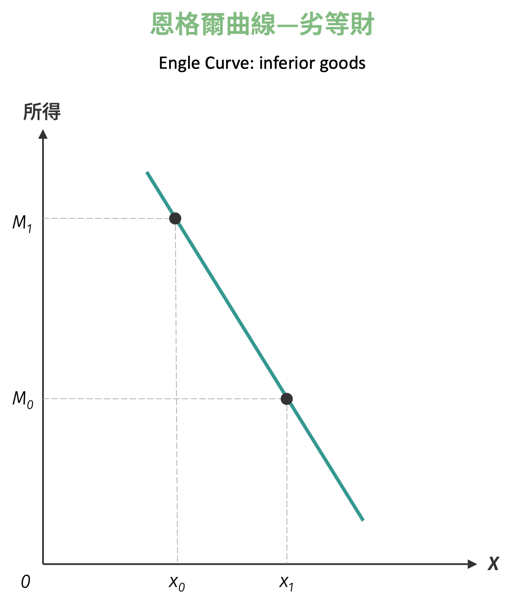
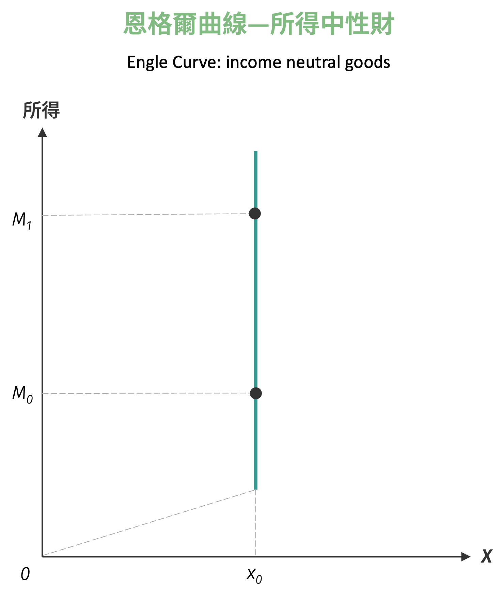

# 交叉彈性與所得彈性

上述討論的彈性範疇係由商品本身價格的變動而引起需求量或供給量的變動。然而，需求函數不僅是自身價格的函數，更是其他相關商品價格或所得的函數。當其他相關商品價格變動或是所得增減對於需求量有何影響，則是本小節要討論的內容。

## 交叉彈性

**交叉彈性** (cross-price elasticity of demand) 定義為在其他情況不變之下，當相關商品價格變動 1% 時，對特定身品需求量變動的百分比值。

!!! note "需求交叉彈性"
    商品 $i$ 對商品 $j$ 價格的需求交叉彈性定義為：[^1]
    $$
    \varepsilon_{xy} = \frac{\partial Q_x^d}{\partial p_y} \cdot \frac{p_y}{Q_x^d}
    $$

由定義可知，交叉彈性用於判斷兩商品之間的關係，其中 $\frac{p_{y}}{x}$ 必為正，因此交叉彈性之正負取決於 $dx / dp_{y}$ 之符號，其可以區分出兩商品之間為替代品、互補品或獨立品。

- **正值** ($\varepsilon_{xy} > 0$)：表示兩商品為**替代品**，一商品價格上升會增加對另一商品的需求
- **負值** ($\varepsilon_{xy} < 0$)：表示兩商品為**互補品**，一商品價格上升會減少對另一商品的需求
- **零值** ($\varepsilon_{xy} = 0$)：表示兩商品為**獨立品**，彼此價格變化不會影響對方需求

例如當可口可樂漲價時，你可能會轉而購買百事可樂；但如果咖啡漲價，你對奶精的需求可能也會下降。前者反映了替代品關係，後者則體現了互補品關係。交叉彈性正是量化這些商品間相互影響程度的重要工具。

## 所得彈性

**所得彈性** (income elasticity of demand) 的定義是，在其他情況不變之下，當消費者所得變動 1% 時，引起對特定商品需求量變動的百分比值。

!!! note "所得彈性"
    商品需求量對消費者所得的彈性定義為：
    $$
    \varepsilon_M = \frac{\partial Q^d}{\partial M} \cdot \frac{M}{Q^d}
    $$

與交叉彈性類似，式中 $\frac{M}{x}$ 必為正，故所得彈性之正負取決於 $\frac{dx}{dM}$，並可區分為正常財、劣等財與中性財。

- **$\varepsilon_M > 0$**：**正常財** (normal goods)
- **$\varepsilon_M < 0$**：**劣等財** (inferior goods)
- **$\varepsilon_M > 1$**：**奢侈品** (luxury goods)
- **$0 < \varepsilon_M < 1$**：**必需品** (necessity goods)

當你的月薪從3萬元增加到5萬元時，你可能會增加外食頻率、購買更好的服裝、或者開始考慮買車。相反地，你可能會減少泡麵消費或不再光顧某些平價商店。這些消費行為的變化正反映了不同商品的所得彈性特徵。

!!! info "恩格爾曲線"
    恩格爾曲線 (Engel Curve) 是指在其他條件不變之下，表達出所得與需求量之間關係的關係曲線。其可表達出正常財、劣等財與所得中性財等關係。

    - 正常財：恩格爾曲線將呈現正斜率，表示所得愈高需求量亦愈高。

    { width="250" }

    - 劣等財：恩格爾曲線將呈現負斜率，表示所得愈高需求量愈低。
    
    { width="250" }

    - 所得中性財：恩格爾曲線將呈現垂直直線，表示所得高低不影響需求量。

    但如下面圖所示，A 點以下的恩格爾曲線為正斜率的意義為，當所得低到一定水準後，消費者的需求量亦將隨所得的減少而減少，仍為中性財。

    { width="250" }

    若是給定兩點座標時，則必須以弧彈性的方法來計算。我們仍以中點座標：
    $$
    \left( \frac{x_0 + x_1}{2}, \frac{M_0 + M_1}{2} \right)
    $$
    作為 $x$ 數量變動百分比與所得變動百分比以求解彈性。因此所得彈性的弧彈性公式為：
    $$
    \varepsilon_{xy}
    = \frac{\frac{x_1 - x_0}{\frac{x_0 + x_1}{2}}}{\frac{M_1 - M_0}{\frac{M_0 + M_1}{2}}}
    = \frac{x_1 - x_0}{x_0 + x_1} \cdot \frac{M_0 + M_1}{M_1 - M_0}
    $$
    由上述公式計算的所得彈性數值，其為正號、零或負號時所代表的意義與點彈性相同。