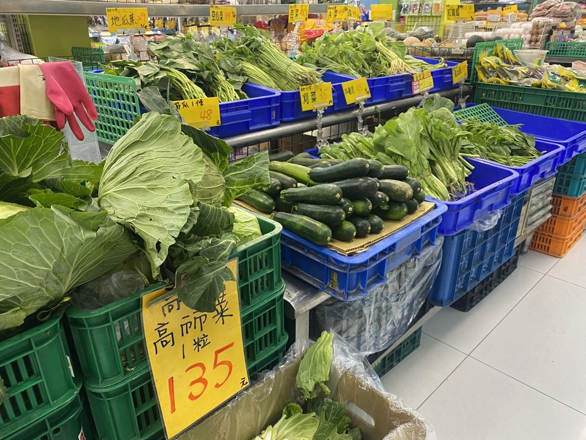

# 彈性

<figure class="chapter-hero">
  
  <figcaption>
    圖片來源：
    <a href="https://money.udn.com/money/story/122328/8914841" target="_blank" rel="noopener">
      聯合報｜連日豪雨菜價漲 高麗菜漲三成五
    </a>
  </figcaption>
</figure>

**彈性** (elasticity) 即是在特定因素刺激下，引發的行為反應程度。以汽油為例，作為一名騎車通勤的學生，如果知道油價即將漲價，前幾天就會去加油站加油；但如果平時以大眾運輸作為通勤方式，油價漲價似乎沒有太大的關係。由上述例子可以看出，不同消費者對於同一項商品價格變動的反應皆不相同，原因正是因為彈性不同所致。

需求與供給函數為商品價格、其他相關性商品/原料價格等變數的函數，因此可以衡量特定商品價格變動、其他相關性商品/原料價格變動與所得變動，對於特定商品需求量與供給量的影響。

## 本章目錄

- [價格彈性](price_elasticity.md)
- [交叉彈性與所得彈性](cross_and_income_elasticity.md)
- [彈性應用](elasticity_application.md)
