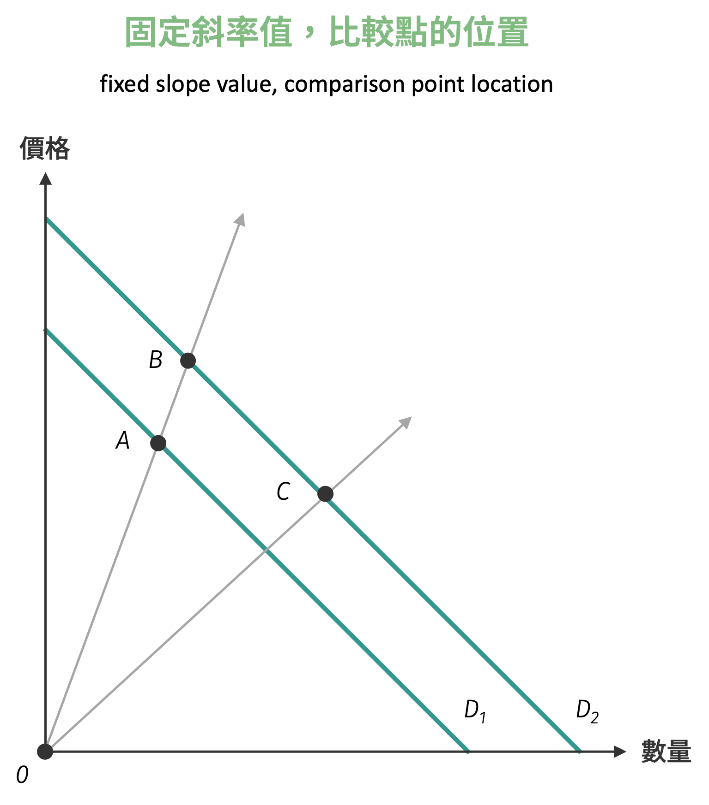
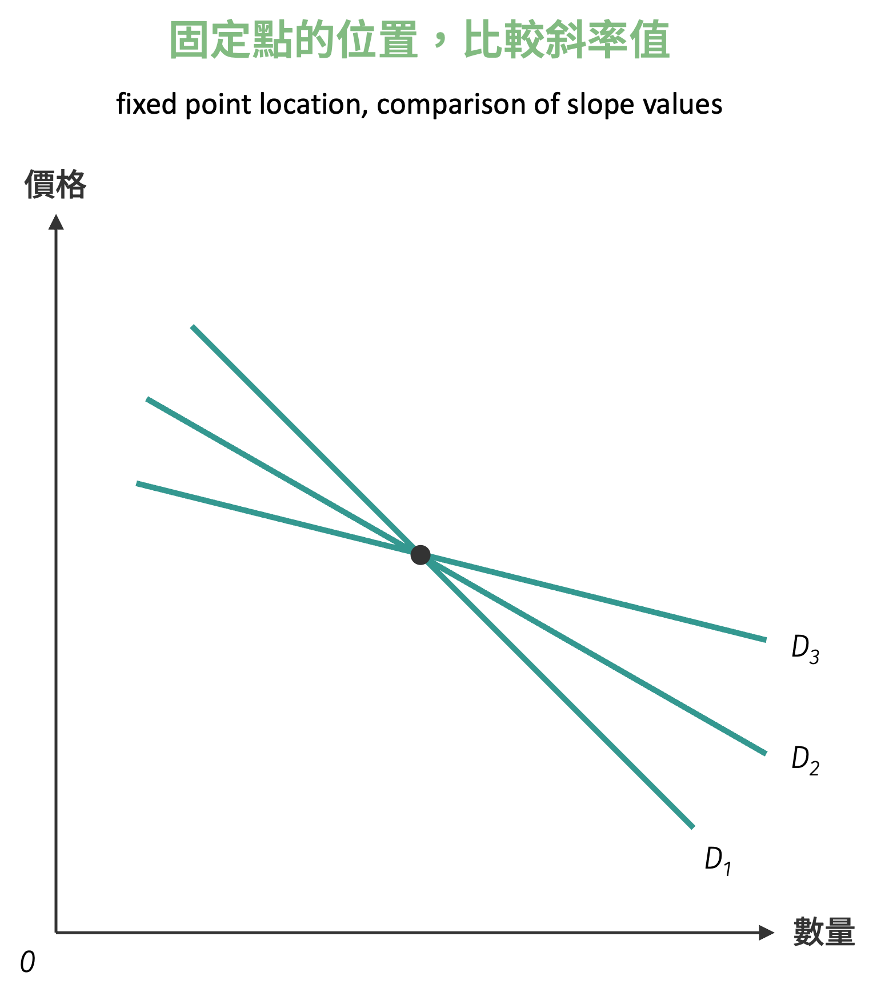
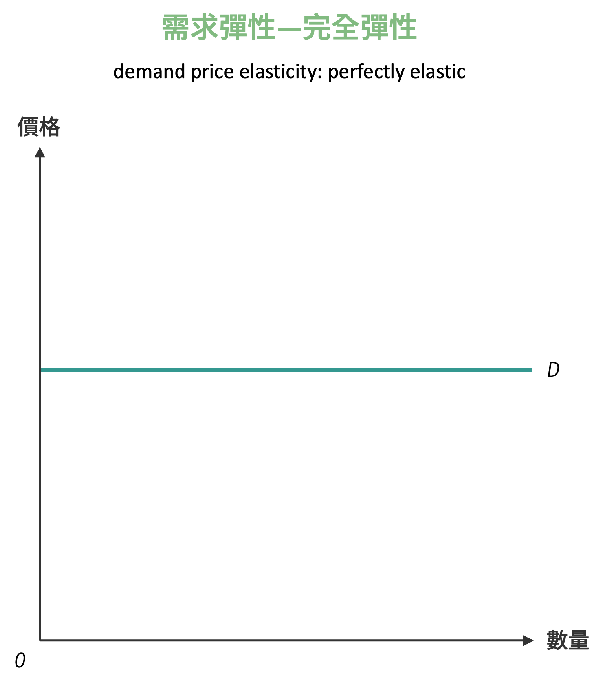
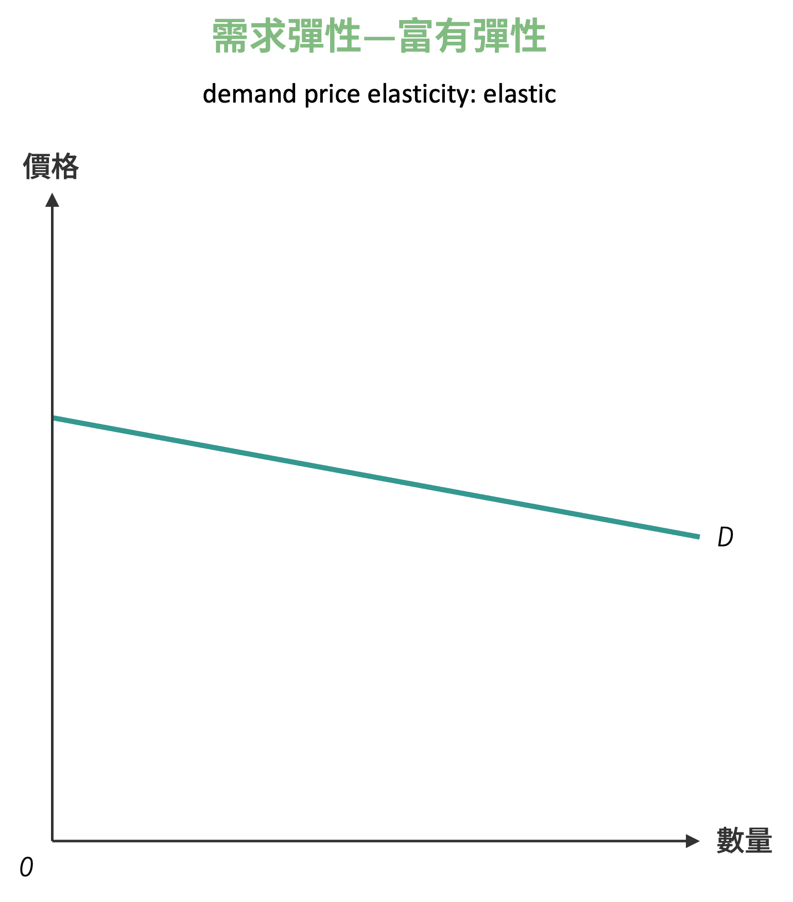
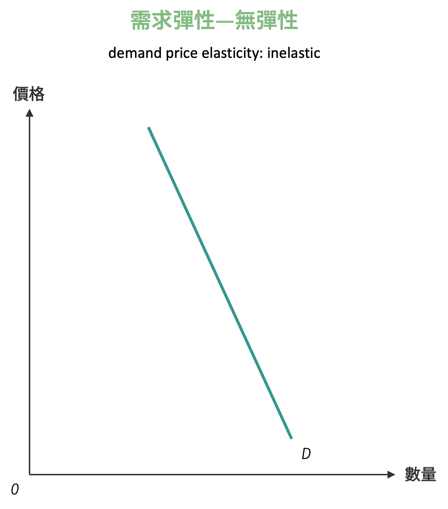
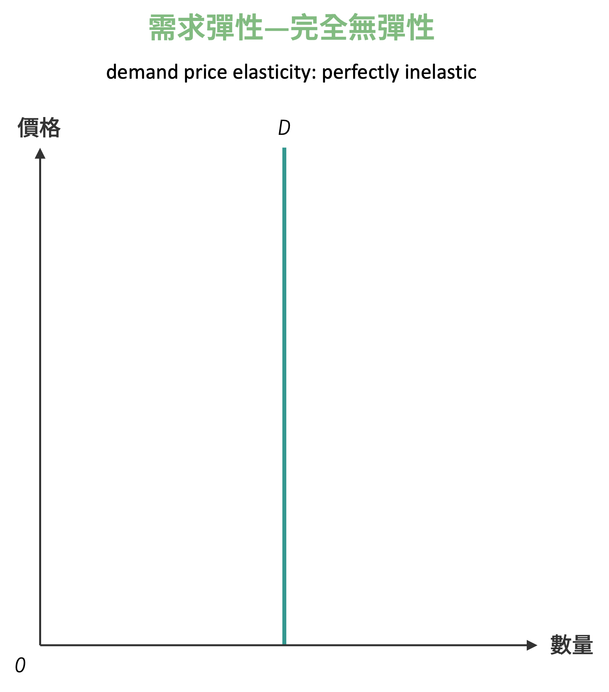
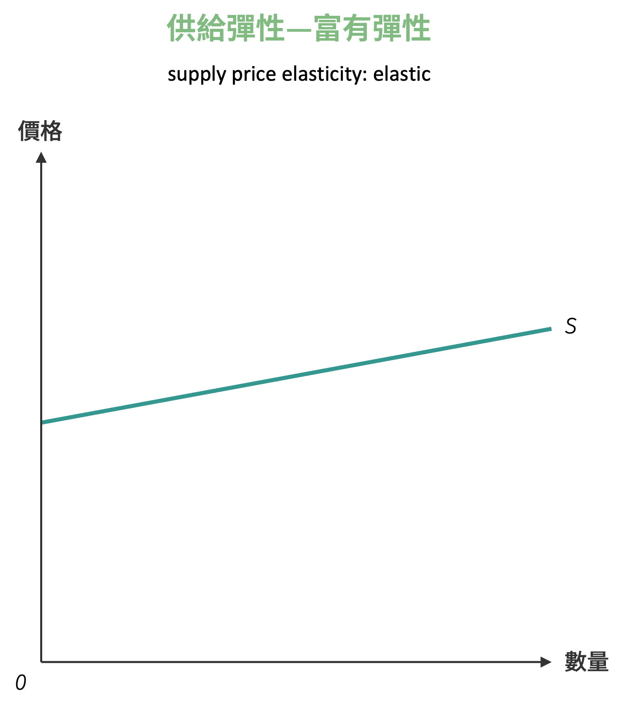
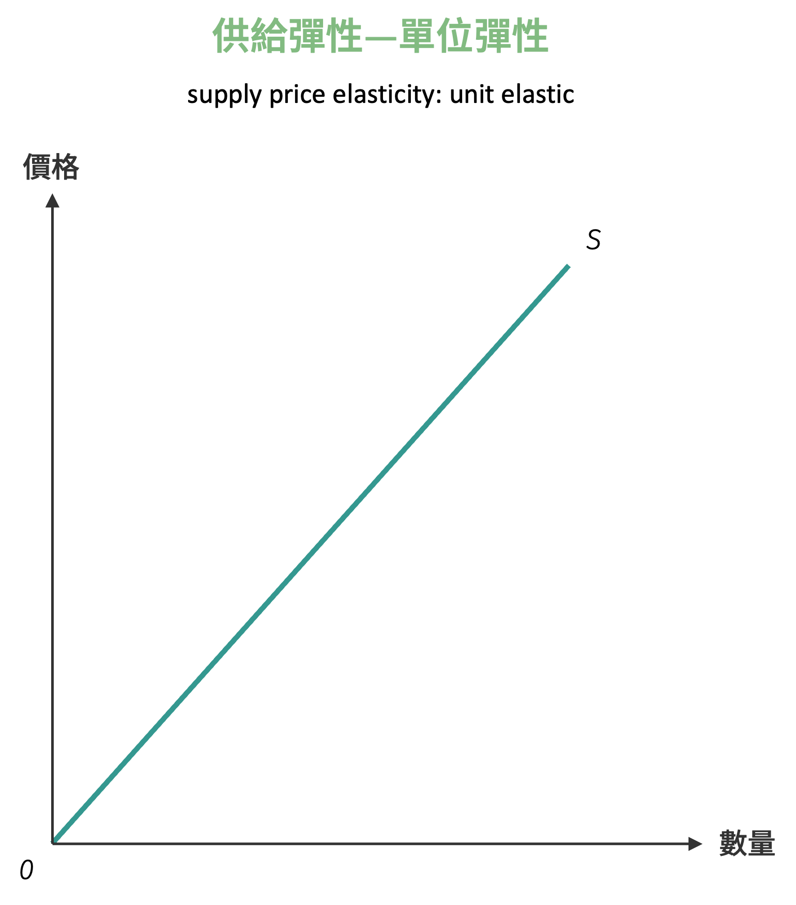
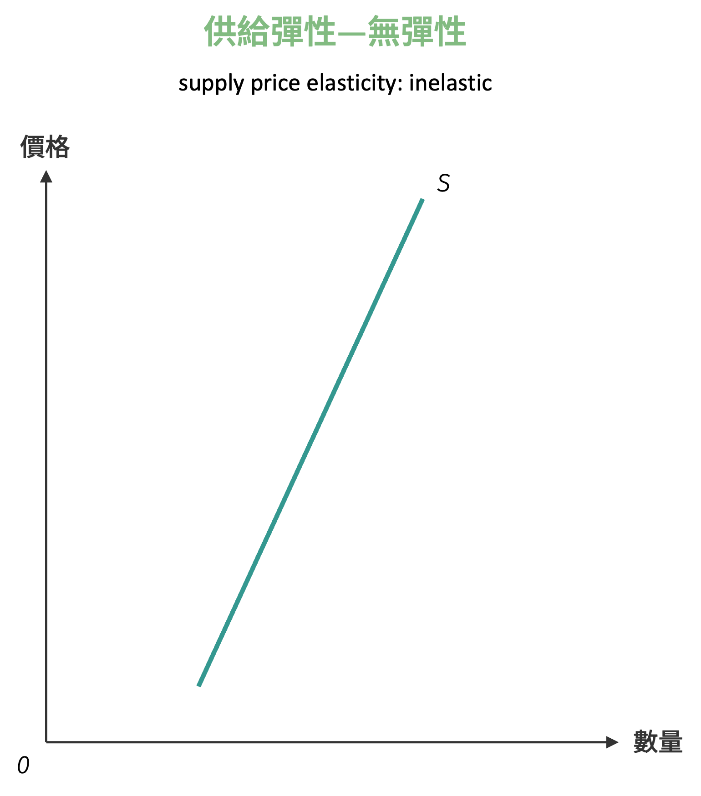
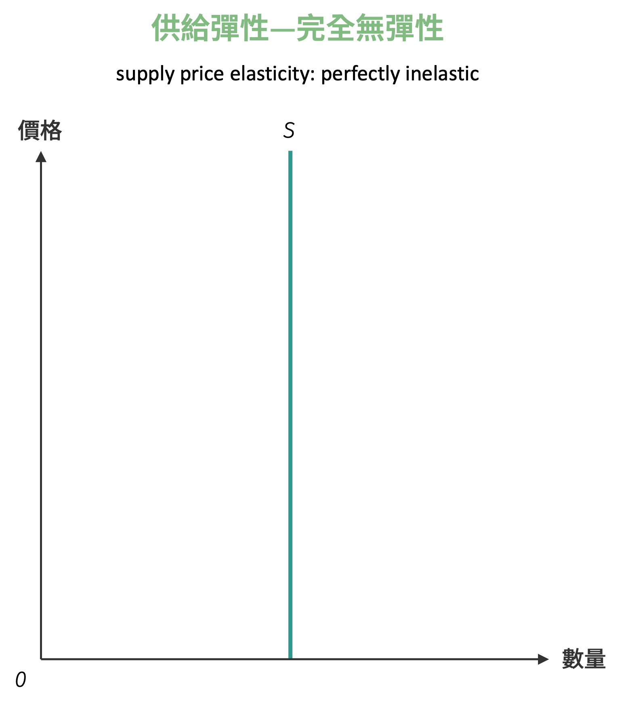

# 價格彈性

我來幫您補齊這段關於價格彈性的說明：

**價格彈性** (price elasticity) 是經濟學中最基礎也最重要的彈性概念。它衡量當商品價格變化時數量的相對變化程度。若欲衡量某商品價格變動對於數量的影響，直覺而言會以 $\frac{\Delta Q}{\Delta p}$ (連續則以 $\frac{dQ}{dp}$)作為指標。

不過細究會發現，當使用此定義作為價格彈性指標，針對同一項商品衡量不同國家的價格彈性時會產生問題。由於各國貨幣單位不同，即使是相同的商品，其價格的絕對數值也會因匯率而有所差異。例如，同一瓶可樂在美國可能售價 $2，在台灣可能售價 NT$60，直接使用 $\frac{\Delta Q}{\Delta p}$ 會導致彈性值無法進行有意義的比較。

此外，即使在同一國家內，不同商品的價格水準也大不相同。奢侈品與日常用品的價格差距可能達到數百倍，使用絕對變化量來衡量彈性會失去經濟意義。

為了解決這個問題，經濟學家採用**百分比變化**的概念，將價格彈性定義為：

$$
\text{價格彈性} = \frac{\text{數量變動百分比}}{\text{價格變動百分比}} = \frac{\%\Delta Q}{\%\Delta p}
$$

或者更精確地表示為：

$$
\varepsilon_p = \frac{\frac{\Delta Q}{Q}}{\frac{\Delta p}{p}} = \frac{\Delta Q}{\Delta p} \cdot \frac{p}{Q}
$$

若分析的對象為連續型需求函數，則可表示為

$$
\varepsilon_p = \frac{\frac{dQ}{Q}}{\frac{dP}{p}} = \frac{d Q}{dp} \cdot \frac{p}{Q}
$$

這樣的定義使得價格彈性成為一個**無單位**的指標，不僅可以跨國比較，也可以在不同商品間進行有意義的比較分析。

## 點彈性與弧彈性

在實際應用價格彈性時，經濟學家面臨一個重要的技術問題：究竟應該以哪個價格和數量作為計算基準？這個看似簡單的問題，實際上關係到彈性測量的準確性和可比較性。為了解決這個問題，經濟學發展出兩種不同的計算方法：**點彈性** (point elasticity) 與**弧彈性** (arc elasticity)。

這兩種方法的差異在於計算基準的選擇。點彈性使用變化前的原始價格和數量作為基準，而弧彈性則使用變化前後的平均值作為基準。雖然這個差異看似微小，但在實際應用中會產生不同的數值結果，尤其是當價格變化幅度較大時。

### 點彈性

**點彈性**是以變化前的原始價格和數量作為計算基準的彈性測量方法。其公式為：

$$
\varepsilon_p = \frac{\frac{\Delta Q}{Q_1}}{\frac{\Delta p}{p_{1}}} = \frac{\Delta Q}{\Delta p} \cdot \frac{p_{1}}{Q_1}
$$

其中 $p_1$ 和 $Q_1$ 分別為變化前的原始價格和數量，$\Delta P$ 和 $\Delta Q$ 分別為價格和數量的變化量。

點彈性的數學意義更為嚴謹，特別是在微分概念下。當價格變化趨近於零時，點彈性可以表達為：

$$
\varepsilon_p = \lim_{\Delta P \to 0} \frac{\Delta Q}{\Delta p} \cdot \frac{p}{Q} = \frac{dQ}{dP} \cdot \frac{p}{Q}
$$

這個表達式說明了點彈性實際上是需求曲線在某特定點的切線斜率，再乘以該點的價格與數量比值。

### 弧彈性

**弧彈性**是以變化前後的平均價格和平均數量作為計算基準的彈性測量方法。在理解弧彈性的設計原理之前，我們先來看看如果不使用平均值會發生什麼問題。

假設我們天真地嘗試用變化前後數值的總和作為基準，彈性公式會變成：

$$
\varepsilon_{naive} = \frac{\frac{\Delta Q}{Q_1 + Q_2}}{\frac{\Delta p}{p_1 + p_2}} = \frac{\Delta Q}{\Delta p} \cdot \frac{p_1 + p_2}{Q_1 + Q_2}
$$

這種做法會產生嚴重的計算偏誤。由於分母中的 $Q_1 + Q_2$ 和 $p_1 + p_2$ 是總和而非平均值，計算出的百分比變化會被人為地縮小一半。具體而言，若數量從 100 變化到 80，變化量為 -20，但如果以總和 180 作為基準，百分比變化會被錯誤地計算為 $\frac{-20}{180} = -11.1\%$，而實際的平均值基準應該是 $\frac{-20}{90} = -22.2\%$。

更嚴重的是，這種錯誤的計算方法會導致**量綱不一致**的問題。百分比變化的定義本身就是變化量除以原始量值，使用總和作為基準會違背百分比變化的基本數學定義，使得彈性失去其「無量綱」的重要特性。

因此，除以2的關鍵作用在於將總和轉換為平均值，確保計算出的百分比變化符合數學定義且具有經濟意義。正確的弧彈性公式為：

$$
\varepsilon_p = \frac{\frac{\Delta Q}{\frac{Q_1 + Q_2}{2}}}{\frac{\Delta p}{\frac{p_1 + p_2}{2}}} = \frac{\Delta Q}{\Delta p} \cdot \frac{\frac{p_1 + p_2}{2}}{\frac{Q_1 + Q_2}{2}} = \frac{\Delta Q}{\Delta p} \cdot \frac{p_1 + p_2}{Q_1 + Q_2}
$$

其中 $p_1, Q_1$ 為變化前的價格和數量，$p_2, Q_2$ 為變化後的價格和數量。

弧彈性的設計理念是要避免因為選擇不同基準點而產生的估算偏誤。由於使用平均值作為基準，無論是從 $(p_1, Q_1)$ 變化到 $(p_2, Q_2)$，還是從 $(p_2, Q_2)$ 變化到 $(p_1, Q_1)$，計算出的弧彈性數值都會相同。

!!! question "點彈性與弧彈性計算"
    某商品的需求資料如下：

    - 當價格為 $\$20$ 時，需求量為 $100$ 單位
    - 當價格上漲到 $\$24$ 時，需求量下降為 $80$ 單位

    請分別計算：

    1. 以變化前後價格與為基準的點彈性
    2. 弧彈性
    3. 比較三種計算結果的差異

!!! question "彈性計算區分"
    1. 底下 $D_{1}$ 與 $D_{2}$ 兩條需求曲線為平行線的圖形中，$A$ 點、$B$ 點與 $C$ 點三者需求價格彈性大小關係為何？
    { width="250" }

    2. 下圖中 $E$ 點恰為三條需求曲線上之同一交點，則 $E$ 點位於哪個需求曲線上的需求價格彈性較大？
    { width="250" }

## 需求價格彈性

**需求價格彈性** (price elasticity of demand) 是衡量需求量對價格變化敏感程度的重要指標。當商品價格發生變化時，消費者的需求量會如何回應。
想像你是一家咖啡店的老闆，正在考慮是否調漲咖啡價格。如果將一杯咖啡從 50 元調漲到 55 元 (漲幅10%) ，而顧客的購買量從每天 100 杯減少到 90 杯 (降幅 10%)，那麼咖啡需求價格彈性就是 1，意味著價格每上漲 1%，需求量就會下降 1%。

### 需求價格彈性的定義與計算

!!! note "需求價格彈性"
    給定需求函數為 $Q^{d} = Q(p)$，則需求價格彈性定義為：
    $$
    \varepsilon_{p}^{d} = - \frac{dQ^d}{dp} \cdot \frac{p}{Q^d}
    $$

需求價格彈性在理論計算中通常會得到**負值**，這是因為需求法則的存在：價格上升時需求量下降，價格下降時需求量上升。由於 $\frac{d Q^d}{d p} < 0$，所以彈性值自然為負。
然而，在實際分析中，當我們說某商品的需求價格彈性為 1.5 時，比說 -1.5 更直觀：我們關心的是彈性的大小 (敏感程度)，而不是符號方向，因為需求法則已經告訴我們方向必然是負的。

### 需求價格彈性的分類

一般來說，需求曲線的形狀會影響到需求彈性大小，因此底下探討需求彈性的各種情況，分為五類：
Table: 需求價格彈性分類

| 彈性數值 | 說明 | 圖形 | 典型例子 |
|----------|------|----------|----------|
| $\varepsilon_{p}^{d} = 0$ | 完全無彈性 | 垂直線 | 胰島素、食鹽 |
| $0 < \varepsilon_{p}^{d} < 1$ | 無彈性 | 陡峭向下傾斜線 | 汽油、電力、基本食品 |
| $\varepsilon_{p}^{d} = 1$ | 單位彈性 | 等軸雙曲線 | 理論中的特殊情況 |
| $\varepsilon_{p}^{d} > 1$ | 富富有彈性 | 平緩向下傾斜線 | 奢侈品、娛樂用品 |
| $\varepsilon_{p}^{d} = \infty$ | 完全彈性 | 水平線 | 完全競爭市場中的個別廠商需求 |

#### 完全彈性

**完全彈性** (perfectly elastic) 的彈性趨近於無窮大，或記成 $\varepsilon_{p}^{d} \to \infty$。在此情境下，價格為常數，因此價格變動的百分比為零。完全彈性之需求曲線為水平線，如下圖所示：

{ width="350"}

#### 富有彈性

**富有彈性** (elastic) 代表需求量變動百分比絕對值大於價格變動百分比絕對值。此時彈性大於 1。需求曲線平緩向下傾斜，如下圖所示：

{ width="350"}

#### 單位彈性

**單位彈性** (unit elastic) 係需求量變動百分比等於價格變動百分比，由此可推出單一彈性的需求函數，隱含消費者的總支出為固定額度。假設商品價格為 $p$，消費者需求量為 $Q^{d}$，固定支出為 $C$。因此可得：
$$
p \cdot Q^{d} = C \Longleftrightarrow Q^{d} = c \cdot p^{-1}
$$
根據需求彈性的公式，可以求得需求彈性為 1。下圖即是單位彈性的需求函數，稱為正等軸雙曲線 (equilateral hyperbola)。

{ width="350"}

!!! question "需求單位彈性"
    小宋每個月的所得固定，並支用三分之一的所得在飲食上。請求出他對食品、飲品的需求彈性。

#### 無彈性

**無彈性** (inelastic) 或稱**缺乏彈性**，其需求量變動百分比小於價格變動百分比。需求曲線陡峭向下傾斜，如下圖所示：

{ width="350"}

#### 完全無彈性

**完全無彈性** (perfectly inelastic) 代表無論價格為何，需求量皆為定數，亦即需求量不受價格變動的影響，因此需求量變動百分比為零。

{ width="350"}

## 供給價格彈性

**供給價格彈性** (price elasticity of supply) 是衡量供給量對價格變化敏感程度的重要指標。當商品價格發生變化時，生產者的供給量會如何回應。
想像你是一家服裝工廠的老闆，市場上T恤的價格從每件100元上漲到110元（漲幅10%）。如果你的工廠將每週產量從1000件增加到1200件（增幅20%），那麼T恤供給價格彈性就是2，意味著價格每上漲1%，供給量就會增加2%。了解供給價格彈性有助於預測市場供給的調整速度和幅度，這對制定生產計畫和投資決策都極為重要。

### 供給價格彈性的定義與計算

!!! note "供給價格彈性"
    給定供給函數為 $Q^{s} = Q(p)$，則供給價格彈性定義為：
    $$
    \varepsilon_s = \frac{dQ^s}{dp} \cdot \frac{p}{Q^s}
    $$

與需求價格彈性不同，供給價格彈性通常為**正值**，這符合供給法則：價格上升時供給量增加，價格下降時供給量減少。由於 $\frac{dQ^s}{dp} > 0$（供給曲線向右上傾斜），所以彈性值自然為正。

供給價格彈性為正值的原因在於**利潤動機**：價格上升提高了生產的潛在利潤，激勵生產者增加產量。這種正向關係反映了市場機制的資源配置功能——當某商品價格上升時，表明市場對該商品需求增加，價格信號引導更多資源流向該商品的生產。

### 供給價格彈性的分類

同理，供給彈性也可以分為以下五類：

Table: 供給價格彈性分類

| 彈性數值 | 說明 | 圖形 | 典型例子 |
|----------|------|----------|----------|
| $\varepsilon_s = 0$ | 完全無彈性 | 垂直線 | 土地、古董、短期農產品 |
| $0 < \varepsilon_s < 1$ | 無彈性 | 陡峭向上傾斜線 | 重工業、電力、醫療服務 |
| $\varepsilon_s = 1$ | 單位彈性 | 45度向上傾斜線 | 理論中的特殊情況 |
| $\varepsilon_s > 1$ | 富有彈性 | 平緩向上傾斜線 | 服務業、勞動密集型產業 |
| $\varepsilon_s = \infty$ | 完全彈性 | 水平線 | 完全競爭長期均衡 |

#### 完全彈性

與需求彈性的情況類似，為一水平線。通常來說，水平供給曲線多出現在國際貿易探討小國面對外國進口的供給曲線。

{ width="350" }

#### 富有彈性

富有彈性代表供給量變動百分比絕對值大於價格變動百分比絕對值。此時彈性大於 1。供給曲線平緩向上傾斜，如下圖所示：

{ width="350" }

#### 單位彈性

單位彈性係供給量變動百分比等於價格變動百分比，此時彈性等於 1。供給曲線具有適中的斜率向上傾斜，如下圖所示：

{ width="350" }

!!! question "供給單位彈性"
    為什麼單位彈性的需求線為曲線，而單位彈性的供給線卻為直線？

    **【解】**

    我們可以從彈性本身的定義來分析這個問題。首先，我們已經知道彈性的定義是「給定刺激下反應的程度」，因此價格彈性（無論是需求或供給，因此先不討論需求彈性要加上負號的情況）用數學的方式寫下來則是：
    $$
    \varepsilon_p = \frac{dQ}{Q} / \frac{dP}{P}
    $$
    我們可以將上面的形式改寫一下：
    $$
    \varepsilon_p = \frac{P}{Q} / \frac{dP}{dQ}
    $$
    假設我們令函數為 $P = aQ$，其中 $dP/dQ = a$，因此代入上面的算法可以得到：
    $$
    \varepsilon_p = \frac{aQ}{Q} / \frac{dP}{dQ} = a/a = 1
    $$
    可以得出如果彈性為 1 時，函數必須為通過原點的直線。但如果令函數為 $P = aQ + c$，代入後得到
    $$
    \varepsilon_p = \frac{aQ + c}{Q} / \frac{dP}{dQ} = \frac{\frac{aQ + c}{Q}}{a} = 1 + \frac{c/a}{Q}
    $$
    由於一般的需求函數為負斜率，代表有截距且不通過原點，因此價格的需求彈性為 1 時，需求函數一定是正等軸雙曲線。

#### 無彈性

無彈性其供給量變動百分比小於價格變動百分比。供給曲線陡峭向上傾斜，如下圖所示：

{ width="350" }

#### 完全無彈性

完全無彈性代表無論價格為何，供給量皆為定數，亦即供給量不受價格變動的影響，因此供給量變動百分比為零。完全無彈性之供給曲線為垂直線，如下圖所示：

{ width="350" }