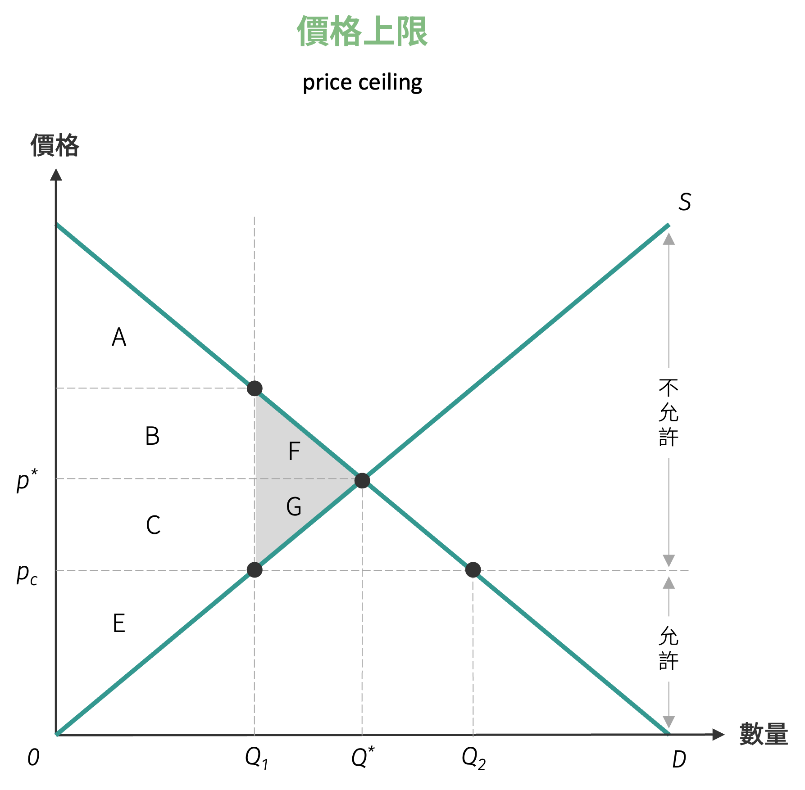
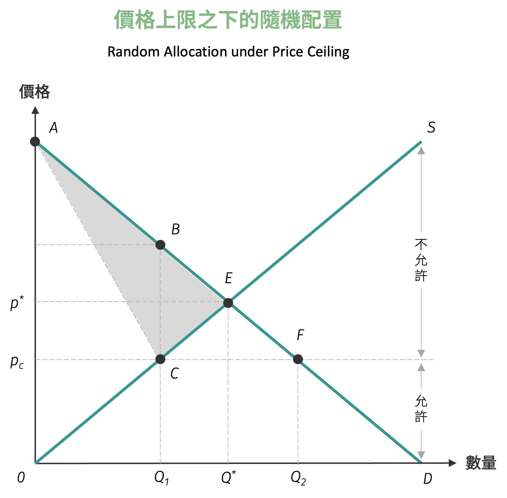
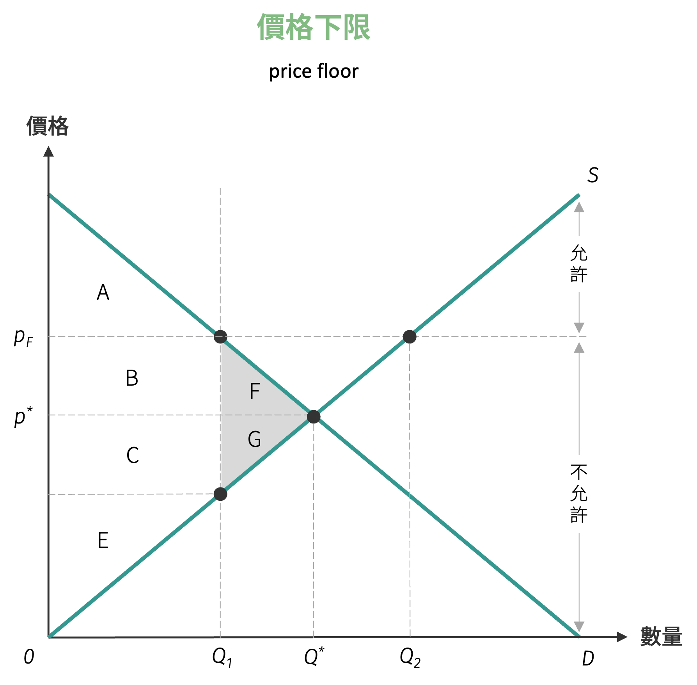

# 限價政策

政府實施限價政策主要有兩種形式，一種為保護消費者而設定的價格上限 (price ceiling) 政策，另一種為保障生產者而設定的價格下限 (price floor) 政策。

## 價格上限

價格上限政策是指政府對於未採取任何價格限制措施時，認定商品由供需曲線所得之市場均衡價格偏高或為民生所需，限制此商品在法令下允許交易的最高交易價格，以價格上限稱之。
價格上限的限制價格必須位於原均衡價格之下，否則會失去限價保護消費者的政策意義。如下圖所示，只有當有效的價格上限 $p_c$ 低於市場均衡價格時，且高於 $p_c$ 的價格不被允許交易，僅低於 $p_c$ 的價格可以從事交易。

{ width="350" }

當然限制實施後的均衡價格將為 $p_c$ (因為在 $p_c$ 之下市場會產生超額需求而推導價格上漲至 $p_c$ 為止)，在 $p_c$ 價格下的需求量雖有 $Q_2$，但供給量僅有 $Q_1$，因此新均衡交易量為 $Q_1$，因而造成社會產生**超額需求** (excess demand)，商品產生短缺現象，因而可能造成黑市交易、排隊購物或有黃牛票套利交易等現象。

當政府採行價格上限政策後，若恰為願付最高價格的消費者群 (即圖形中補償變分線段之消費者優先購買到商品)，則對社會福利的影響如下表所示，且採取價格上限後，無謂損失為 $F + G$。

| 政策實施 | 消費者剩餘 | 生產者剩餘 | 社會福利 |
|----------|-----------|-----------|----------|
| 限價前 | $A + B + F$ | $C + E + G$ | $A + B + C + E + F + G$ |
| 限價後 | $A + B + C$ | $E$ | $A + B + C + E$ |

若政府採取價格上限後，消費者並不是恰由願付最高價格 $\overline{AB}$ 的消費者購買到商品，而是一般像是去看電影的隨機排隊購買，則此時在 $p_{c}$ 價格下，應有 $Q_{2}$ 的消費者欲購買此一商品。如果假設消費者買到商品後，不會再有轉售 (resale) 的套利行為，在消費者隨機排隊購買下，購買到商品的機率僅有 $\frac{\overline{p_{c}C}}{\overline{p_cF}}$。因此消費者剩餘的計算在 $p_c$ 下，$Q_2$ 的消費者皆能買到商品的消費者剩餘乘上機率的結果：
$$
\begin{aligned}
CS &= \triangle AFp_c \left(\frac{\overline{p_cC}}{\overline{p_cF}}\right)\\\\
&= \frac{1}{2} \cdot AFc \cdot p_cF \cdot \left(\frac{\overline{p_cC}}{\overline{p_cF}}\right)\\\\
&= \frac{1}{2} \cdot AFc \cdot p_cC = \triangle ACp_c
\end{aligned}
$$

{ width="350" }

此種情況下的福利變動如下表：

| 政策實施 | 消費者剩餘 | 生產者剩餘 | 社會福利 |
|----------|-----------|-----------|----------|
| 限價前 | $\triangle AEp^*$ | $\triangle p^*EO$ | $\triangle AEO$ |
| 限價後 | $\triangle ACp_c$ | $p_cCO$ | $\triangle ACO$ |

此時無謂損失 $DWL = W_0 - W_2 = \triangle AEC$，比較之前由願付最高價格者購買之社會福利，此時的無謂損失更大，其原因在於許多不是願付

如果轉售行為不被禁止，透過轉售行為，願付較高價格的消費者可以以較低價格購買到商品的消費者進行套利的互惠行為，則較低價格購買到商品之消費者也可賺取其間的價差，願付較高價格的消費者又可以自己願付或低於願付最高價格購買到商品，此種行為雙方都得利且無人受損，有利於社會福利的提升。此種在資源重新分配後，可在不損及其他人的福利下，而使得某些人的福利提升的情況，稱為柏拉圖改善 (Pareto improvement)。

在價格上限的政策下，若存在黃牛的行為，對於增進效率、社會福利是有幫助的，惟對於公平 (分配) 方面損害[^1]，這就是必須取捨黃牛的原因。故我們可以簡單定義區隔效率與公平的差異為：

- 效率就是把餅做大
- 公平就是平均分配

## 價格下限

價格下限政策指政府對於未採取任何價格限制措施時，認定商由供需曲線所得之市場均衡價格偏低，乃限制此一商品在法令下所允許交易的最低價格，稱為價格下限。
此一價格下限的限制價格必須位於原均衡價格交易之上，否則將失去保護生產者的意義。如下圖顯示有效的價格下限價格 $p_f$ 應高於原均衡價格，且低於 $p_f$ 的價格不被允許交易，僅高於 $p_f$ 的價格可以從事交易。

{ width="350" }

當然此時新的均衡價格將為 $p_f$ (因為在 $p_f$ 之上市場會產生超額供給而引導價格下漲至 $p_f$ 為止)，在 $p_f$ 價格下的供給量雖有 $Q_2$，但需求量僅有 $Q_1$，因此新均衡交易量為 $Q_1$，因而造成社會產生**超額供給** (excess supply)，商品產生過剩現象，因而可能造成生產者滯銷的現象。

當政府採價格下限政策後，並未配合其他相關性的配套政策，則對社會福利的影響為：

| 政策實施 | 消費者剩餘 | 生產者剩餘 | 社會福利 |
|----------|-----------|-----------|----------|
| 限價前 | $A + B + F$ | $C + E + G$ | $A + B + C + E + F + G$ |
| 限價後 | $A$ | $B + C + E$ | $A + B + C + E$ |

採取價格下限後，無謂損失為 $F + G$。

!!! question "限價政策"
    假設蘋果的市場需求及市場供給曲線分別為
    $$
    \begin{aligned}
    Q^{d} &= 10 - p\\
    Q^{s} &= -8 + 2p
    \end{aligned}
    $$
    其中 $Q^{d}$ 為蘋果的需求量，$Q^{s}$ 為蘋果的供給量，$p$ 為蘋果的價格。

    1. 假設政府設定蘋果的價格下限為 5，則市場上實際交易價格、消費者剩餘、生產者剩餘、無謂損失依序為多少？
    2. 若政府設定蘋果的價格上限為 5，則市場上實際交易價格、消費者剩餘、生產者剩餘、無謂損失依序為多少？

[^1]: 若將等候時間成本之「買得到與買不到」之消費者而言，套利行為的好處可視為其等候的時間成本節省。