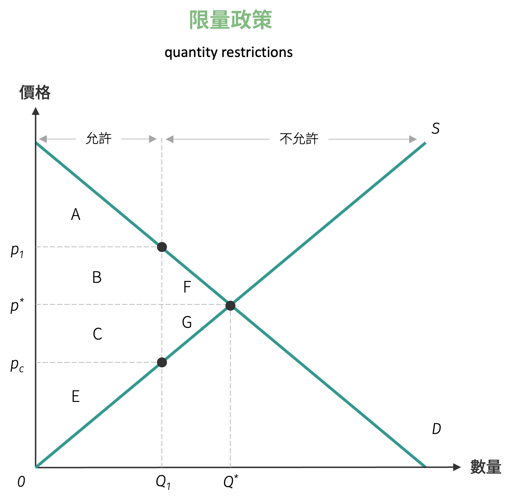

# 限量政策

在特定的經濟環境下，政府可能基於戰略考量、國際貿易平衡或公共健康等因素，選擇對某些商品實施數量管制措施。這類限量政策的核心在於設定一個最大交易數量上限，且此數量必須低於自由市場條件下的均衡交易量，如此才能發揮政策調節的實際效果。

{ width="350" }

在採數量限制下的消費量為 $Q_1$，此時的消費者剩餘為 $A$。若政府改採價格上限政策，且限制價格為 $p_c$，此時的消費量亦為 $Q_1$，但此時的消費者剩餘為 $(A + B + C)$。顯示在相同的消費量 $Q_1$ 下，消費者可以接受消費者剩餘只有 $A$ 部分，此亦表示在價格上限政策下的消費者剩餘會多出 $(B + C)$ 的部分，因為在價格上限政策下會產生超額需求，會使得消費者需要去蒐集在 $p_c$ 價格下仍在銷售廠商的資訊，因此即使額外付出 $(B + C)$ 的部分來當作搜尋的額外成本，仍可使得消費者剩餘至少維持在 $A$ 部分，此 $(B + C)$ 的部分被稱為**搜尋成本** (search cost)。

!!! question "台灣口罩產能配額政策"
    台灣政府為確保疫情期間口罩供應穩定，對口罩製造商實施產能配額管制，規定每日總產能不得超過 $\bar{Q} = 1,000$ 萬片。已知國內兩大口罩製造商的供給函數分別為：

    - 甲廠商：$Q_A^s = 3p - 60$  
    - 乙廠商：$Q_B^s = 2p - 20$  

    其中 $p$ 為每片口罩的價格 (元)，$Q$ 為數量 (萬片/日)。

    1. 在無配額限制的情況下，當市場價格為 $p = 50$ 元時，兩家廠商各自的供給量為多少？總供給量為多少？

    2. 在配額限制下，若市場價格仍為 $p = 50$ 元，且兩家廠商按其供給能力比例分配配額，請計算：
        - 甲、乙兩廠商的配額分配量
        - 相較於無配額情況，各廠商的供給量變化

    3. 承上題，若配額分配改為平均分配 (各廠商分得 500 萬片)，哪種分配方式較符合經濟效率原則？請說明原因。