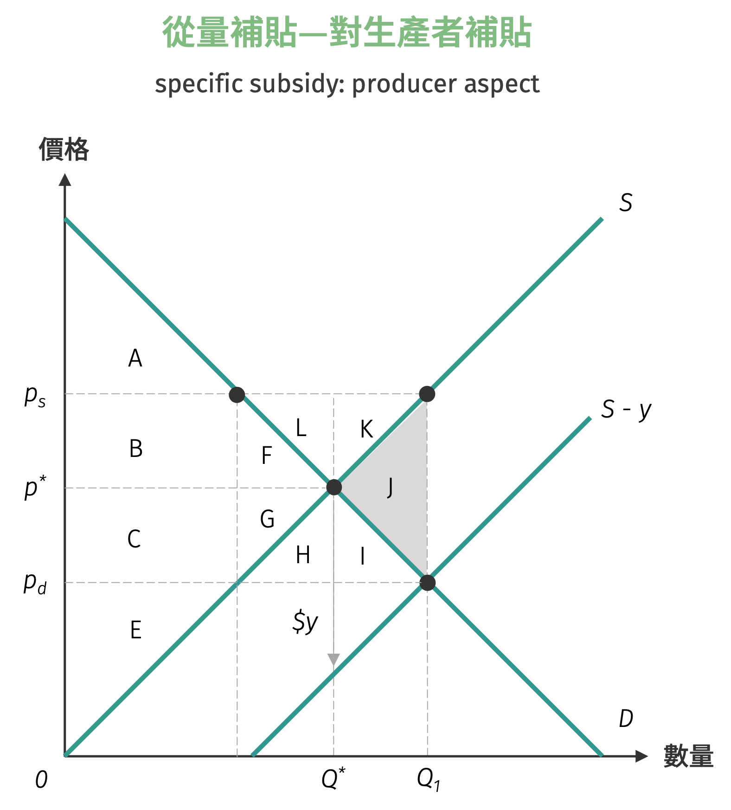

# 補貼分析

補貼政策是政府干預市場的另一種重要工具，與課稅政策恰好相反。政府透過提供補貼來降低生產成本或消費負擔，目的在於鼓勵特定產業發展、提高社會福利或達成政策目標。補貼政策在現實經濟中廣泛應用，從農業補貼、能源補貼到教育補貼，都是政府用以調節市場機制的重要手段。

補貼的實施方式主要分為兩類：**從量補貼** (specific subsidy) 和**從價補貼** (ad valorem subsidy)。從量補貼是對每單位商品給予固定金額的補助，而從價補貼則是按商品價值的一定比例提供補助。無論採用何種補貼方式，其經濟效果都會透過供需機制傳遞到市場中，改變均衡價格和數量，並對消費者、生產者以及整體社會福利產生影響。
礙於篇幅緣故，此處僅針對從量補貼進行分析與討論。

**從量補貼**是政府對每單位商品提供固定金額的補助，例如政府對每公升生質燃料補貼 2 元，或對每度綠電補貼 1 元。與從量稅相反，從量補貼會使供給曲線向下移動或需求曲線向上移動，移動的垂直距離等於單位補貼金額。

當政府向生產者提供每單位 $s$ 元的從量補貼時，在相同的數量 $Q_0$ 下，原本生產者需要 $p_0$ 的價格才願意供應，補貼後則只需要 $(p_0 - s)$ 的市場價格就願意供應相同數量，這表示每單位生產成本實質下降 $s$ 元。

若政府補貼對象為消費者，在 $Q_0$ 數量時，消費者原本的保留價格為 $p_0$，補貼後則願意支付 $(p_0 + s)$ 的價格購買相同數量的商品，隱含消費者的實質購買力增加了 $s$ 元。

=== "從量補貼—對生產者補貼"
    { width="350" }

=== "從量補貼—對消費者補貼"
    { width="350" }

補貼實施後，消費者實際支付的價格從 $p^*$ 下降至 $p_d$，生產者實際收到的價格則從 $p^*$ 上升至 $p_s$，其中 $p_s - p_d = s$ (補貼金額)。

- $(p^* - p_d)$：單位補貼**前向轉移**由消費者受益的部分
- $(p_s - p^*)$：單位補貼**後向轉移**由生產者受益的部分

此時政府補貼支出為 $B + C$，社會淨福利增加 $F + G$。

| 政策實施 | 消費者剩餘 | 生產者剩餘 | 政府支出 | 社會淨福利 |
|----------|-----------|-----------|----------|------------|
| 補貼前 | $A + B + F$ | $C + E + G$ | 0 | $A + B + C + E + F + G$ |
| 補貼後 | $A + B + C + F + G + H + I$ | $B + C + E + F + G + K + L$ | $B + C + F + G + H + L$ | $A + B + C + E + F + G$ |

!!! question "農產品補貼政策"
    假設有機蔬菜的市場需求及市場供給曲線分別為：
    $$
    \begin{aligned}
    Q^{d} &= 20 - 2p\\\\
    Q^{s} &= -4 + p
    \end{aligned}
    $$
    其中 $Q^{d}$ 為有機蔬菜的需求量，$Q^{s}$ 為有機蔬菜的供給量，$p$ 為有機蔬菜的價格。

    1. 求出無補貼時的市場均衡價格與數量。

    2. 假設政府對生產者提供每單位 3 元的從量補貼，求出補貼後的均衡價格與數量。

    3. 計算補貼政策實施後：
    - 消費者剩餘的變化
    - 生產者剩餘的變化
    - 政府補貼支出
    - 社會淨福利變化

    4. 分析此補貼政策中，消費者和生產者各自獲得的補貼利益比例。