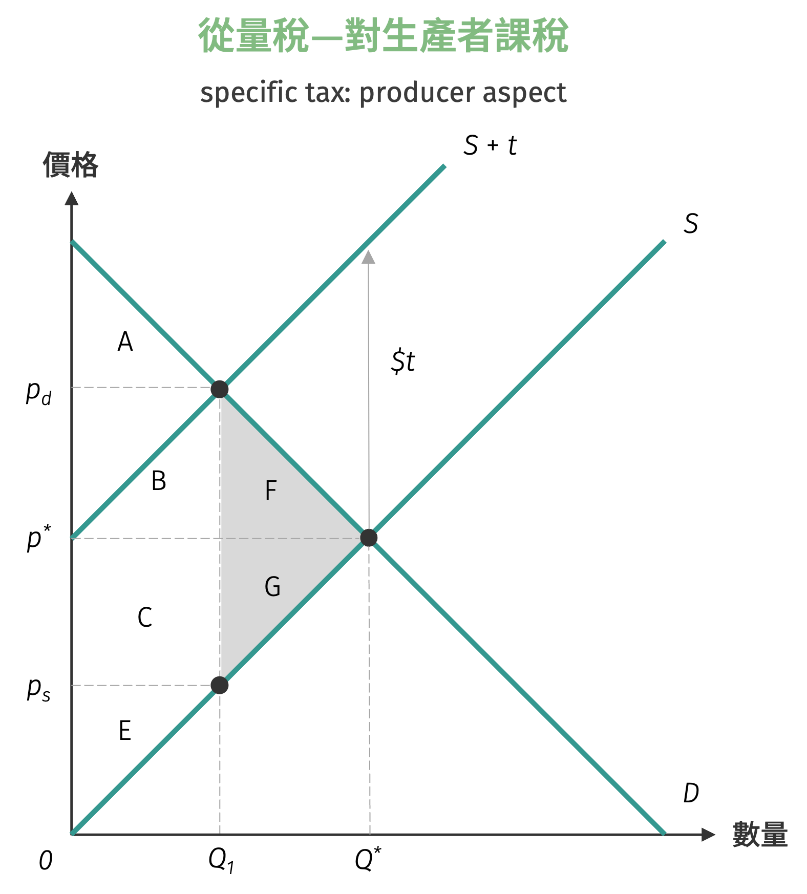
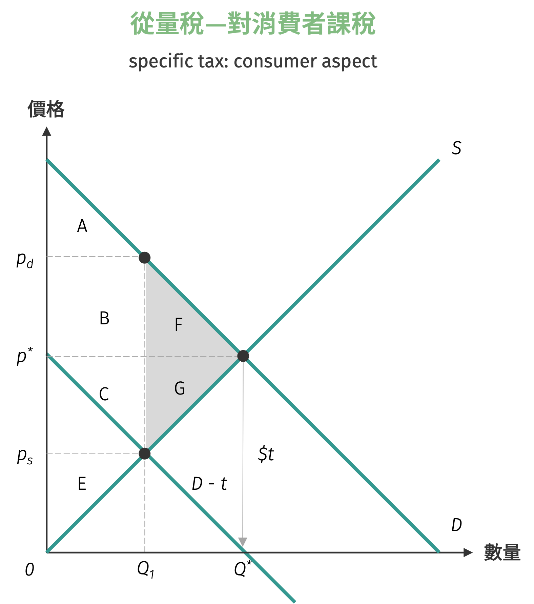
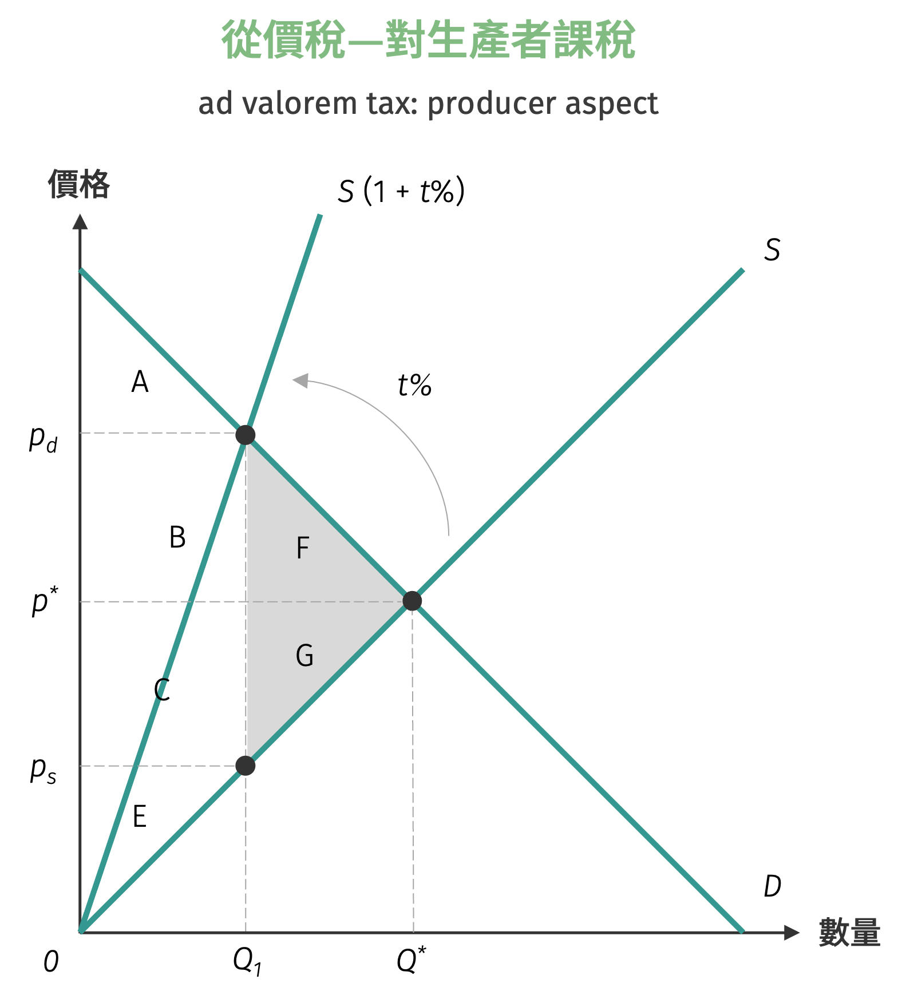
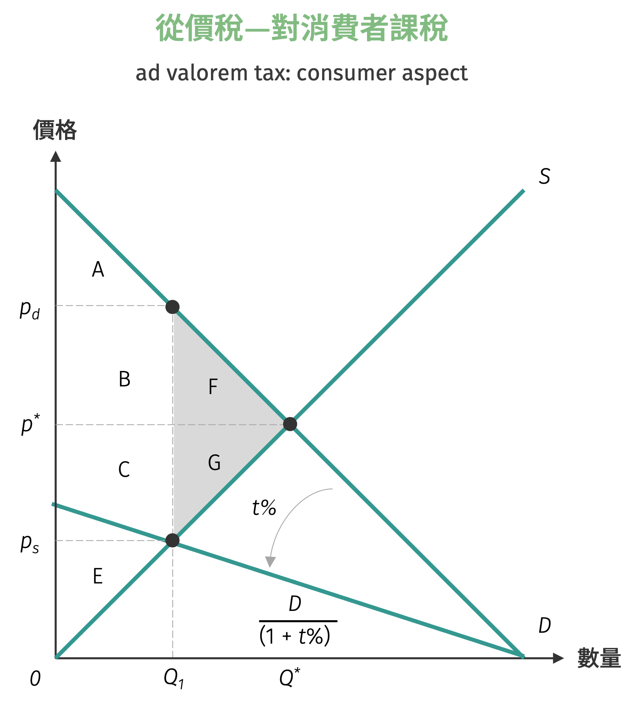
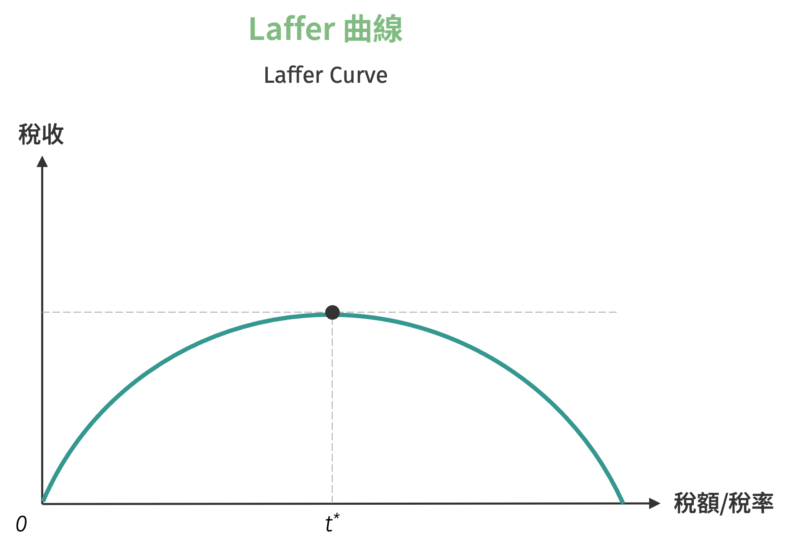
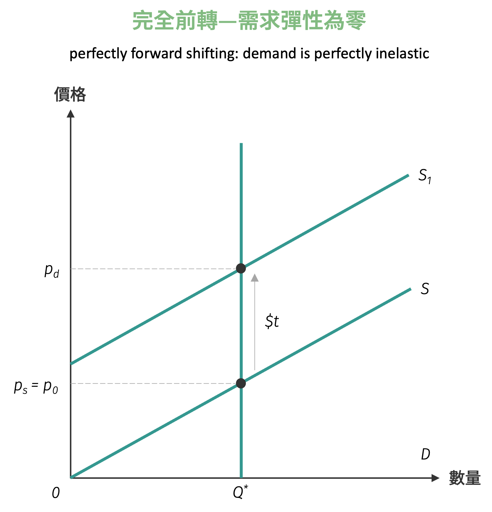
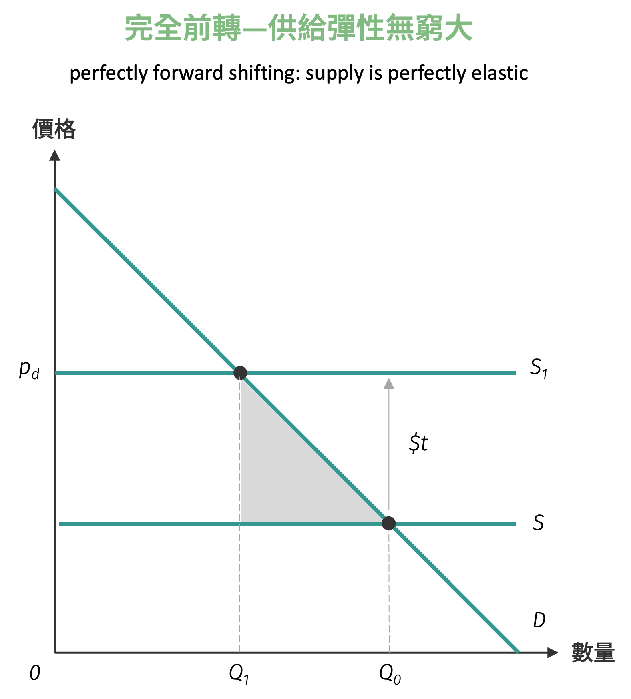
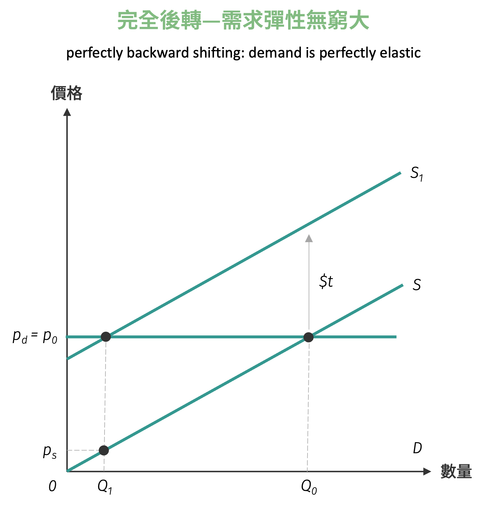
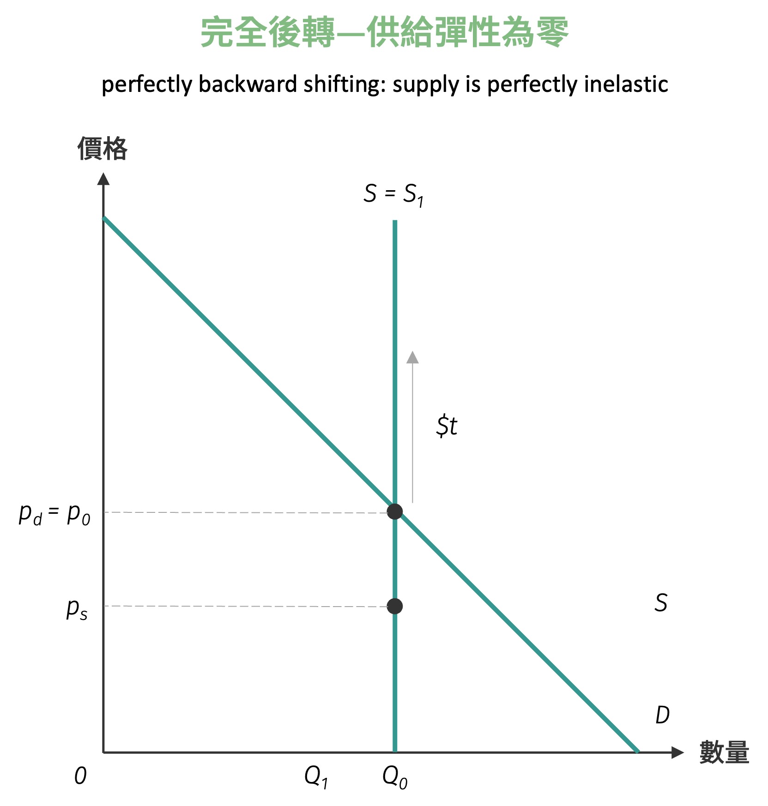

# 課稅分析

稅收制度是政府調節經濟活動與獲取財政收入的重要工具，也是現代經濟體系中不可或缺的政策手段。透過課稅政策，政府不僅能夠籌措公共支出所需的資金，更能夠影響市場價格機制，進而達到資源重新分配或矯正市場失靈的目的。然而，任何稅收政策的實施都會對市場均衡產生影響，改變消費者與生產者的行為模式，並可能產生經濟效率損失。

從生產與消費面端視「稅」，對於廠商而言，稅是生產商品的成本之一，因此若政府對於特定商品課稅，廠商便會將稅額加諸於生產成本上，商品自然而然也會變貴。相對應地，消費者會面臨物價的上漲，相較於原本的價錢必須多支付稅額的幅度。雖然這兩種課稅方式在實際操作上各有優缺點，並會產生不同的經濟效果，但無論採用何種課稅方式，最終的**稅負歸宿** (tax incidence) 往往取決於供需雙方的相對彈性，而非法律上的納稅義務人。

## 從量稅

**從量稅** (specific tax) 是針對商品的實體數量課徵固定金額的稅收，例如每公升汽油課徵 3 元的燃料稅，其稅額不隨商品價格變動而改變。供給曲線上移或需求曲線下移的垂直距離，即是從量稅的單位稅額。當政府向生產者課徵每單位 $\$t$ 元的從量稅時，在 $Q_{0}$ 數量下，稅前生產者每單位以 $p_{0}$ 出售商品；稅後則必須加上 $\$t$ 為 $p_{1}$ 出售，表示每單位成本均上升 $\$t$ 元。

若政府課徵對象為消費者，在 $Q_{0}$ 單位時其願付的保留價格為 $p_{0}$，稅後則會先扣除 $\$t$ 元，算出不含稅的保留價格 $p_{1}$，隱含消費者稅後僅願以 $p_{1}$ 購買商品，另外再支付從量稅給政府。

=== "從量稅—對生產者課稅"
    { width="350" }

=== "從量稅—對消費者課稅"
    { width="350" }

課稅之後，消費者每單位商品購買的價格從 $p^{*}$ 提高至 $p_{1}$，生產者每單位商品實得價格則是 $p_{d}$ 扣除單位稅額 $\$t$ 後的 $p_{s}$，其中：

- $(p_{d} - p^{*})$：單位稅額**前轉** (forward shifting) 由消費者負擔的部分
- $(p^{*} - p_{s})$：單位稅額**後轉** (backward shifting) 由生產者負擔的部分

此時政府稅收為 $B + C$，且產生無謂損失 $F + G$。

| 政策實施 | 消費者剩餘 | 生產者剩餘 | 政府稅收 | 社會福利 |
|----------|-----------|-----------|----------|----------|
| 課稅前 | $A + B + F$ | $C + E + G$ | 0 | $A + B + C + E + F + G$ |
| 課稅後 | $A$ | $E$ | $B + C$ | $A + B + C + E$ |

## 從價稅

**從價稅** (ad valorem tax) 則是按照商品價值的一定比例課徵，如營業稅採用 5% 的稅率，稅額會隨商品價格的高低而有所不同。供給曲線旋轉上移或需求曲線旋轉下移的垂直距離，即是從價稅單位稅率的高低。當政府對生產者每單位售出的商品課徵 $t\%$ 的從價稅時，在 $Q_{0}$ 數量下，稅前生產者以每單位 $p_{0}$ 出售商品；稅後則必須加上 $t\%$ 並以 $p_{1}$ 出售，表示每單位成本均增加 $t\%$，且 $p_{1} = p_{0}(1 + t\%)$。

若政府課徵對象為消費者，在 $Q_{0}$ 單位時其願付的保留價格為 $p_{0}$，稅後則會先扣除 $t\%$，算出不含稅的保留價格 $p_{1}$，且 $p_{0} = p_{1}(1 + t\%)$，隱含消費者稅後僅願以 $p_{1}$ 購買商品，另外再支付從價稅給政府。

=== "從價稅—對生產者課稅"
    { width="350" }

=== "從價稅—對消費者課稅"
    { width="350" }

與從量稅類似，在此不多贅述，可以自行檢驗從價稅的福利變化。

| 政策實施 | 消費者剩餘 | 生產者剩餘 | 政府稅收 | 社會福利 |
|----------|-----------|-----------|----------|----------|
| 課稅前 | $A + B + F$ | $C + E + G$ | 0 | $A + B + C + E + F + G$ |
| 課稅後 | $A$ | $E$ | $B + C$ | $A + B + C + E$ |

## Laffer 曲線

在討論課稅政策時，一個直觀的想法可能是：政府課稅越多，稅收收入就越高，因此應該盡可能提高稅率以增加政府財政收入。然而，這種想法忽略了課稅對經濟活動的負面影響。當稅率過高時，可能會抑制生產與消費的誘因，導致經濟活動萎縮，反而使得稅收收入下降。這個現象正是 **Laffer 曲線** (Laffer Curve) 所要說明的重要經濟概念。

Laffer 曲線描述了稅率與稅收收入之間的關係，說明存在一個最適稅率，能夠使政府稅收收入達到最大值。當稅率低於此最適水準時，提高稅率確實能增加稅收；但當稅率超過最適水準後，進一步提高稅率反而會減少稅收收入，因為高稅率會嚴重打擊經濟活動的積極性。

假設市場需求函數為 $Q^d = a - bp$，供給函數為 $Q^s = cp$，其中 $a, b, c > 0$。

在無稅收的自由市場下，均衡條件為 $Q^d = Q^s$，可得均衡價量為：

$$
\begin{aligned}
p^* &= \dfrac{a}{b + c}\\\\
Q^* &= \dfrac{ac}{b + c}
\end{aligned}
$$

假設政府對每單位商品課徵從量稅 $t$，則消費者面對的價格 $p_d$ 與生產者收到的價格 $p_s$ 之間的關係為：

$$
p_d = p_s + t
$$

新的均衡價格分別有稅後消費者負擔的 $p_{d}$ 與生產者實收的 $p_{s}$：

$$
\begin{aligned}
p_s &= \frac{a - bt}{b + c}\\
p_d &= \frac{a - bt}{b + c} + t = \frac{a + ct}{b + c}
\end{aligned}
$$

均衡數量為：

$$
Q^{\prime} = cp_s = c \cdot \frac{a - bt}{b + c} = \frac{c(a - bt)}{b + c}
$$

政府的稅收收入函數為：

$$
R(t) = t \cdot Q = t \cdot \frac{c(a - bt)}{b + c} = \frac{ct(a - bt)}{b + c}
$$

將稅收函數對稅額為分，可得

$$
\dfrac{dR}{dt} = \frac{c}{b + c}[(a - bt) - bt] = \frac{c(a - 2bt)}{b + c}
$$

令一階導數等於零並求解，最終可得：

$$
t^* = \frac{a}{2b}
$$

計算二階導數：

$$
\frac{d^2R}{dt^2} = \frac{c(-2b)}{b + c} = -\frac{2bc}{b + c} < 0
$$

由於二階導數為負，確認 $t^* = \frac{a}{2b}$ 為稅收收入的最大值點。最後將最適稅率代入稅收函數，得到：

$$
R^{max} = R(t^*) = \frac{c \cdot \frac{a}{2b} \cdot (a - b \cdot \frac{a}{2b})}{b + c} = \frac{ca^2}{4b(b + c)}
$$

上述數學證明顯示出幾個重要結論：

- **存在最適稅率**：$t^* = \frac{a}{2b}$，此時政府稅收收入達到最大值。

- **稅率過高的負面效果**：當 $t > t^*$ 時，$\frac{dR}{dt} < 0$，提高稅率反而會減少稅收收入。

- **完全禁止性稅率**：當 $t = \frac{a}{b}$ 時，$Q = 0$，稅收收入亦為零，這是理論上的最高稅率上限。

- **彈性的重要性**：最適稅率 $t^* = \frac{a}{2b}$ 與需求彈性密切相關，需求越有彈性 ($b$ 越大)，最適稅率越低。

Laffer 曲線的形狀呈現倒 U 型，左半部稅率較低時稅收隨稅率上升而增加，右半部稅率過高時稅收反而隨稅率上升而下降。這個理論提醒政策制定者，課稅政策需要在增加政府收入與維持經濟活力之間取得平衡，過度課稅可能適得其反。

{ width="400"}

## 課稅轉嫁程度分析

由上述課稅分析之範例可知，前轉及後轉的單位轉嫁程度之和以為單位稅額，但課稅所造成的前轉及後轉程度大小皆會相等，可能前轉大於後轉，前轉等於後轉或前轉小於後轉等三種情形，究竟是何種因素會使得前轉及後轉的程度有所差異？設 $p_{d}$ 為稅後消費者支付價格，$p_{s}$ 為稅後生產者實收價格，則需求彈性與供給彈性分別可以寫成
$$
\varepsilon_p^{d} = - \dfrac{\dfrac{dQ}{Q}}{\dfrac{dp^{d}}{p_{d}}}, \qquad \varepsilon_p^{s} = - \dfrac{\dfrac{dQ}{Q}}{\dfrac{dp^{s}}{p_{s}}}
$$
其中數量下降幅度相同，因此毋需區分需求量或供給量。由需求彈性與供給彈性相除的結果，可得：
$$
\dfrac{\varepsilon_p^{d}}{\varepsilon_p^{s}} = \dfrac{\dfrac{dp_{s}}{p_{s}}}{\dfrac{dp_{d}}{p_{d}}} = \dfrac{d\ln p_{s}}{d \ln p_{d}}
$$

上式說明需求彈性與供給彈性的比值等於生產者價格變動率與消費者價格變動率的比值：價格彈性相對較大之一方，其被轉嫁的程度愈少。

- 當 $|\varepsilon_p^{d}| > |\varepsilon_p^{s}|$ 時，生產者承擔較多稅負
- 當 $|\varepsilon_p^{d}| = |\varepsilon_p^{s}|$ 時，雙方平均分擔稅負
- 當 $|\varepsilon_p^{d}| < |\varepsilon_p^{s}|$ 時，消費者承擔較多稅負

課稅轉嫁幅度的經濟直覺是，彈性較大的一方對價格變化更為敏感，因此具有較強的「抗稅能力」，能夠將更多的稅負轉嫁給彈性較小的對方。

### 從量稅之數學模型分析

從量稅之分析數學模型可設計為：

$$
\begin{aligned}
Q^d = Q^d(p_d)\\
Q^s = Q^s(p_s)
\end{aligned}
$$

其中 $p_d$ 為稅後消費者負擔價格，$p_s$ 為稅後生產者實收價格。均衡方程式為 $p_d = p_s + t$ 或 $p_s = p_d - t$，$t$ 為單位從量稅額。
均衡時需求量等於供給量：$Q^d(p_d) = Q^s(p_s)$，此式兩邊對 $t$ 微分，可得：
$$
\frac{dQ^d(p_d)}{dp_d} \cdot \frac{dp_d}{dt} = \frac{dQ^s(p_s)}{dp_s} \cdot \frac{dp_s}{dt}=
\frac{dQ^s(p_s)}{dp_s} \cdot \left(\frac{dp_d}{dt} - 1\right)
$$

經過整理後，可得：

$$
\begin{aligned}
\dfrac{dp_d}{dt} &= \dfrac{\dfrac{dQ^s(p_s)}{dp_s}}{\dfrac{dQ^s(p_s)}{dp_s} - \dfrac{dQ^d(p_d)}{dp_d}} \cdot \left(\dfrac{p^{*}}{Q^{*}}\right) \cdot \left(\dfrac{Q^{*}}{p^{*}}\right) = \dfrac{\varepsilon_p^{s}}{\varepsilon_p^{s} + \varepsilon_p^{d}}
\end{aligned}
$$

此表示需求彈性愈大，則消費者之稅後交易價格上漲幅度愈小，反之上漲幅度愈大，而供給彈性愈大，上漲幅度愈小。此與之前之前轉幅度相同。

因爲
$$
\frac{dp_s}{dt} = \left(\frac{dp_d}{dt} - 1\right)
$$
故 
$$
\frac{dp_s}{dt} = \frac{-\varepsilon_p^{d}}{\varepsilon_p^{s} + \varepsilon_p^{d}}
$$
可知當需求彈性愈大或供給彈性愈小時，供給者稅後實收價格下跌幅度愈多，亦即後轉幅度愈大。

我們可能會想考慮是否在某些條件下，消費者將必須負擔所有的稅額，而某些條件下生產者亦會負擔所有的稅額。答案是肯定的，若我們將彈性的大小視為抗拒稅負的抵抗力量，當需求彈性為零或供給彈性為無窮大時，則稅負會全部前轉給消費者負擔，若需求彈性為無窮大或供給彈性為零時，則稅負會全部後轉給生產者負擔。底下給出政府對生產者課徵從量稅之各種狀態下的圖形，其中 $p_{0}$ 代表稅後的市場均衡價格亦為消費者的購買價格，$p_s$ 代表稅後生產者實際所得的價格。

### 完全前轉由消費者負擔的情況

在特定的市場條件下，稅負可能完全由消費者承擔，這種情況稱為「完全前轉」。當稅負完全前轉時，消費者支付的價格會上升整個稅額的數量，而生產者實際收到的價格保持不變。這種現象主要出現在兩種極端情況：需求完全無彈性或供給完全彈性。在這些情況下，消費者缺乏避稅的替代選擇，因此必須承擔全部的稅負。

#### 需求彈性為零

將 $\varepsilon_p^{d} = 0$ 代入，得到：
$$
\frac{dp_d}{dt} = \frac{\varepsilon_p^{s}}{\varepsilon_p^{s} + \varepsilon_p^{d}} = \frac{\varepsilon_p^{s}}{\varepsilon_p^{s}} = 1
$$
隱含 $dp_d = dt$。

如下圖所示當需求彈性為零時，需求曲線為垂直線，假設供給曲線為一般符合供給法則之型態，則政府對生產者之商品課徵每單位 $\$t$ 從量稅，導致供給曲線由 $S$ 上移至 $S_{1}$，稅後均衡交易價格由 $p_{0}$ 上升至 $p_d$，稅後均衡交易數量不變，扣除單位稅額 $\$t$ 後生產者每單位實收價格 $p_s$ 仍恰為 $p^{*}$，表示稅前稅後生產者實收價格不變，交易價格 $p_{0}$ 恰為 $(p_{0} + t)$，單位稅額完全由消費者吸收。

{ width="350" }

#### 供給彈性無窮大

將 $\varepsilon_p^{s} \to \infty$ 代入，得到：
$$
\frac{dp_d}{dt} = \frac{\varepsilon_p^{s}}{\varepsilon_p^{s} + \varepsilon_p^{d}} \to 1
$$
隱含 $dp_d = dt$。

如下圖當供給彈性為無窮大時，供給曲線為水平線，假設需求曲線為一般符合需求法則之型態，則政府對生產者之商品課徵每單位 $\$t$ 從量稅，導致供給線由 $S$ 上移至 $S_{1}$，稅後均衡交易價格由 $p^{*}$ 上升至 $p_d$ 恰等於 $(p_{0} + t)$，稅後均衡交易數量減少，扣除單位稅額 $\$t$ 後生產者每單位實收價格 $p_s$ 仍恰為 $p^{*}$，表示稅前稅後生產者實收價格不變，單位稅額完全由消費者吸收。

{ width="350" }

### 完全後轉由生產者負擔的情況

與完全前轉相對，在另一些特定的市場條件下，稅負可能完全由生產者承擔，這種情況稱為「完全後轉」。當稅負完全後轉時，消費者支付的價格保持不變，而生產者實際收到的價格會下降整個稅額的數量。這種現象同樣出現在兩種極端情況：需求完全彈性或供給完全無彈性。在這些情況下，生產者缺乏將稅負轉嫁給消費者的市場力量，因此必須自行吸收全部的稅負成本。

#### 需求彈性無窮大

將 $\varepsilon_p^{d} \to \infty$ 代入，得到：

$$
\frac{dp_d}{dt} = \frac{\varepsilon_p^{s}}{\varepsilon_p^{s} + \varepsilon_p^{d}} = 0
$$
隱含 $dp_d = 0$。

如下圖當需求彈性為無窮大時，需求曲線為水平線，假設供給曲線為一般符合供給法則之型態，則政府對生產者之商品課徵每單位 $\$t$ 從量稅，導致供給曲線由 $S$ 上移至 $S_{1}$，稅後均衡交易價格 $p_d$ 仍然等於 $p^{*}$，稅後均衡交易數量減少，扣除單位稅額 $\$t$ 後生產者每單位實收價格 $p_s$ 為 $(p_{0} - t)$，表示稅前稅後消費者購買價格不變，單位稅額完全由生產者吸收。

{ width="350" }

#### 供給彈性為零

將 $\varepsilon_p^{s} = 0$ 代入，得到：

$$
\frac{dp_d}{dt} = \frac{\varepsilon_p^{s}}{\varepsilon_p^{s} + \varepsilon_p^{d}} = 0
$$
隱含 $dp_d = 0$。

如下圖當供給彈性為零時，供給曲線為垂直線，假設需求曲線為一般符合需求法則之型態，則政府對生產者之商品課徵每單位 $\$t$ 從量稅，導致供給曲線 $S_{1}$ 然因為供給曲線為垂直線，此稅後供給曲線 $S_{1}$ 仍然重疊於原線由 上移至 $S_{1}$，然因為供給曲線為垂直線，此稅後供給曲線 $S_{1}$ 仍然重疊於原來的供給線 S 上，稅後均衡交易價格 $p_{0}$ 亦維持在原價格 $p^{*}$ 上，稅後均衡交易數量不變，扣除單位稅額 $\$t$ 後生產者每單位實收價格 $p_s$ 為 $(p_{0} - t)$，表示稅前稅後消費者支付價格不變，單位稅額完全由生產者吸收。

{ width="350" }