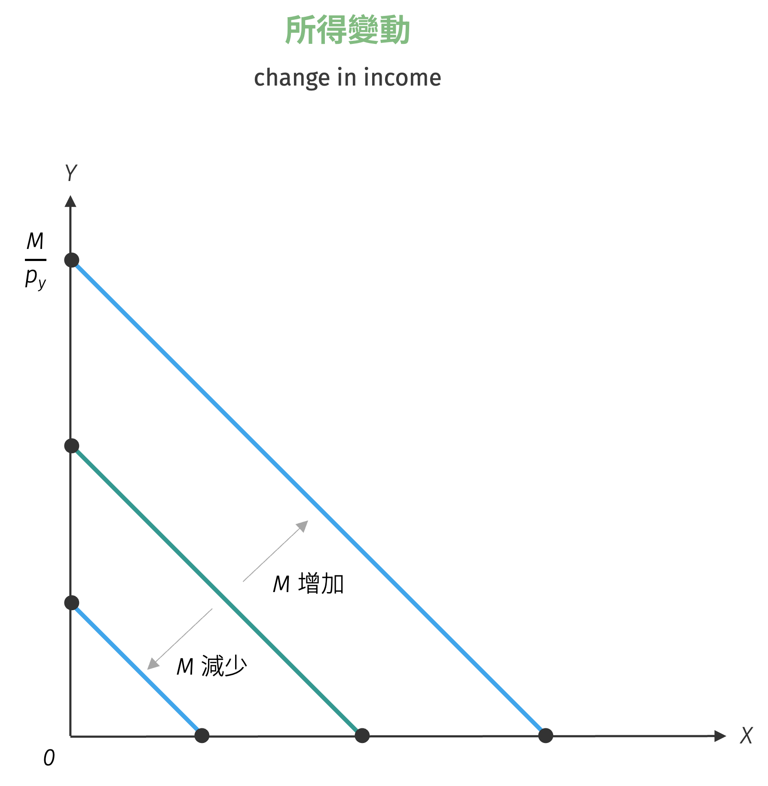

# 預算限制式

走進便利商店挑選飲料時，你心中可能同時浮現兩種聲音：一是對各式商品的渴望，二是對錢包厚度的現實考量。這個日常場景完美詮釋了經濟學的基本矛盾——無窮慾望與有限資源的對峙。預算限制式正是這種資源稀缺性的數學表達，它如同一條無形的繩索，將消費者的選擇空間框定在現實可行的範圍內。透過價格機制與所得水準的約束，**預算限制式** (budget contraint) 或稱為**消費可能曲線** (consumption possibility curve) 不僅決定了消費者的可購買商品組合，更深層地影響著整個市場的資源配置效率。

在分析消費者所面對的無異曲線時，是假設消費者主觀上對於特定商品組合之偏好程度，同條無異曲線上的商品組合皆代表消費者相同程度的滿足感。但在現實中，不同的消費者面對不同的商品價格與相同的所得，不同商品組合的消費支出恰巧會不同，表示並非所有的商品組合對消費者而言皆為預算限制式的概念，來表示消費者在既定商品價格與所得水準下，有能力購買的各種商品與消費組合即是預算限制式。

一般我們分析在消費者面對 $x$ 與 $y$ 兩商品其所有可能購買組合的方程式，以數學表達為
$$
p_x \cdot x + p_y \cdot y \leq M
$$
當然亦可推廣為多商品的分析，一般而言，在經濟學中為簡化分析，經常假設商品的狀況，其中一個為分析中所主要分析的商品，另一個則稱為合成商品 (composite good)，同學可將其視為是其他商品的加權組合。例如分析在 $N$ 種商品時則預算限制式為
$$
p_1 \cdot x_1 + p_2 \cdot x_2 + p_3 x_3 + \cdots + p_N x_N \leq M
$$
可簡化運算為
$$
p_1 \cdot x_1 + p_2 \cdot \left( x_2 + \frac{p_3}{p_2} x_3 + \cdots + \frac{p_N}{p_2} x_N \right) \leq M
$$
並且若設 $x_1 = x$，則 
$$
\left( x_2 + \frac{p_3}{p_2} x_3 + \cdots + \frac{p_N}{p_2} x_N \right) = y
$$
則 $N$ 種商品之預算限制式與兩商品之預算限制式其實相同。

利用兩商品的預算限制式，我們取等號 (支出等於所得，表示所得完全支出) 可將其轉換為
$$
y = \frac{M}{p_y} - \frac{p_x}{p_y} \cdot x
$$
此式如果劃在 $x$-$y$ 平面上，當消費者完全不消費 $y$ 商品時，$x$ 商品最多可消費 $\frac{M}{p_x}$ 數量，故 $x$ 軸截距為 $\frac{M}{p_x}$，同理當消費者完全不消費 $x$ 商品時，$y$ 商品最多可消費 $\frac{M}{p_y}$ 數量，$y$ 軸截距為 $\frac{M}{p_y}$。此一線性直線方程式的斜率為 $-\frac{p_x}{p_y}$，顯示出兩商品的相對價格比率。因此若預算限制式意涵表示兩商品之間的相對價格下跌，反之預算限制式變得更平坦。

{ width="350" }

利用簡單的代數運算，底下的過程可以輕易地說明預算限制式的斜率。原預算限制式 $p_x \cdot x + p_y \cdot y = M$，在所得及商品相對價格不變之下，消費者欲改變 $x$ 與 $y$ 之消費量，即 $x$ 消費變動 $\Delta x$ 單位，$y$ 消費變動 $\Delta y$ 單位，當然此處之 $\Delta x$ 與 $\Delta y$ 之正負號必為相反，即 $p_x \cdot (x + \Delta x) + p_y \cdot (y + \Delta y) = M$。利用後式減去前式，可得 $p_x \cdot \Delta x + p_y \cdot \Delta y = 0$，經過移項整理即得 $\frac{\Delta x}{\Delta y} = -\frac{p_y}{p_x}$。

預算限制式的斜率為 $-\frac{p_x}{p_y}$，其經濟意義在於，當消費者面對一定的所得及商品價格下消費 $x$ 與 $y$ 兩商品，若消費者為多購買一單位的 $x$ 商品，就必須放棄此斜率值的 $y$ 商品數量，這樣的觀念經濟學家通常稱為消費者消費某商品的**機會成本** (opportunity cost)。機會成本的概念簡單而言即為消費者消費某定商品所必須放棄的其他商品數量，我們會在以下章節中再詳細介紹。至此我們應可瞭解，無異曲線是描述消費者「主觀」的偏好，而預算限制式則是說明了消費者在市場上「客觀」的商品選擇條件。

## 預算限制變動

瞭解了預算限制式的意義後，接著我們來看預算限制式的變動。當商品價格或消費者所得變動後，消費者所能夠購買的商品組合亦應該有所變動，或者預算集合會有所變動。底下我們分列出各種變動狀況分析

### 特定商品價格變動

當消費者的所得及 $y$ 商品價格不變下，$x$ 商品的價格由 $p_x^0$ 下跌至 $p_x^1$，則此時消費者所能購買的最大 $y$ 商品數量 (縱軸截距) 不受影響，但是 $x$ 商品的最大購買量會增加，亦即 $x$ 商品價格下跌會導致預算限制式向外旋轉，使得預算集合擴大，並導致預算限制式斜率變得更加平坦。

{ width="350" }

### 所得變動或商品相對價格同方向同比例變動

當商品價格不變而消費者的所得由 M 增加為 $M'$ 時，則 $x$ 軸的截距變為 $\frac{M'}{p_x}$，$y$ 軸的截距變為 $\frac{M'}{p_y}$，但因為商品價格不變，所以預算限制式斜率會整條平行外移。反之，當商品價格不變而消費者的所得減少，則預算限制式會整條平行內移。圖形如下：

{ width="350" }

當消費者所得不變，預算限制式仍然有可能平行外移，例如當 $x$ 與 $y$ 商品價格同時下跌同一比例，即預算限制式會平行外移，又或者 $x$ 與 $y$ 商品價格同時上漲同一比例，則預算限制式會平行內移。

當消費者所得不變，預算限制式斜率必與原預算限制式的斜率相同。

### 限制消費數量

有時某些經濟事件會引起政府或生產者限制消費者對某特定商品的消費，例如戰時期的政府限制消費者對民生用品消費的數量，發生某些極端與民眾搶買現象水量，或生產者限制消費者每人限購 2 單位等。此時消費者面臨的預算限制式將如圖所示，若 $x$ 商品被限制最多僅能消費 $x_0$ 數量，則預算集合為深色所圍之區域。

{ width="350" }

存在消費量的限制式時，預算限制式表達為
$$
p_x \cdot x + p_y \cdot y = M, \quad x \leq x_{0}
$$

### 對特定商品課稅

當政府欲對特定商品課稅，以抑制消費者之消費量，可以對商品採從量稅或從價稅。

若對 $x$ 商品採從量稅，將使得 $x$ 商品價格由 $p_x$ 上升至 $(p_x + t)$，此處的 $t$ 可以假設為單位稅額完全前轉由消費者負擔或部分前轉後價格提升的幅度。此舉會使 $x$ 與 $y$ 量商品的相對價格由 $\frac{p_{x}}{p_{y}}$ 提高至 $\frac{p_{x} + t}{p_{y}}$。

若對 $x$ 商品採從價稅，$x$ 商品價格則會由 $p_x$ 上升至 $p_x (1 + t\%)$，則 $x$ 與 $y$ 量商品的相對價格將由 $\frac{p_{x}}{p_{y}}$ 提高至 $\frac{p_x (1 + t\%)}{p_{y}}$。

因此由上述簡單推導可知，無論課徵從量稅或從價稅，皆會使預算限制式變得更陡峭，如下圖所示：

{ width="350" }

對於商品的課稅也可以修改為消費數量超過 $x_0$ 後才課稅，此時預算限制式就變成分段函數：

$$
\begin{cases}
p_x^0 \cdot x + p_y^0 \cdot y = M, \quad x \leq x_0\\
p_x^1 \cdot (x - x_0) + p_y^0 \cdot y = M - p_x^0 \cdot x_0, \quad x > x_0
\end{cases}
$$

圖形如下所示：

{ width="350" }

### 對特定商品補貼

對特定商品補貼與課稅相似，只是將稅額改為補貼額，圖形與結論皆為相反，請自行證明與繪圖。

### 商品數量補貼

商品數量補貼 (subsidy in-kind) 是指，消費者可免費直接獲得一定數量的特定商品的補貼，但不是金錢上價格上的優惠，因此消費者面對的商品價格皆不變。在這些免費補助商品不得轉售的情況下，如果消費者的所得完全花費在 $x$ 商品上，除可消費 $\frac{M}{p_x}$ 數量的 $x$ 商品外，另可額外獲得消費 $x_0$ 數量的 $x$ 商品，因此最多可消費 $\left( \frac{M}{p_x} + x_0 \right)$ 數量之 $x$ 商品，如圖中之 C 點。若消費者將所得完全花費在 $y$ 商品上，則除可消費 $\frac{M}{p_y}$ 外，亦可額外消費 $x_0$ 數量的 $x$ 商品，如圖中 A 點可右移至 B 點，因此我們可以說當消費者獲得 $x_0$ 數量的 $x$ 商品實物補貼後，會使得原來的預算限制式整個往右移，至於 $\overline{AB}$ 線段的部分，在假設消費者可**自由拋棄** (free disposal) 任何所獲致的 $x_0$ 數量下即會成立。

{ width="350" }

當商品補貼的商品在可以**全額轉售** (resale) 的情形下，則消費者可以將 $\overline{AB}$ 線段的 $x$ 商品轉售後再以 $\frac{p_x}{p_y}$ 的相對價格來消費 $y$ 商品，此時的預算限制式將由 $\overline{ABC}$ 線段轉為 $\overline{DBC}$ 線段，此時與所得增加對預算限制式的影響相同。圖形如下：

{ width="350" }

## 標準商品

當消費者的所得及所有商品價格皆變動同一倍數或比率，則其預算限制式在圖形上的圖樣不受影響，例如當所得與所有商品價格皆變動 $\lambda$ 倍，即新的預算限制式為
$$
(\lambda p_x) \cdot x + (\lambda p_y) \cdot y = (\lambda M)
$$

此式與原預算限制式 $p_x \cdot x + p_y \cdot y = M$ 在商品絕對價格與絕對所得而言有所不同，但就相對價格與相對所得而言則相同。令 $\lambda = \frac{1}{p_y}$，則預算限制式可寫為

$$
\dfrac{p_x}{p_y} \cdot x + 1 \cdot y = \frac{M}{p_y}
$$

假設 $\frac{p_x}{p_y} = \hat{p}_x$，$\frac{M}{p_y} = \hat{M}$，則此新的預算限制式即為
$$
\hat{p}_x \cdot x + 1 \cdot y = \hat{M}
$$

顯見 $y$ 商品相對價格現為單位元，此時的 $y$ 商品被稱為**標準商品** (numeraire)。標準商品可定義為將市場所有商品相對價格與消費者之所得，利用一比例與方向進行標準化後，將其中一商品的相對價格轉化為單位元。