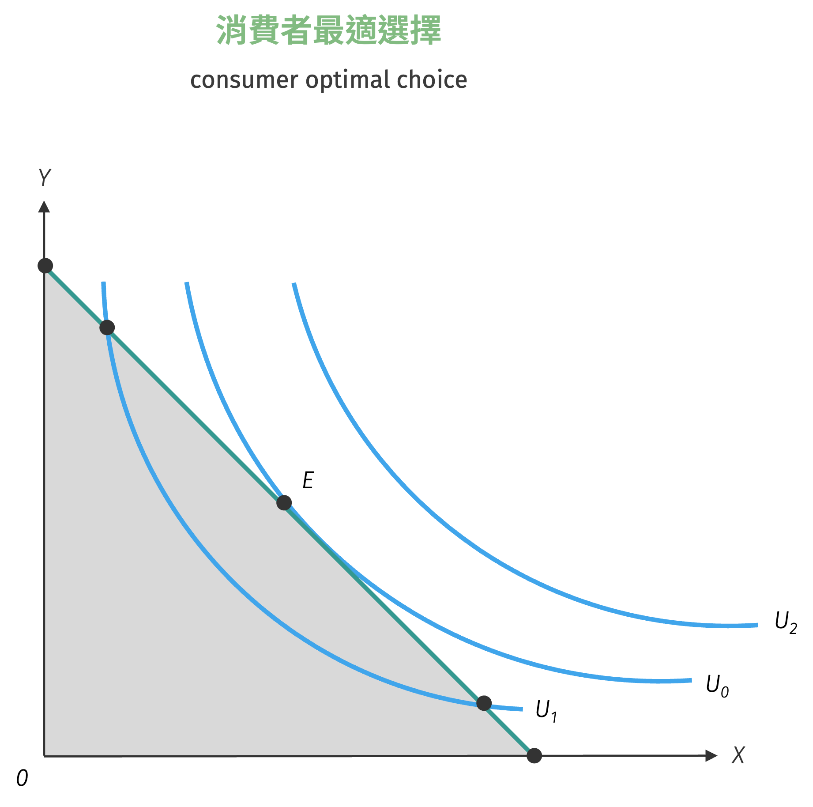
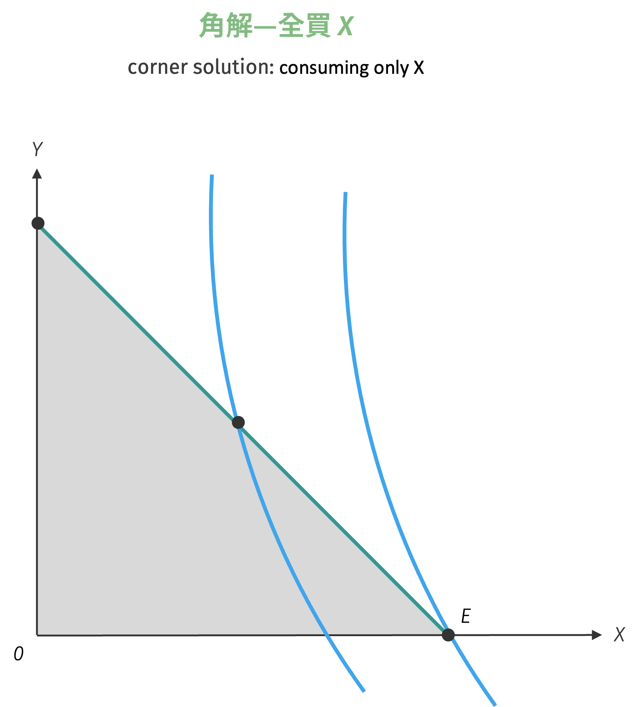
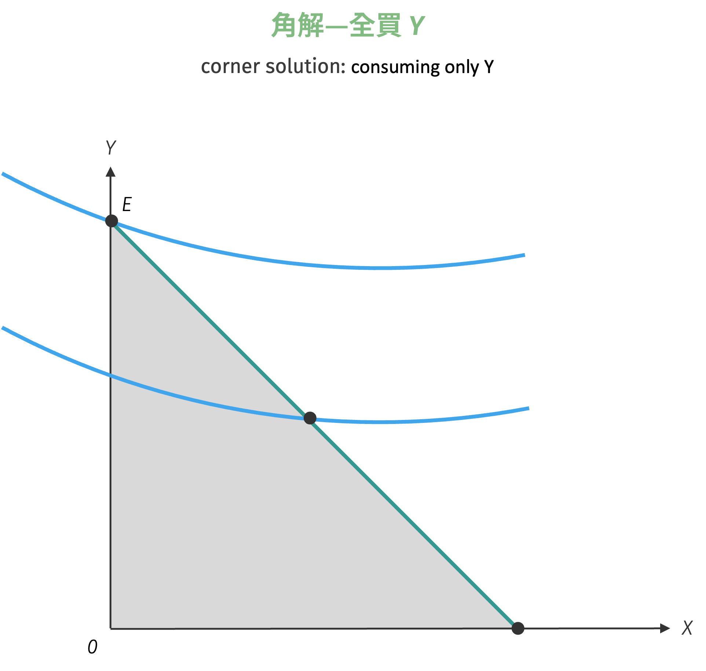
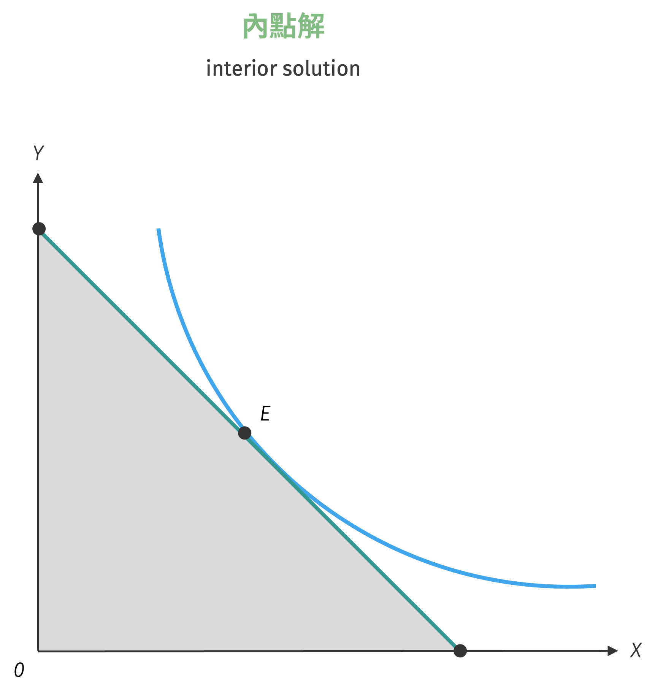

# 消費者最適選擇

當消費者手握有限的預算，面對商品架上琳瑯滿目的選擇時，如何在預算限制下做出最理性的決策？這個問題的核心在於找到無差異曲線與預算限制線的最適切點。在經濟學中，消費者最適選擇問題可視為一個約束最適化問題：在預算限制的約束條件下，尋求效用函數的最大值。
這個看似抽象的數學問題，實際上精確地刻畫了日常生活中每一次消費決策的理性邏輯。透過拉格朗日乘數法等數學工具，我們能夠將主觀的消費偏好與客觀的市場約束整合為一套完整的分析框架，不僅能夠預測消費者行為，更能深入理解價格機制如何引導資源的有效配置。

## 最適化問題

消費者最適選擇問題的本質是一個約束最適化問題，這類問題在經濟學分析中具有核心地位。消費者作為理性的經濟個體，必須在有限資源的約束下做出選擇，以實現其效用的最大化。

設消費者的效用函數為 $U(x, y)$，捕捉了消費者對不同商品組合的偏好排序。消費者面臨預算限制 $p_x x + p_y y = M$，其中 $p_x$、$p_y$ 分別為商品 $x$、$y$ 的市場價格，$M$ 為消費者的名目所得。
消費者的決策目標是在既定的預算限制下，選擇最適的商品組合 $(x^*, y^*)$ 以最大化其效用水準。此過程涉及在可行集合中尋找最優解，其中可行集合由預算限制和非負約束條件共同定義。非負約束條件 $x \geq 0, y \geq 0$ 反映了現實中消費數量不能為負數的物理限制。

從數學角度而言，此最適化問題可以形式化表述為：

$$
\begin{aligned}
\max_{x,y} \quad & U(x, y)\\
\text{s.t.} \quad & p_x x + p_y y = M\\
& x \geq 0, y \geq 0
\end{aligned}
$$

## 圖解分析

從圖形角度來看，消費者最適選擇問題可以透過無差異曲線與預算限制線的幾何關係來直觀理解。這種圖解方法不僅提供了數學解的視覺化呈現，更重要的是揭示了最適化條件背後的經濟直觀。

消費者的最適選擇通常出現在無差異曲線與預算限制線的切點。在此切點處，兩條曲線具有相同的斜率，這意味著無差異曲線的斜率等於預算限制線的斜率。數學上，這個條件可以表述為：

$$
MRS_{xy} = \frac{p_x}{p_y}
$$

{ width="350" }

此切點條件具有深刻的經濟含義：邊際替代率 $MRS_{xy}$ 反映了消費者的**主觀評價**：為了多獲得一單位商品 $x$，消費者願意放棄多少單位的商品 $y$，同時保持效用水準不變。而價格比 $\frac{p_x}{p_y}$ 則反映了市場的**客觀交換比例**：在市場上用一單位商品 $x$ 可以換取多少單位商品 $y$。
換言之，消費者在最適點處，其主觀的商品替代率 (邊際替代率) 必須等於市場的客觀替代率 (價格比) 。若此條件不滿足，消費者可透過調整商品組合來提高效用水準。

當 $MRS_{xy} = \frac{p_x}{p_y}$ 時，消費者的主觀評價與市場的客觀交換比例達成一致，此時已無法透過調整消費組合來進一步提升效用。若這個等式不成立，消費者就有動機改變其消費組合：

- **當 $MRS_{xy} > \frac{p_x}{p_y}$ 時**：消費者對商品 $x$ 的主觀評價高於市場價格，應該增加 $x$ 的消費，減少 $y$ 的消費
- **當 $MRS_{xy} < \frac{p_x}{p_y}$ 時**：消費者對商品 $x$ 的主觀評價低於市場價格，應該減少 $x$ 的消費，增加 $y$ 的消費

綜上，從圖形上觀之，最適點必須滿足以下條件：

- **可行性條件**：該點必須位於或內於預算限制線所界定的可行集合內
- **最適性條件**：在所有可行點中，該點必須位於最高的無差異曲線上
- **切點條件**：當最適解為內點解時，無差異曲線與預算線必須相切

值得注意的是，切點條件僅適用於內點解的情況。當最適解出現在預算線的端點時 (即消費者完全不消費某種商品) ，我們得到的是邊界解，此時切點條件不再適用。

### 邊界解的情形

當最適解出現在預算線的端點時 (即 $x^* = 0$ 或 $y^* = 0$) ，稱為**邊界解** (corner solution) 或**角解**。此時 $MRS_{xy} \neq \frac{p_x}{p_y}$，消費者完全不消費其中一種商品。邊界解通常出現在：

=== "角解—全買 X"
    { width="350" }

=== "角解—全買 Y"
    { width="350" }

邊界解通常出現在以下情況：

- **商品間替代性很高的情況 (如完全替代品) **：當兩種商品可以完全相互替代時，消費者會根據相對價格選擇成本較低的商品。若 $\frac{MU_x}{MU_y} > \frac{p_x}{p_y}$，消費者會全部購買商品 $x$；反之則全部購買商品 $y$。完全替代型效用函數是這種情況的典型例子。

- **某商品價格相對過高**：即使兩商品具有一定的互補性，當其中一種商品的價格過於昂貴時，消費者可能會選擇完全放棄該商品。這種情況在奢侈品市場中較為常見，例如當珠寶價格過高時，一般消費者可能完全不購買珠寶，而將所得全部用於其他必需品。

- **消費者對某商品的偏好極低**：某些商品可能與消費者的個人偏好、文化背景或價值觀不符，導致消費者對該商品的邊際效用極低。在這種情況下，即使價格不高，消費者仍可能選擇完全不消費該商品。

### 內點解的條件

當最適解滿足 $x^* > 0$ 且 $y^* > 0$ 時，稱為**內點解** (interior solution)。內點解的一階必要條件為：

$$
\begin{aligned}
\dfrac{\partial U}{\partial x} &= \lambda p_x\\
\dfrac{\partial U}{\partial y} &= \lambda p_y\\
p_x x + p_y y &= M
\end{aligned}
$$

其中 $\lambda > 0$ 為拉格朗日乘數，具有重要的經濟意義：它表示額外一單位所得能帶來的邊際效用增加量，即**所得的邊際效用** (marginal utility of income)。

由前兩個條件可得：

$$
\dfrac{\dfrac{\partial U}{\partial x}}{\dfrac{\partial U}{\partial y}} = \dfrac{MU_x}{MU_y} = MRS_{xy} = \dfrac{p_x}{p_y}
$$

{ width="350" }

內點解的另一個重要特徵是其對參數變化的敏感性。與邊界解不同，內點解通常對價格和所得的小幅變化都會產生連續的反應。
從政策分析的角度來看，內點解的消費者通常對價格變化更敏感，因為他們同時購買多種商品，價格變化會透過替代效應和所得效應同時影響其消費決策。

## 拉格朗日乘數法

**拉格朗日乘數法** (Lagrangian 乘數法) 是解決約束最適化問題的標準數學工具。對於消費者選擇問題，我們構造拉格朗日函數：

$$
\mathcal{L}(x, y, \lambda) = U(x, y) - \lambda(p_x x + p_y y - M)
$$

其中 $\lambda$ 為拉格朗日乘數，代表約束條件的**影子價格** (shadow price)。

#### 一階條件 (First-Order Conditions, FOCs)

對拉格朗日函數分別對 $x$、$y$ 和 $\lambda$ 求偏微分並令其等於零：

$$
\begin{aligned}
\dfrac{\partial \mathcal{L}}{\partial x} &= \dfrac{\partial U}{\partial x} - \lambda p_x = 0 \quad \Rightarrow \quad MU_x = \lambda p_x\\\\
\dfrac{\partial \mathcal{L}}{\partial y} &= \dfrac{\partial U}{\partial y} - \lambda p_y = 0 \quad \Rightarrow \quad MU_y = \lambda p_y\\\\
\dfrac{\partial \mathcal{L}}{\partial \lambda} &= -(p_x x + p_y y - M) = 0 \quad \Rightarrow \quad p_x x + p_y y = M
\end{aligned}
$$

從前兩個條件可以得到：

$$
\dfrac{MU_x}{p_x} = \dfrac{MU_y}{p_y} = \lambda
$$

這個條件被稱為**等邊際原理** (equimarginal principle)：在最適選擇下，消費者花在每種商品上的最後一元錢所帶來的邊際效用必須相等。若此條件不滿足，消費者可透過重新分配支出來提高總效用。

### 二階條件 (Second-Order Conditions, SOCs)

為確保求得的是最大值而非最小值，必須檢驗二階條件。二階條件是約束最適化問題中的關鍵步驟，因為一階條件只能確保我們找到了駐點 (stationary point) ，但無法保證該駐點是最大值、最小值還是鞍點 (saddle point) 。

在約束最適化問題中，我們需要使用**有界 Hessian 矩陣** (bordered Hessian matrix) 來檢驗二階條件。對於消費者選擇問題，有界 Hessian 矩陣的構造如下：

$$
\bar{H} = \begin{bmatrix}
0 & -p_x & -p_y \\\\
-p_x & U_{xx} & U_{xy}\\\\
-p_y & U_{yx} & U_{yy}
\end{bmatrix}
$$

其中：

- **左上角的零**：反映了約束條件本身不含二階項
- **第一行和第一列的價格項**：來自預算約束的係數 $-p_x$ 和 $-p_y$
- **右下角的 $2 \times 2$ 子矩陣**：包含效用函數的所有二階偏微分，即無約束 Hessian 矩陣

為了確保最適解是最大值，我們需要檢驗有界 Hessian 矩陣的**行列式** (determinant) 的符號。對於最大化問題，二階條件要求： $\det(\bar{H}) < 0$。逐步計算這個行列式，使用第一行展開，可得到：

$$
\begin{aligned}
\det(\bar{H}) &= 0 \cdot \begin{vmatrix} U_{xx} & U_{xy} \\ U_{yx} & U_{yy} \end{vmatrix} - (-p_x) \cdot \begin{vmatrix} -p_x & U_{xy} \\\\
-p_y & U_{yy} \end{vmatrix} + (-p_y) \cdot \begin{vmatrix} -p_x & U_{xx} \\ -p_y & U_{yx} \end{vmatrix}\\\\
&= p_x(-p_x U_{yy} + p_y U_{xy}) - p_y(-p_x U_{yx} + p_y U_{xx})\\\\
&= -p_x^2 U_{yy} + p_x p_y U_{xy} + p_x p_y U_{yx} - p_y^2 U_{xx}
\end{aligned}
$$

利用 Young's theorem ($U_{xy} = U_{yx}$) ，得到：

$$
\det(\bar{H}) = -p_x^2 U_{yy} - p_y^2 U_{xx} + 2p_x p_y U_{xy}
$$

因此，二階條件要求：

$$
-p_x^2 U_{yy} - p_y^2 U_{xx} + 2p_x p_y U_{xy} < 0
$$

重新整理可得更直觀的形式為：

$$
p_x^2 U_{yy} + p_y^2 U_{xx} - 2p_x p_y U_{xy} > 0
$$

#### 二階條件的經濟意義

注意到上述不等式可以寫成：
$$
\begin{bmatrix} p_x & p_y \end{bmatrix} \begin{bmatrix} U_{xx} & U_{xy} \\\\ U_{yx} & U_{yy} \end{bmatrix} \begin{bmatrix} p_x \\\\ p_y \end{bmatrix} > 0
$$
代表無約束 Hessian 矩陣 
$$
H_U = \begin{bmatrix} U_{xx} & U_{xy} \\\\ U_{yx} & U_{yy} \end{bmatrix}
$$
在價格向量 $(p_x, p_y)$ 方向上必為**正定** (positive definite)。從經濟角度來看，此條件確保了以下幾點非常重要的性質：

1. **無差異曲線的凸性**：確保無差異曲線向原點凸出，這與邊際替代率遞減的假設一致

2. **效用函數的凹性限制**：雖然不要求效用函數全域凹 (globally concave)，但要求其在最適點附近沿預算約束方向具有適當的曲率

3. **穩定性條件**：保證小幅價格變動不會導致最適點發生劇烈跳躍

#### 檢驗二階條件的實際步驟

1. **計算效用函數的二階偏微分**：$U_{xx}$、$U_{yy}$、$U_{xy} = U_{yx}$

2. **將最適解代入**：將從一階條件求得的 $(x^*, y^*)$ 代入上述二階偏微分

3. **計算判別式**：計算 $p_x^2 U_{yy} + p_y^2 U_{xx} - 2p_x p_y U_{xy}$ 的值

4. **檢查符號**：若結果大於零，則二階條件滿足；若小於等於零，則需要進一步分析

#### 二階條件失效的情況

當二階條件不滿足時，可能出現以下情況：

- **鞍點**：駐點既不是最大值也不是最小值
- **邊界解**：真正的最大值可能出現在可行集合的邊界上
- **多重均衡**：存在多個局部最大值

在這些情況下，需要採用其他方法 (如比較各候選點的目標函數值) 來確定真正的最適解。

### 拉格朗日乘數的經濟意義

拉格朗日乘數 $\lambda$ 的經濟意義如下：

- **邊際效用價值**：$\lambda = \frac{MU_x}{p_x} = \frac{MU_y}{p_y}$ 表示額外一單位所得的邊際效用
- **影子價格**：反映預算限制的緊峭程度
- **效用函數的量綱**：當效用函數乘以常數 $k$ 時，$\lambda$ 也會乘以 $k$

!!! note "影子價格"
    **影子價格** (shadow price) 反映了放寬預算約束對消費者福利的邊際改善。

    $$
    \frac{\partial U^*}{\partial M} = \lambda
    $$

    其中 $U^*$ 是最適化問題的最大效用值。這意味著如果消費者的所得增加一個微小單位，其最大可達成的效用水準將增加 $\lambda$ 單位。從政策分析角度來看，$\lambda$ 的大小反映了預算約束的「緊峭程度」：

    - **$\lambda$ 值較大**：表示額外的一元錢對消費者來說價值很高，預算約束較緊
    - **$\lambda$ 值較小**：表示額外的一元錢對消費者的改善有限，預算約束相對寬鬆

拉格朗日乘數 $\lambda$ 其實不只是數學解題時的技巧，在經濟學裡它有更貼近直覺的用法。它告訴我們，在資源有限的情況下，消費者怎麼分配才算「最划算」。同時，它也常被拿來分析福利和政策影響。簡單說，$\lambda$ 就像是一個翻譯器，把效用最大化這種很抽象的理論，轉換成我們在市場裡能觀察到的行為，讓理論跟現實之間有了更清楚的連結。

!!! example "不同效用函數下的最適選擇"
    設消費者面臨預算限制 $p_{x}x + p_{y}y = M$，求以下四種效用函數下的最適消費組合：

    1. 完全替代型效用函數：$U(x, y) = ax + by$
    2. 完全互補型效用函數：$U(x, y) = \min\{ax, by\}$
    3. Cobb-Douglas 效用函數：$U(x, y) = Ax^{\alpha} y^{\beta}$
    4. 準線性效用函數：$U(x, y) = \ln x + y$

    **【解】**

    1. 最適化問題可以表達為以下形式
    $$
    \begin{aligned}
    \max\;& U(x, y) = ax + by\\\\
    \text{s.t.}\;& p_{x}x + p_{y}y = M
    \end{aligned}
    $$
    完全替代型效用函數的無異曲線為線性形式，因此消費者最適選擇與無異曲線之邊際替代率大小有關。

        - 若 $MRS_{xy} > \frac{p_x}{p_y}$，則消費者最適組合為 $(x^{*}, y^{*}) = (\frac{M}{p_{x}}, 0)$
        - 若 $MRS_{xy} < \frac{p_x}{p_y}$，則消費者最適組合為 $(x^{*}, y^{*}) = (0, \frac{M}{p_{y}})$
        - 若 $MRS_{xy} = \frac{p_x}{p_y}$，隱含無異曲線與預算限制式重疊，因此預算限制式上任何一點均可能是消費者的最適選擇，但消費者僅能選擇其中一點，因此表達最適選擇為

        $$
        \{(x^{*}, y^{*})\} = \{p_{x}x + p_{y}y = M\}
        $$

    2. 最適化問題可以表達為以下形式：
        $$
        \begin{aligned}
        \max\;& U(x, y) = \min\\{ax, by\\}\\\\
        \text{s.t.}\;& p_{x}x + p_{y}y = M
        \end{aligned}
        $$
        從圖形來看，完全互補型效用函數之消費者最適選擇如圖中 $E$ 點所示，位於預算限制式與商品消費固定比例射線上，亦即求解以下聯立：
        $$
        \begin{cases}
        ax = by\\\\
        p_{x}x + p_{y}y = M
        \end{cases}
        $$
        由上式得 $y = \frac{a}{b}x$，代入預算限制式，可得
        $$
        p_{x}x + p_{y} \cdot \dfrac{a}{b}x = M
        $$
        求解後可得 $x$ 與 $y$ 兩商品之需求函數為

        $$
        x^{*} = \dfrac{bM}{bp_{x} + ap_{y}}, \quad y^{*} = \dfrac{aM}{bp_{x} + ap_{y}}
        $$

    3. 最適化問題可以表達為以下形式：

        $$
        \begin{aligned}
        \max\;& U(x, y) = Ax^{\alpha} y^{\beta}\\\\
        \text{s.t.}\;& p_{x}x + p_{y}y = M
        \end{aligned}
        $$
        
        由邊際替代率
        $$
        MRS_{xy} = \dfrac{\alpha}{\beta} \cdot \dfrac{y}{x} = \dfrac{p_{x}}{p_{y}}
        $$
        整理後可得：
        $$
        \dfrac{y}{x} = \dfrac{\beta}{\alpha} \cdot \dfrac{p_{x}}{p_{y}} \cdot x
        $$
        代入預算限制式後可得
        $$
        p_{x}x + p_{y} \cdot \left(\dfrac{\beta}{\alpha} \cdot \dfrac{p_{x}}{p_{y}} \cdot x\right) = M
        $$
        求解後可得 $x$ 與 $y$ 兩商品之需求函數為

        $$
        x^{*} = \dfrac{\alpha}{\alpha + \beta} \cdot \dfrac{M}{p_{x}}, \quad y^{*} = \dfrac{\beta}{\alpha + \beta} \cdot \dfrac{M}{p_{y}}
        $$

    4. 最適化問題可以表達為以下形式：
        $$
        \begin{aligned}
        \max\;& U(x, y) = \ln x + y\\\\
        \text{s.t.}\;& p_{x}x + p_{y}y = M
        \end{aligned}
        $$
        由邊際替代率
        $$
        MRS_{xy} = \frac{1}{x} = \dfrac{p_{x}}{p_{y}}
        $$
        即可立刻求得 $x$ 與 $y$ 商品的最適需求量為：

        $$
        x^{*} = \dfrac{p_{y}}{p_{x}}, \quad y^{*} = \dfrac{M}{p_{y}} - 1
        $$

        但必須滿足 $\frac{M}{p_{y}} > 1$ 的條件。因此
        
        - 若 $\frac{M}{p_{y}} > 1$ 成立，則 $(x^{*}, y^{*}) = (\frac{p_{y}}{p_{x}}, \frac{M}{p_{y}} - 1)$。
        - 若 $\frac{M}{p_{y}} \leq 1$ 成立，則 $(x^{*}, y^{*}) = (\frac{M}{p_{x}}, 0)$。