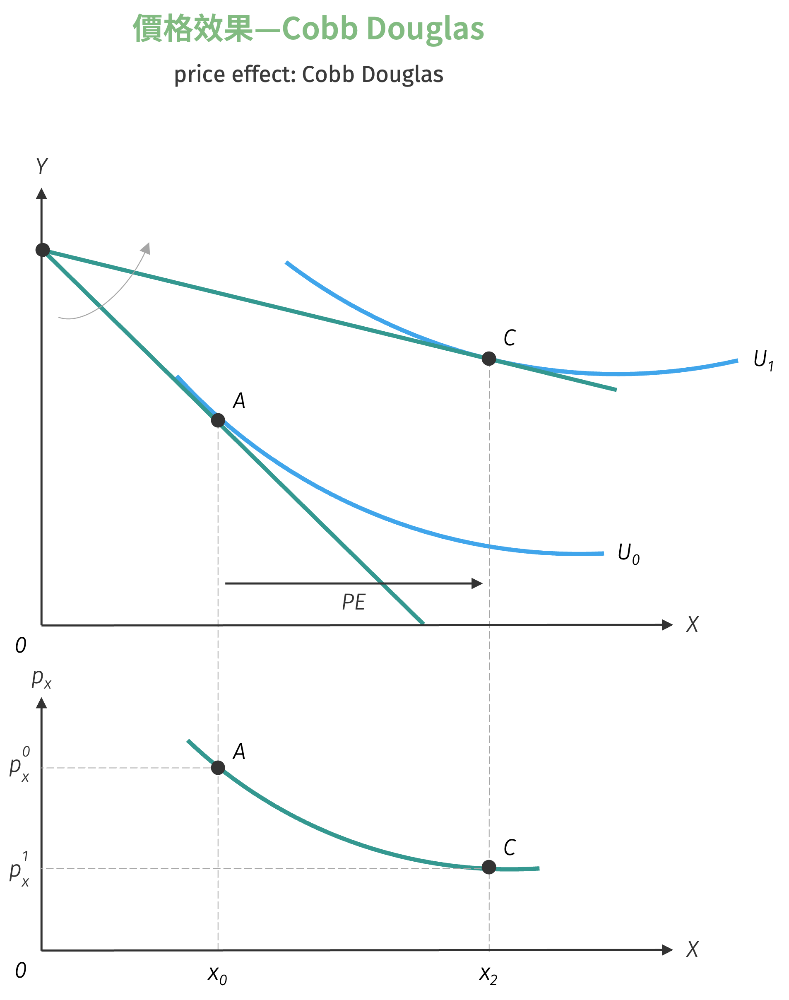

# 分解價格效果

當百貨公司特定專櫃化妝品價格下跌後，會發現每位消費者對此價格變動反應不一：有些消費者會大量增加消費數量，有些則會增加購買量但增幅有限，而有些無動於衷，維持與過往相同的消費量。

造成上述消費者購買行為的差異主要原因為何？此種當商品改變後始消費者消費數量改變的效果稱為價格效果，因此本節目的即是分解價格效果，分析是因為何種深層原因使得不同消費者面對價格變動時，呈現不同的消費行為。

## 價格效果

!!! note "價格效果"
    **價格效果** (price effect) 係指在其他條件不變之下，特定商品的價格變動對此商品需求量變動的效果。

繪製價格效果之方式，以 $x$ 商品為例，給定消費者偏好的無異曲線 (假設符合無異曲線所有良好的假設) 與其面對的預算限制式，以及價格變動的幅度，記變動前為 $p_{x}^{0}$，變動後為 $p_{x}^{1}$。在價格變動後，預算限制式會旋轉，並與無異曲線相切，得到 $x$ 在價格變動前後的最適需求量，記作 $x_{0}$ 與 $x_{2}$，則 $\Delta x = x_{2} - x_{0}$ 即為價格效果。
接著在 $x$-$y$ 平面下方繪製價量平面，橫軸為 $x$、縱軸為 $p_{x}$，將上述步驟得到的價量組合繪製在平面上並連線，即可推導出 $x$ 的需求曲線。

{ width="350" }

### 價格效果與需求曲線範例

根據分解價格效果的步驟與繪製需求曲線的方法，以下就常見的偏好型態作為範例。

首先為完全替代型偏好，當 $x$ 商品價格高於 $p_x^0$，如上方預算限制式為 AB 線段時，當預算限制線 $x$ 商品價格逐漸下跌後，當預算限制線與消費者最適選擇下之 $x$ 消費量為 0，隨著 $x$ 商品價格逐漸下跌後，亦即 $x$ 商品價格為 $p_x^0$ 時，$x$ 之最適消費數與 $U_0$ 效用水準之無異曲線重疊時，開始消費者的選擇，因此此時 $x$ 商品的消費量可能是預算限制式上任何一點，開始消費者的選擇，因此此時 $x$ 商品需求量隨價格數量可能由 0 到 $\frac{M}{p_x^0}$，當 $x$ 商品價格下跌至小於 $p_x^0$ 時，則 $x$ 商品需求量隨價格下跌而增加，如無異曲線圖形所示，此時不論價格下跌至何種水準，消費者最適選擇皆為角解僅消費 $x$ 商品，故需求曲線呈現負斜率且漸進趨近於 $x$ 軸。

{ width="500" }

在上圖中的 B、C、E 點皆為角解僅買 $x$ 商品，表示 $x$ 商品的需求函數必為
$$
x = \frac{M}{p_x}
$$
低型態的需求函數滿足 $p_x \cdot x = M$ 亦即等軸雙曲線的型態。

接著是完全互補型偏好，完全互補型效用函數的消費者其最適均衡在兩商品模型中為：
$$
x^* = \dfrac{bM}{bp_x + ap_y}, \quad y^* = \dfrac{aM}{bp_x + ap_y}
$$
由
$$
\frac{\partial x^*}{\partial p_x} = \frac{-b^2M}{(bp_x + ap_y)^2} < 0
$$
顯見 $x$ 商品之需求函數符合需求法則 ($y$ 商品亦同)，可求算出 $x$ 商品之需求曲線的斜率值為
$$
\dfrac{\partial p_x}{\partial x} = \dfrac{(bp_x + ap_y)^2}{-b^2M} < 0
$$
如下圖所示 $x$ 商品的需求曲線為曲線型態。

{ width="400" }

!!! question "特殊的完全互補型偏好"
    給定效用函數為 $U(x_{1}, x_{2}) = \min\{x_{1}, x_{2}^{2}\}$，預算限制式為 $p_1 x_1 + p_2 x_2 = M$。

    1. 求出消費者最適選擇[^1]。
    2. 請在 $x_1$-$x_2$ 平面上繪製無異曲線。
    3. 假設 $x_{1}$ 價格下跌，設原本價格為 $p_{1}^{*}$，下跌後價格為 $p_{1}^{\prime}$。請在$x_1$-$x_2$ 平面上繪製價格效果。

最後則是 Cobb-Douglas。具有 Cobb-Douglas 效用函數的消費者其最適選擇在兩商品模型中分別為

$$
x^* = \dfrac{\alpha}{\alpha + \beta} \cdot \dfrac{M}{p_x}, \quad y^* = \dfrac{\beta}{\alpha + \beta} \cdot \dfrac{M}{p_y}
$$

其中

$$
\dfrac{\partial x^*}{\partial p_x} = \dfrac{\alpha}{\alpha + \beta} \cdot \dfrac{M}{p_x^2} < 0
$$

表示 $x$ 商品之需求函數符合需求法則且其斜率值為
$$
\dfrac{\partial p_x}{\partial x^*} = -\dfrac{\alpha + \beta}{\alpha} \cdot \dfrac{p_x^2}{M}
$$
另由 $\frac{\partial y^*}{\partial p_x} = 0$ 得知當 $x$ 商品價格下跌後，$x$ 商品的消費量增加但 $y$ 商品的消費量不受影響，如下圖中 A 點移至 C 點之情形。且由 $x$ 商品的需求函數，可得知會滿足
$$
p_x \cdot X = \frac{\alpha}{\alpha + \beta} \cdot M
$$
亦即總支出為所得的部分比例，當所得不變時，則此部分比例為常數，因此表示 $x$ 與 $y$ 商品的需求函數為等軸雙曲線的型態。

{ width="400" }

### 價格消費曲線

!!! note "價格消費曲線"
    在其他商品價格與消費者所得不變之下，消費者對於特定商品在各種不同的價格下，消費者最適消費選擇組合點的連線，稱之為**價格消費曲線** (price consumption curve, PCC)，又稱為**價格擴張曲線** (price expansion path) 或**價格提供曲線** (price offer curve)。

如下圖所示，隨著 $x$ 商品價格持續性的下跌，消費者最適選擇均衡點亦逐漸由 A 點過向 B 點及 C 點，因此價格消費曲線亦即上述價格效果的應用，故可由價格消費曲線來推導消費者對特定商品的需求曲線。一般而言價格消費曲線的出發點為縱軸上的 D 點，因為當 $x$ 商品價格過高時，消費者傾向完全不解偶消費 $y$ 商品。

{ width="350" }

由於價格消費曲線是表達外生變數 $p_x$ 變動對內生變數 $y$ 與 $x$ 的路徑軌跡，因此實際上價格消費曲線方程式看不到 $p_x$ 變數，只會看到 $y$ 與 $x$ 的相互變動關係，因此在一般存在有內解的無異曲線，價格消費曲線方程式會滿足以下兩式

- $MRS_{xy} = \frac{p_x}{p_y}$

- $p_x x + p_y y = M$

將上兩式整理過後，可得價格消費曲線方程式：
$$
y = \dfrac{M}{p_y} - MRS_{xy} \cdot x
$$

!!! note "價格消費曲線與方程式"
    寫出並繪製下列效用函數的價格消費方程式：

    1. $U(x,y) = x^{\alpha} \cdot y^{\beta}$
    2. $U(x,y) = \min\{ax, by\}$
    3. $U(x,y) = \sqrt{x} + y$
    4. $U(x,y) = \ln x + y$
    5. $U(x,y) = x + y$

## 所得效果

!!! note "所得效果"
    **所得效果** (income effect) 是指在商品相對價格不變之下，分析由於所得的變動，引起對特定商品需求量變動的影響效果。

原消費者最適選擇為 B 點，當消費者所得增加後，會使得預算限制式向外平行外移，從而擴大預算集合，因此消費者最適選擇將會由 $U_1$ 選擇至效用更高的 $U_2$ 消費，因而得到新的最適選擇點 C 點。原本需求量為 $x_1$，所得增加後為 $x_2$，所得效果為 $\Delta x = x_{2} - x_{1}$，記成 IE。

{ width="350" }

### 所得效果與恩格爾曲線

利用所得效果，可以推導出不同所得水準與需求量的曲線，即是在彈性一章提及過的恩格爾曲線。底下常見的偏好型態，計算恩格爾曲線斜率值非常簡單：給定商品的最適需求量，對所得微分後可得 $\frac{\partial x^{*}}{\partial M}$，將結果取倒數即可求得 $\frac{\partial M}{\partial x^{*}}$，此即恩格爾曲線的斜率值。

- 完全互補型：$x$ 商品為正常財，$x$ 商品之恩格爾曲線的斜率值為
  $$
  \frac{\partial M}{\partial x^*} = \frac{bp_x + ap_y}{b} > 0
  $$

- 準線性效用函數：$x$ 商品為所得中性財，$x$ 商品之恩格爾曲線的斜率值為 $0$。

- Cobb-Douglas 效用函數：$x$ 商品為正常財，恩格爾曲線的斜率值為
  $$
  \frac{\partial M}{\partial x^*} = \frac{\alpha + \beta}{\alpha} \cdot p_x > 0
  $$

!!! note "恩格爾法則"
    統計學家 Engel 調查家戶商品的消費支出所得之比例分析，將家庭所得區分為貧困、中產、富裕三個級距，並令食物支出占所得的比例為**恩格爾係數** (Engel coefficient)，可得到如下之結論。

    1. 隨所得水準提高，用於食物支出的比例會之減少，亦即恩格爾係數隨之下降，顯示食物的所得彈性小於一。

    2. 隨所得水準提高，用於衣、住等支出亦提高但維持固定比例，即恩格爾係數為常數，顯示衣、住等之所得彈性為一。

    3. 隨所得水準提高，用於育、樂、醫療等支出亦提高且比例亦之增加，亦即恩格爾係數隨所得增加而上升，顯示育、樂、醫療等之所得彈性大於一。

### 所得消費曲線

!!! note "所得消費曲線"
    消費者對於特定商品在各種不同的所得下，消費者最適選擇均衡點的連線，稱之為**所得消費曲線** (income consumption curve, ICC)，又稱為**所得擴張曲線** (income expansion path)。

如下圖所示，隨著所得持續增加，消費者最適選擇均衡點亦逐漸由 A 點過向 B 點及 C 點，因此所得消費曲線亦即前述所得效果的應用，故可由所得消費曲線來推導消費者對特定商品的恩格爾曲線。一般而言所得消費曲線的出發點為原點，表示當所得為零時，消費者對於 $x$ 與 $y$ 兩商品的最適選擇亦皆為零。當所得消費曲線為正斜率時，表示時，消費者對於 $x$ 與 $y$ 兩商品的最適選擇亦皆為零，若所得消費曲線為呈現負斜率的區段，則表示其中一種商品必為劣等財。

{ width="350" }

由於所得消費曲線是表達外生變數 $M$ 變動對內生變數 $y$ 與 $x$ 的路徑軌跡，因此實際上所得消費曲線方程式看不到 $M$ 變數，只會看到 $y$ 與 $x$ 的相互變動關係，因此在一般存在有內解的無異曲線，所得消費曲線方程式會滿足下式

$$
MRS_{xy} = \frac{p_x}{p_y}
$$

由上式經過整理即可得所得消費曲線方程式為
$$
y = f(x)
$$

上述的所得消費曲線方程式計算僅限於存在有內解的型態適用，如果是效用函數本身即不可微分，或會存在有角解的型態時，則有時利用 $M$ 變動的圖形即可得知所得消費曲線方程式。

## 替代效果

在討論替代效果之前，有必要對於名目所得與實質所得兩個名詞加以說明。

!!! note "名目所得與實質所得"
    **名目所得** (nominal income, $M$) 為以貨幣數值衡量之所得，而**實質所得** (real income) 則是名目所得除以物價水準後衡量實質購買力的所得，即 $\left(\frac{M}{P}\right)$。

!!! example "實質所得不變"
    假設小宋現在在台北上班月薪為 $M = \$10,000$，面對 $x$ 與 $y$ 兩商品可消費，$x$ 與 $y$ 兩商品在台北的價格分別為 $p_x = \$100$，$p_y = \$100$。
    若假定小宋的效用函數為 $U(x,y) = x^{\frac{1}{2}}y^{\frac{1}{2}}$。現在小宋在台北的最適選擇為 $(x^*, y^*) = (50, 50)$，如下圖中之 A 點 ($B_1$ 預算限制式)，此時小宋的效用水準為 $U = 50$ util。
    小宋的老闆有意將他調任 $x$、$y$ 商品物價分別為 $p_x = \$25$，$p_y = \$100$ 的高雄就職，且仍然給予相同的薪水，則小宋在高雄的最適選擇為 $(x^*, y^*) = (200, 50)$，小宋的效用水準會因此而提升至 $U = 100$ util，如下圖中的 C 點 ($B_2$ 預算限制式)。

    當小宋被調到高雄上班後，小宋的老闆覺得高雄的物價相對低於台北的物價，如果不減少名目所得而讓小宋維持以前在台北的效用水準，因此對老闆而言對在固定效用下求支出極小化問題，此模型為：

    $$
    \begin{cases}
    \min & 25x + 100y \\\\
    s.t & U = 50 = x^{\frac{1}{2}}y^{\frac{1}{2}}
    \end{cases}$$

    求解後得最適選擇為 $(x^*, y^*) = (100, 25)$，表示小宋以在高雄的商品物價水準而要能夠達到過去在台北的效用水準，消費 $(x^*, y^*) = (100, 25)$ 的商品組合將使得小宋的效用水準就與在台北相同。
    因此小宋的老闆現在只要支薪 $25 \times 100 + 100 \times 25 = \$5,000$，就可以讓小宋「實質」上在高雄 $5,000，如圖形中之 $B_1$ 預算限制式平行內移至 $B_3$ 預算限制式，此時在高雄面對較低之相對物價亦較低的名目所得，但效用水準不受影響，如圖形中之 A 與 B 點皆為維持實質所得不變。

    | 消費者最適選擇 | 名目所得 | 實質所得 |
    |--------------|----------|----------|
    | A 點至 C 點 | 不變 | 提升 |
    | A 點至 B 點 | 減少 | 不變 |
    | B 點至 C 點 | 增加 | 增加 |

有了名目所得與實質所得的概念後，即可說明替代效果在經濟學的意涵：

!!! note "替代效果"
    **替代效果** (substitution effect) 是指當商品相對價格變動後，為維持實質所得不變，而對消費者的名目所得加以扣除或補償，以維持在商品相對價格變動前之效用水準，進而衡量消費者會以相對價格較低商品來取代相對價格較高商品之需求量變動影響。

如下圖所示，設原預算限制式為 $B_0$ 線段，消費者最適選擇為 A 點之效用水準 $U_0$。當 $x$ 商品相對價格下跌後，會使得消費者的預算限制式虛轉右移至 $B_2$ 線段，新的消費者最適選擇為 C 點之效用水準 $U_1$，此時名目所得不變，但消費者的實質所得會因為預算集合擴大而增加，為使消費者在商品相對價格下跌後，仍然維持在先的 $U_0$ 效用水準，扣除補償變量後消費者之預算限制式將由較鬆弛的 $B_0$ 移至較平且之 $B_1$，顯示出 $x$ 商品相對價格下跌商品 (預算限制式由較傾斜的 $B_0$ 移至較平且之 $B_1$，顯示 $x$ 商品相對價格下跌或說 $y$ 商品相對價格上漲)，如圖形中的 A 點至 B 點，$x$ 商品消費數量增加而 $y$ 商品消費數量減少的過程，稱為替代效果，以圖形中之 SE 表達。

{ width="350" }

一般而言當不同消費者面對特定商品價格下跌時，有些會出現搶購的情形，而有些僅會較往常多買一些，而有些人則會減少其消費量。造成不同消費量改變的價格效果之差異，源自於替代效果與所得效果的組合不同，亦即消費者偏好的差異，導致兩種效果的強度不一樣。
底下將商品分為正常財、所得中性財、劣等財、獨立品與季芬財分述之，並假設 $x$ 商品價格下跌，價格效果均由 A 點至 C 點，其中包含：

- 替代效果：A 點至 B 點
- 所得效果：B 點至 C 點

此外，利用價格效果推導出的需求曲線稱為**Marshall 需求曲線** (Marshal demand curve)，以 $D_M$ 表示，此即一般的需求曲線。
而根據替代效果推導出的需求曲線稱為**受補償需求曲線** (compensated demand curve) 或稱為**Hicks 需求曲線** (Hicksian demand curve)。

### 正常財

替代效果疊加所得效果，增加商品相對價格下跌後的消費數量。

{ width="350" }

### 所得中性財

在此情況下，B 點至 C 點衡量的所得效果為 $0$，因此所得中性財的價格效果完全來自於替代效果。事實上，所得中性財可以理解為所得上升後也不會多消費該特定商品。

{ width="350" }

可以自行驗證準線性效用函數分解價格效果後，呈現出的圖形即為所得中性財。

### 劣等財

根據劣等財的定義：當所得上升後，反而會減少特定商品的消費數量。因此在下圖中，實質所得增加後，消費量卻減少了。此時替代效果強於反向的所得效果，因此價格效果仍會推升 $x$ 商品的消費數量。

{ width="350" }

### 獨立品

所謂**獨立品** (independent goods) 係針對商品本身價格獨立，而非兩商品之間的獨立。由下圖可知，此時替代效果與反向的所得效果會相互抵銷，從而造成衡量的價格效果為 $0$。

{ width="350" }

### 季芬財

**季芬財** (Giffen goods) 即是描述當商品價格變動時，需求量也會同向變動，明顯違反需求法則。究其原因，即是因為實質所得變動後，消費者大幅減少消費量，強過於替代效果，引申出的價格效果造成商品的消費數量減少。

{ width="350" }

由上圖即可得知，一般需求曲線已明顯違反需求法則，但受補償需求曲線仍為負斜率。此外，比較劣等財與季芬財，可以得出以下結論：**劣等財不一定為季芬財，但季芬財必為劣等財**。

!!! note "Slutsky 方程式"
    **Slutsky 方程式** (Slutsky equation) 係用於描述替代效果與所得效果之合併對價格效果的影響，用數學式表達為：

    $$
    \dfrac{\partial x}{\partial p_x} = \dfrac{\partial x}{\partial p_x}\Biggr|_{U=U_0}^{\text{SE}} + \dfrac{\partial x}{\partial p_x}\Biggr|^{\text{IE}} = \underbrace{\dfrac{\partial x}{\partial p_x}\Biggr|_{U=U_0}}_{\text{替代效果}} \underbrace{- x \cdot \dfrac{\partial x}{\partial M}}_{\text{所得效果}}
    $$

    | 商品項目 | 價格效果 | 替代效果 | 所得效果 |
    |----------|----------------------------------|---------------------------------------------|------------------------------------------------|
    | 正常財 | $-$ | $-$ | $-$ |
    | 所得中性財 | $-$ | $-$ | $0$ |
    | 劣等財 | $-$ | $-$ | $+$ |
    | 獨立品 | $0$ | $-$ | $+$ |
    | 季芬財 | $+$ | $-$ | $+$ |

由上述分析可知，在無異曲線呈現凸向原點的條件下，分析 $x$ 商品價格下跌後的替代效果必定造成 $x$ 商品的消費數量增加，且此結論不因商品的性質而異；所得效果則會因為商品性質而呈現不同的幅度。
直觀來說，替代效果與所得效果可以這樣理解：

- 替代效果：用較便宜替代較貴的
- 所得效果：物價降低，消費者實質所得提升

!!! question "價格效果"
    給定效用函數為 $U(x, y) = xy$，預算限制式為 $p_x x + p_y y = M$。請求算：

    1. $x$ 商品的 Marshall 需求曲線與需求彈性
    2. $x$ 商品的 Hicks 需求曲線與需求彈性

    **【解】**

    1. 略。
    2. 令原效用水準為 $\bar{U}$。由支出極小化
    $$
    \begin{aligned}
    \min\;& p_x x + p_y y\\
    \text{s.t.}\;& xy = \bar{U}
    \end{aligned}
    $$
    根據一階條件，可求出 $y = \frac{p_x}{p_y} \cdot x$ 的關係，代入限制式後得到
    $$
    x^{H}(p_x, p_y, \bar{U}) = \sqrt{\dfrac{p_y}{p_x} \cdot \bar{U}}
    $$

[^1]: 提示：最適選擇尚需寫出特定條件。