# 效用

站在手搖飲料店前，你可能會陷入一個熟悉的困境：是選擇平常最愛的珍珠奶茶，還是嘗試新推出的芋泥拿鐵？這個看似簡單的選擇背後，其實涉及了經濟學中最核心的概念之一——**效用**。效用不只是滿足感或快樂程度的抽象表述，它是經濟學家用來理解和預測消費者行為的縝密工具。

效用的概念源於一個簡單但深刻的觀察：人類永遠渴望更多更好的東西。無論是品嚐美食帶來的愉悅、購買新衣服的興奮、或是學習新知識的充實感，這些主觀體驗雖然因人而異，但都指向同一個事實——我們天生就是慾望無窮的存在。早晨起床後，你可能希望有一杯完美的咖啡；中午用餐時，你渴望品嚐美味的料理；晚上下班後，你想要舒適的休閒娛樂。即使今天的所有願望都得到滿足，明天又會有新的慾望產生。這種永無止境的慾望推動著我們不斷消費、不斷選擇，也推動著整個經濟體系的運行。效用理論的力量在於將這種主觀的、難以衡量的心理感受轉化為可以數學化分析的客觀工具。

## 理性行為與選擇公理

進行消費者行為分析以前，我們必須有一些假設或公理作為分析準則。這些假設被稱為理性行為 (rational behavior)，即我們假設消費者會在面對特定的預算限制下，選擇具有最大效用的行為，或是當目標確定時，會選擇成本最少的行為方式。經濟學中所謂的「理性」，並非指經濟個體自利 (self-interest) 或是貪婪等情緒層面的特質，而是假設我們有能力認定某一項商品組合是否優於另一項商品組合，進而在偏好顯示下，選擇具有較高效用的組合。

為了更好分析，通常使用 $\succ$ 符號代表我們對某一商品組合嚴格偏好 (strictly prefers) 於另一個商品組合，例如 $(x_1, y_1) \succ (x_2, y_2)$ 表示 $(x_1, y_1)$ 組合優於 $(x_2, y_2)$ 組合。另外若表示兩種商品組合滿足無差異 (indifferent)，例如 $(x_1, y_1) \sim (x_2, y_2)$，表示 $(x_1, y_1)$ 組合主觀上讓消費者的滿足感與 $(x_2, y_2)$ 組合相同，表示兩商品組合無差異。基於以上偏好關係，我們可以建立一套描述理性偏好的基本公理：

### 完整性公理 (Completeness)

!!! note "完整性公理"
    在 $(P_x^0, P_y^0, M_0)$ 的預算條件下，消費者存在 $A(x_0, y_0)$ 與 $B(x_1, y_1)$ 兩商品組合可選擇，則必然發生 $A \succ B$ 或 $B \succ A$ 或 $A \sim B$，三種組合中必只僅有一組會成立，且不可能皆不成立，此稱為完整性公理成立。

亦即消費者可明確判斷商品組合的偏好順序，否則便消費者無法明示偏好順序，則選擇將變得困難且不具完整性公理的假設。

惟在現實生活中，完整性公理不一定會成立，例如當你是一位美國 MLB 棒球的教練，設 X 為打擊率，Y 為全壘打的數量，你如果面對 A、B 兩個球員且 A 球員為 $(x_0, y_0) = (0.375, 10)$ 而球員 B 為 $(x_1, y_1) = (0.250, 50)$，A 打擊率遠高於 B 表示其上壘次數會比較多，而 B 的全壘打數卻遠高於 A，顯示 B 的關鍵一擊可能會改變戰局，此時你可能會難以選擇。但在序列效用分析過程中，一定要假設完整性公理要成立，否則我們無法進行效用函數與比較分析。

### 反身性公理 (Reflexivity)

!!! note "反身性公理"
    表示 $(x_0, y_0) \sim (x_0, y_0)$，表示對消費者而言，任一 A 商品組合與同一 A 商品組合一樣好，簡單而言，反身性公理就是自己(商品組合)就是自己。

反身性一般皆出現於說明過程，故在本章分析過程中比較少用到。

### 遞移性公理 (Transitivity)

!!! note "遞移性公理"
    在 $(P_x^0, P_y^0, M_0)$ 的預算條件下，若消費者存在 $A(x_0, y_0)$ 與 $B(x_1, y_1)$ 與 $C(x_2, y_2)$ 三種商品組合可以選擇，則在下任一條件成立時，我們皆稱為 $A \succ C$：

    1.  $A \succ B$ 且 $B \succ C$
    2. $A \sim B$ 且 $B \succ C$
    3. $A \succ B$ 且 $B \sim C$

    另外若 $A \sim B$ 且 $B \sim C$，則依據遞移性公理則 $A \sim C$ 亦會成立。遞移性公理在現實社會裡有時難以成立，但在經濟分析中，如果遞移性公理不成立，即消費者將無法找到最佳選擇。

當我們假設 $x \succ y$ 可對應以效用函數 $U(x) > U(y)$，此處 $U(\cdot)$ 代表效用函數(水準)。

### 單調性公理 (Monotonicity)

!!! note "單調性公理"
    如果我們假設所有商品皆為喜好品 (goods)，當消費者所消費的商品數量愈多其效用愈高，即假設滿足單調性公理，亦即單調性公理只要成立，就自動表示消費者之消費行為無飽和點 (non-satiation) 的限制，此處的飽和點是指當消費者消費至某一特定商品組合時，當商品消費提升，反會使得消費者的效用下降，以致於最適存在有飽和點的限制，以利確保在有效的模型框架中仍有較佳的狀況，藉此一商品組合就會被視為最有效的消費狀況。

    以圖形而言，我們通常假設消費者更偏好位於右上方的商品組合。因此，我們通常假設消費者消費的是有利於他們效用增加的商品，而非會降低效用下降的有害品。

    單調性公理是指在 $(P_x^0, P_y^0, M_0)$ 的條件下，若消費者存在 $A(x_0, y_0)$ 與 $B(x_1, y_1)$ 兩商品組合可以選擇，則

    1. 當 $x_0 > x_1$ 且 $y_0 > y_1$ 時；或
    2. 當 $x_0 \geq x_1$ 且 $y_0 > y_1$ 時；或
    3. 當 $x_0 > x_1$ 且 $y_0 \geq y_1$ 時

    上述任一條件成立時，皆稱為 $A(x_0, y_0) \succ B(x_1, y_1)$。

### 凸性公理 (Convexity)

!!! note "凸性公理"
    凸性公理前提為，我們先要介紹凹函數 (concave function) 的觀念。在經濟分析中要討論的凹函數，有單變數函數的凹函數與多變數函數的凹函數。集中在函數 $z = f(x)$ 且令 $\bar{x} = \theta \cdot x_0 + (1 - \theta) \cdot x_1$，當 $0 < \theta \leq 1$ 時，凹函數的分類如下：

    1. 若 $f(\bar{x}) \geq \theta \cdot f(x_0) + (1 - \theta) \cdot f(x_1)$ 成立時，則稱 $z$ 為**凹函數** (concave function)
    2. 若 $f(\bar{x}) > \theta \cdot f(x_0) + (1 - \theta) \cdot f(x_1)$ 成立時，則稱 $z$ 為**嚴格凹函數** (strictly concave function)
    3. 若 $f(\bar{x}) \leq \theta \cdot f(x_0) + (1 - \theta) \cdot f(x_1)$ 成立時，則稱 $z$ 為**弱凹函數** (weakly concave function)
    4. 若 $f(\bar{x}) = \theta \cdot f(x_0) + (1 - \theta) \cdot f(x_1)$ 成立時，則稱 $z$ 為**準凹函數**

    故當加權的函數值大於函數值的加權時，此即為凹函數。

另一種判斷函數是否具有凸性或是否為凹函數的方法，可將兩商品組合的連線 (加權平均商品組合) 視其是否完全落於弱偏好集合之中，如下圖中 A 我們稱為凹函數或稱為具有凸性 (convex)，圖 B 亦為凹函數，圖 C 則稱其函數為凸函數 (convex function) 或稱為具有凹性 (concave)。

### 連續性公理 (Continuity)

!!! note "連續性公理"
    在經濟學所研究的商品，事實上大都難以細微分割，但表示於圖形上，會導致線條非曲線，因此為方便起見，以連續性假設商品可以任意分割。

連續性公理確保了效用函數的數學性質，使我們能夠使用微積分工具進行分析。在現實中，許多商品確實是離散的 (如汽車、房屋)，但連續性假設簡化了分析過程，且在大部分情況下不會顯著影響結論的有效性。

### 小結

上述五個公理共同構成了消費者理性行為的基礎假設。完整性與遞移性確保偏好排序的邏輯一致性，反身性提供基本的邏輯起點，單調性反映了「多即是好」的基本假設，而凸性則隱含了邊際效用遞減和風險趨避的行為特徵。連續性公理則為數學分析提供了技術基礎。

透過這些公理的建立，我們能夠將主觀的消費者偏好轉化為客觀的數學表達，為後續的效用函數建構和最適化分析奠定堅實的理論基礎。

## 無異曲線

無異曲線 (indifferent curve) 的定義為，在其他情況 (價格) 不變，清費者消費 $x$ 及 $y$ 兩商品 (亦可推廣至多種商品)，在維持其效用水準不變下，兩種商品間可以互換的效用水準為為某一特定常數，我們以下表的五種 $(x, y)$ 組合來說明：若 $x, y$ 兩商品皆為喜喜好品，表中所列的商品組合 $(x, y) = (1, 12)$、此組合與 $(2, 8)$、$(3, 5)$、$(4, 3)$ 與 $(5, 2)$ ，當該給消費者具有相同 $U_0$ 水準的滿足感，則將這些組合表示於座標上所形成的曲線，稱為無異曲線。

| 組合 | A | B | C | D | E |
|------|---|---|---|---|---|
| $x$    | 1 | 2 | 3 | 4 | 5 |
| $y$    | 12| 8 | 5 | 3 | 2 |

上圖中的無異曲線，在利用連續性假設後，一般我們將無異曲線畫成圖形的曲線，在同一條無異曲線上的各種商品組合，皆代表對消費者而言相同的一特定水準上所有構其為無異曲線類型 $U_0$；圖形上的 F 點商品組合 $(x, y) = (3, 8)$ 依照單調性公理其效用必滿足 $(2, 8)$ 與 $(3, 5)$ 兩商品組合，因此通過 $(3, 8)$ 而且與 $(3, 5)$ 具有相同效用水準 $U_1$ 的無異曲線可能如圖中紅色線條所示。在滿足之前所談有關描述偏好的行為公理，在 $x$ 與 $y$ 兩商品皆為喜好品的假設下，則無異曲線的特性有：

### 無異曲線的基本特性

#### 平面上存在無限多條無異曲線

如上圖所示，紅色線條與藍色線條分別可再分出效用值介於 $U_0$ 與 $U_1$ 的無異曲線，因此平面上存在無限多條表達出各種不同效用值的無異曲線。

#### 負斜率

當兩商品皆為喜好品時，為了維持效用水準固定不變，增加一商品的消費必須減少另一商品的消費，即依據單調性公理兩種商品都同時增加或減少，因此無異理，消費者的效用水準必定也同時上升或下降，而無法維持效用無異。因此無異曲線為負斜率。

!!! note "邊際替代率"
    **邊際替代率** (marginal rate of substitution, MRS) 指在兩種財貨組合 $x$ 與 $y$ 及保持效用不變的條件下，消費者每得到額外一單位 $x$ 之後要而必須放棄 $y$ 的數量，以 $MRS_{xy}$ 表示，其計算方式為：
    $$
    MRS_{xy} = -\dfrac{dy}{dx}\bigg|_{\bar{U}}
    $$
    其中下標 $\bar{U}$ 表示效用維持固定。

利用效用函數 $U = U(x, y)$，對其全微分得：

$$
\begin{aligned}
&\;dU = 0 = \frac{\partial U}{\partial x} \cdot dx + \frac{\partial U}{\partial y} \cdot dy\\
\Rightarrow\;& 0 = MU_x \cdot dx + MU_y \cdot dy\\
\Rightarrow\;& \frac{dy}{dx} = \frac{MU_x}{MU_y} = MRS_{xy}
\end{aligned}
$$

其中 $dU = 0$ 的原因在於求無異曲線的 $MRS_{xy}$ 必須是效用水準的變動值為零。由上得知，$MRS_{xy}$ 為兩商品消費至最後一單位時的邊際效用函數值相除。邊際替代率 $MRS_{xy}$ 的用途，為可搭配效用函數來點出無異曲線的形狀，底下舉例說明。

!!! question "無異曲線斜率計算"
    設效用函數為 $U(x, y) = x^2 y^2$，則其無異曲線的形狀為何？

#### 愈往右上，效用愈高

若 $x$ 與 $y$ 兩商品皆為喜好品，則單調性公理將保證愈往右上方向，$x$ 與 $y$ 的商品數量愈多效用愈高，愈往左下方向表示 $x$ 與 $y$ 商品偏好愈高的方向，且 $U_1$ 大於 $U_0$。

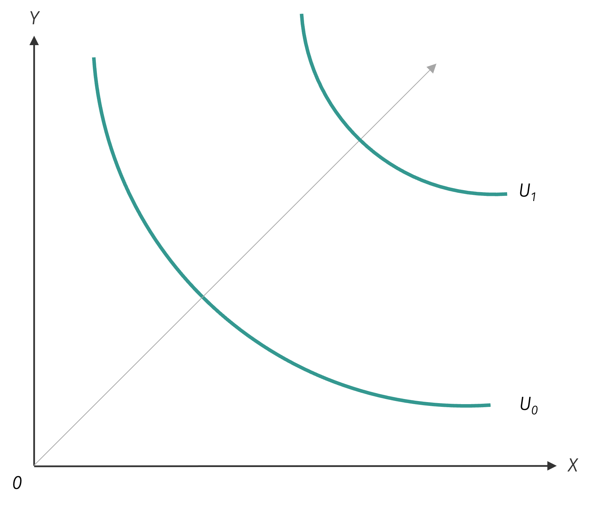{ width="350" }

#### 任兩條無異曲線不相交[^1]

設無異曲線可以相交，如下圖中之 $U_0$ 與 $U_1$。假設 A 點與 B 點位於同一無異曲線 $U_0$ 上，所以 A 點與 B 點的效用無異，且 A 點與 C 點位於同一無異曲線 $U_1$ 上，所以 A 點與 C 點的效用無異。

利用遞移性公理，B 點的 $x$ 數量大於 C 點的 $x$ 數量一樣，且 B 點的 $y$ 數量會大於 C 點的 $y$ 數量，可知 B 點效用會大於 C 點。

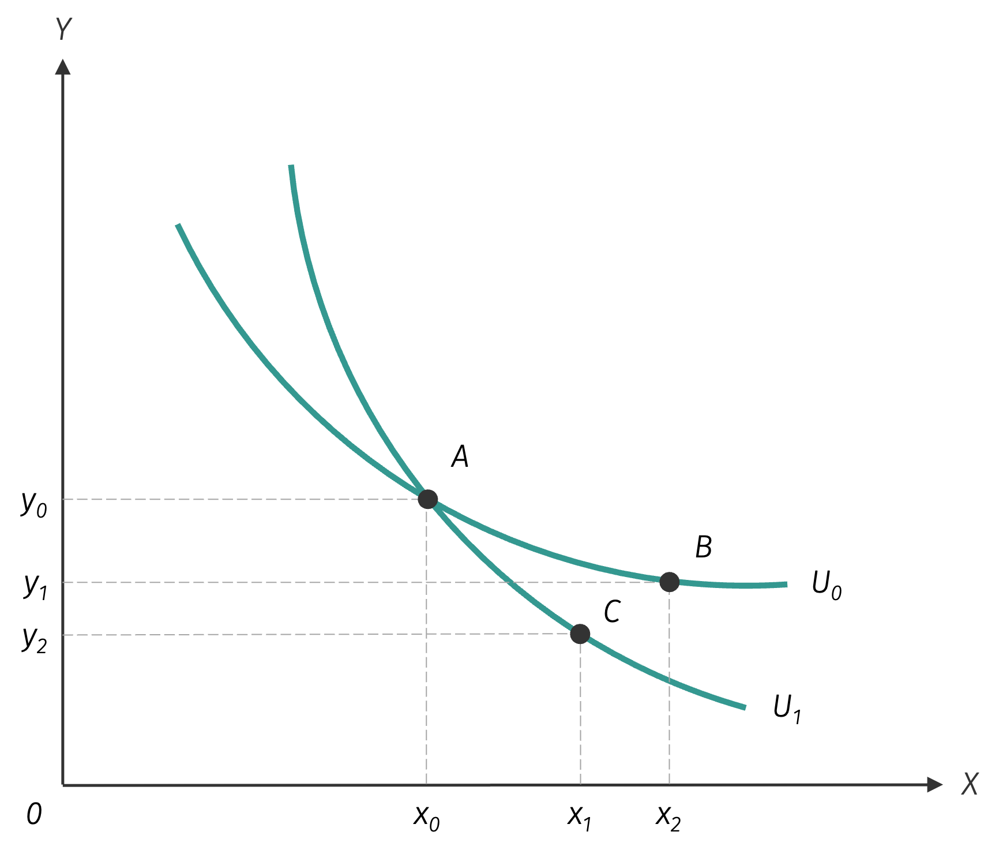{ width="350" }

圖形中顯示，B 點的 $x$ 數量大於 C 點的 $x$ 數量，且 B 點的 $y$ 數量大於 C 點的 $y$ 數量，因此利用單調性公理，我們有 B 點比 C 點的效用一致，產生矛盾，代表原假設有誤，故任兩條無異曲線不可相交。

#### 無異曲線會呈凸向原點

無異曲線會呈凸向原點的特性，是由於邊際效用遞減法則所致。

!!! note "邊際效用遞減法則"
    **邊際效用遞減法則**係指在一般情況下，消費者為維持一定的效用水準，以某一特定 $x$ 商品來替換 $y$ 商品，通常會隨著 $x$ 商品的數量增加，所願意犧牲的 $y$ 商品數量會隨之減少。

下圖中由 A 點到 B 點，當消費者多消費一單位 $x$ 商品，此時在維持 $U_0$ 效用水準下，消費者必須犧牲 $\Delta y_1$ 的 $y$ 商品數量，而當消費者再次增加一單位 $x$ 商品的消費 (B 點到 C 點)，此次 $x$ 商品的消費所帶給消費者的邊際效用將不若前一單位 $x$ 商品的邊際效用，因此在維持 $U_0$ 效用水準下，消費者此次僅需犧牲較少的 $y$ 商品數量可，意味著 $\Delta y_2$ 必小於 $\Delta y_1$ 的 $y$ 商品數量。此會會導致隨著 $x$ 商品數量愈多效用下降，此會會導致邊際替代率 $MRS_{xy}$ 遞減，而呈現無異曲線會呈現凸向原點的特性，此時就導致邊際替代率遞減法則 (the law of diminishing $MRS_{xy}$)。無異曲線會具有凸向原點的特性，此時就導致邊際替代率遞減法則成立的結果。

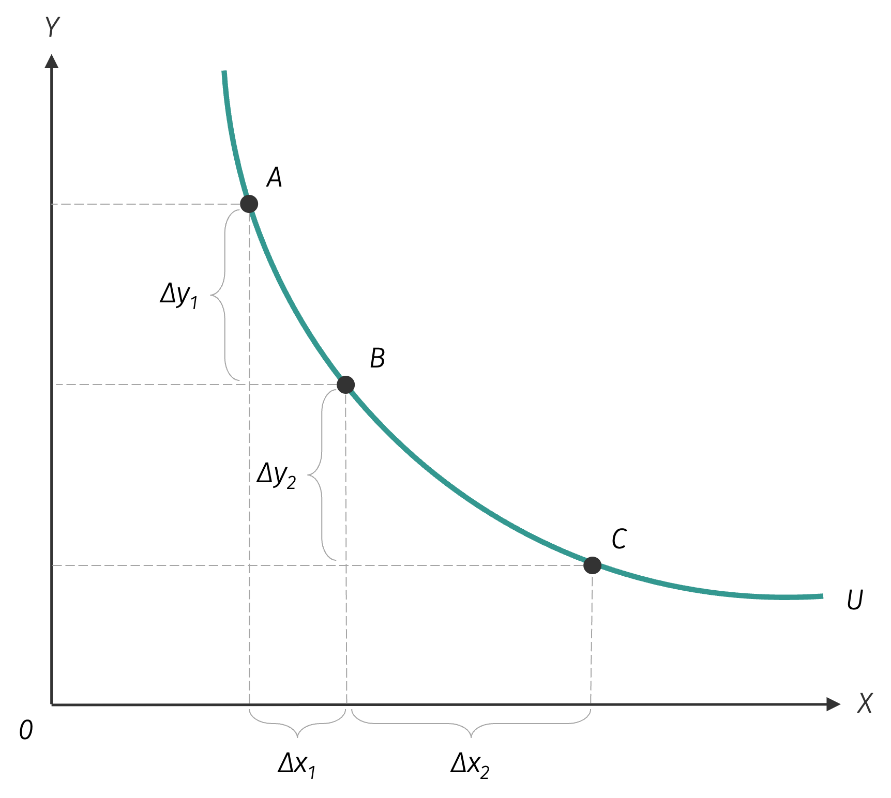{ width="350" }

!!! question "邊際效用遞減與邊際替代率遞減"
    是否當所有商品的邊際效用遞減法則皆成立時，會隱含無異曲線的邊際替代率遞減法則亦會成立？如果設效用函數為
    $U = U(x,y)$ 且滿足 $U_x > 0$、$U_{xx} < 0$、$U_y > 0$、$U_{yy} < 0$，亦即 $x$ 與 $y$ 商品皆為
    喜好商品且邊際效用皆隨消費量增加而遞減，另無異曲線的斜率可表達為

    $$
    \frac{dY}{dX} = -\frac{MU_x}{MU_y} = -\frac{U_x}{U_y}，其中
    $$

    $$
    \begin{aligned}
    U_x &= U_x(x,y) = \frac{\partial U}{\partial x} = MU_x(x,y) > 0, U_{xx} = \frac{\partial U_x}{\partial x} = \frac{\partial MU_x}{\partial x} < 0\\
    U_y &= U_y(x,y) = \frac{\partial U}{\partial y} = MU_y(x,y) > 0, U_{yy} = \frac{\partial U_y}{\partial y} = \frac{\partial MU_y}{\partial y} < 0
    \end{aligned}
    $$

    且 $MRS_{xy} = -\frac{dY}{dX} = \frac{U_x}{U_y} = \frac{U_x(x,Y(x))}{U_y(x,Y(x))}$。
    若隨著 $x$ 商品消費量增加，$MRS_{xy}$ 會隨之下降，則表示邊際替代率遞減法
    則成立，以數學表達即為 $\frac{dMRS_{xy}}{dx} < 0$。底下證明成立條件：
    $$
    \begin{aligned}
        \dfrac{dMRS_{xy}}{dx} &= \dfrac{d}{dx}\left(\dfrac{U_{x}}{U_{y}}\right) = \dfrac{1}{U_{y}^{2}}\left[U_{xx} + U_{xy}\left(\dfrac{dy}{dx}\right)\right] \cdot U_{y} - \left[U_{yx} + U_{yy}\left(-\dfrac{dy}{dx}\right)\right] \cdot U_{x}\\\\
        &= \dfrac{1}{U_{y}^{2}}\left[U_{xx} + U_{xy}\left(-\frac{U_x}{U_y}\right)\right] \cdot U_y - \left[U_{yx} + U_{yy}\left(-\frac{U_x}{U_y}\right)\right] \cdot U_x\\\\
        &= \dfrac{1}{U_y^2} \left(U_{xx} \cdot U_y - U_{xy} \cdot U_x - U_{yx} \cdot U_x + U_{yy} \cdot \frac{U_x^2}{U_y}\right)\\\\
        &= \dfrac{1}{U_y^3}\left(U_{xx} \cdot U_y^2 - 2 \cdot U_{xy} \cdot U_x \cdot U_y + U_{yy} \cdot U_x^2\right)
    \end{aligned}
    $$

    利用 Young's theorem 得知 $U_{xy} = U_{yx}$，故上式可改為

    $$
    = \frac{1}{U_y^3}\left(U_{xx} \cdot U_y^2 - 2 \cdot U_{xy} \cdot U_x \cdot U_y + U_{yy} \cdot U_x^2\right) < 0
    $$

    上式中 $U_y^3 > 0$，所以 $\frac{dMRS_{xy}}{dx} < 0$ 隱含 $U_{xx} \cdot U_y^2 - 2 \cdot U_{xy} \cdot U_x \cdot U_y + U_{yy} \cdot U_x^2 < 0$

    必須要成立，若商品邊際效用遞減法則成立，則 $U_{xx} \cdot U_y^2 < 0$ 且 $U_{yy} \cdot U_x^2 < 0$

    但因為 $U_{xy}$ 的正負符號不確定，故無法確認 $\frac{dMRS_{xy}}{dx} < 0$，例如當 $U_{xy} < 0$，即所

    - 當 $U_{xy} > 0$，亦即 $U_{xy} = \frac{dU_x}{dY} > 0$，表示消費者多消費一單位的 $Y$ 商品，此
    時 $x$ 商品的邊際效用會提升，隨含 $x$ 與 $Y$ 商品具有效用上的互補關係，故在 $x$
    與 $Y$ 商品具有效用上的互補關係時，兩商品邊際效用遞減法則成立即隱含邊際替
    代率遞減法則亦成立。

    - 當 $U_{xy} < 0$，亦即 $U_{xy} = \frac{dU_x}{dY} < 0$，表示消費者多消費一單位的 $Y$ 商品，此
    時 $x$ 商品的邊際效用會下降，隨含 $x$ 與 $Y$ 商品具有效用上的替代關係，故在 $x$
    與 $Y$ 商品具有效用上的替代關係時，兩商品邊際效用遞減法則成立即隱含邊際替
    代率遞減法則亦成立。

## 無異曲線形狀與邊際替代率的關係

若 $x$ 與 $Y$ 兩商品皆為喜好商品，則無異曲線的形狀與邊際替代率的變動關係
如下圖所示：

當 $\frac{dMRS_{xy}}{dx} < 0$ 時，表示在商品邊際效用遞減法則成立的條件下，並不代
表邊際替代率一定會呈現遞減的形式，亦即邊際效用遞減與邊際替代率遞減法
則，兩者之間並不具有互相隱含的關係。

- **$\frac{dMRS_{xy}}{dx} < 0$**：無異曲線呈現凸向原點的形狀
- **$\frac{dMRS_{xy}}{dx} = 0$**：無異曲線呈現直線的形狀
- **$\frac{dMRS_{xy}}{dx} > 0$**：無異曲線呈現凹向原點的形狀

若 $x$ 與 $y$ 兩商品皆為喜好品，則無異曲線的形狀與邊際替代率的變動關係如下圖所示：

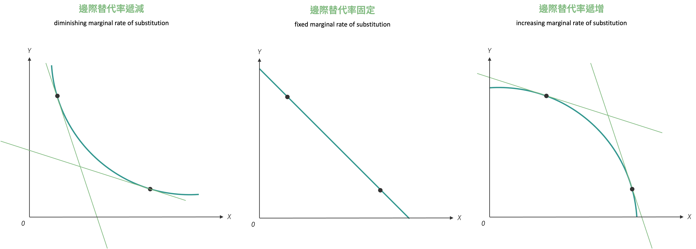{ width="650" }

- 左圖：邊際替代率呈現遞減，亦即 $\frac{dMRS_{xy}}{dx} < 0$ 成立。
- 中圖：邊際替代率呈現固定，亦即 $\frac{dMRS_{xy}}{dx} = 0$ 成立。
- 右圖：邊際替代率呈現遞增，亦即 $\frac{dMRS_{xy}}{dx} > 0$ 成立。

## 效用函數之單調遞增轉換

序列效用分析仍延續計數效用分析中之效用函數水準的偏好，在計數效用分析中的效用水準有一意義，例如當我們說效用水準為 10 util 與 20 util 可將後者的滿足感是前者滿足感的兩倍，效用水準的數字本身有絕對的觀念。

但在序列效用分析之中，用以代表效用水準的函數中皆為相對對照 (relative magnitude) 的觀念，就像是我們在測量溫度時，可採用攝氏 (Celsius) 或華氏 (Fahrenheit) 來量，0$^{\circ}$C 等於 32$^{\circ}$F，100$^{\circ}$C 等於 212$^{\circ}$F，亦好像我們在測量距離時，可採用公尺 (meters) 或英尺 (feet) 來衡量。效用水準就像上述的相對量一樣，不同的衡量基準會導致數字不同，這也不影響函數本身具有相同間好的消費者。你現在有多快樂？乙回答：「我現在很有幸福快樂。」甲回答：「乙會回答：『我現在在萬分快樂。』」其中的甲的『十分』與乙的『萬分』，其實可能表達出一樣的滿足感。這隱含不同的效用函數可能可以表達出相同的價好水準，但其順序不同的效用水準的數字不同。

!!! note "單調轉換"
    **單調轉換** (monotonic transformation)，代表隨著不同的效用函數之效用值之間具有正/負相關。設效用函數 $U = U(x, y)$，則存在另一效用函數 $V = f(U) = f[U(x, y)]$。

    - 若 $\frac{dV}{dU} = f^{\prime}(U) > 0$，稱 $V$ 為 $U$ 之**單調遞增轉換** (monotonic increasing transformation)。亦即兩個函數之間若互為單調遞增轉換時，則兩函數的無異曲線形狀會相同，但偏好方向相同，但相同商品組合的效用值不會相同。
    - 若 $\frac{dV}{dU} = f^{\prime}(U) < 0$，稱 $V$ 為 $U$ 之**單調遞減轉換** (monotonic decreasing transformation)，亦即兩個函數之間若互為單調遞減轉換時，則兩函數的無異曲線形狀會相同，但偏好方向相反，但相同商品組合的效用值不會相同。

假設現存在消費者 A，其效用函數為 $U = xy$，由 $MU_x = \frac{\partial U}{\partial x} = y$，$MU_y = \frac{\partial U}{\partial y} = x$，可得 $MRS_{xy} = \frac{MU_x}{MU_y} = \frac{y}{x}$，亦隱含無異曲線的斜率為 $\frac{dy}{dx} = -\frac{y}{x}$。再配合效用函數 $U = xy$，我們可以畫出無異曲線的形狀為

{ width="350" }

若存在另一消費者 B，其效用函數為 $V = 2xy$，由 $MU_x = \frac{\partial V}{\partial x} = 2y$，$MU_y = \frac{\partial V}{\partial y} = 2x$，可得 $MRS_{xy} = \frac{MU_x}{MU_y} = \frac{y}{x}$，亦隱含無異曲線的斜率為 $\frac{dy}{dx} = -\frac{y}{x}$。再配合效用函數 $V = 2xy$，我們可以畫出無異曲線的形狀為

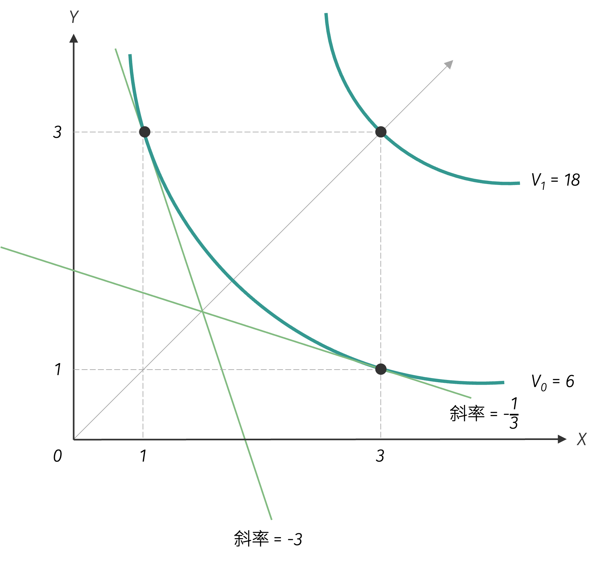{ width="350" }

若存在一消費者 C，其效用函數為 $w = \frac{1}{xy}$，由 $MU_x = \frac{\partial w}{\partial x} = \frac{-1}{x^2y}$，$MU_y = \frac{\partial w}{\partial y} = \frac{-1}{xy^2}$，可得 $MRS_{xy} = \frac{MU_x}{MU_y} = \frac{y}{x}$，亦隱含無異曲線的斜率為 $\frac{dy}{dx} = -\frac{y}{x}$。再配合效用函數 $w = \frac{1}{xy}$，我們可以畫出無異曲線的形狀為

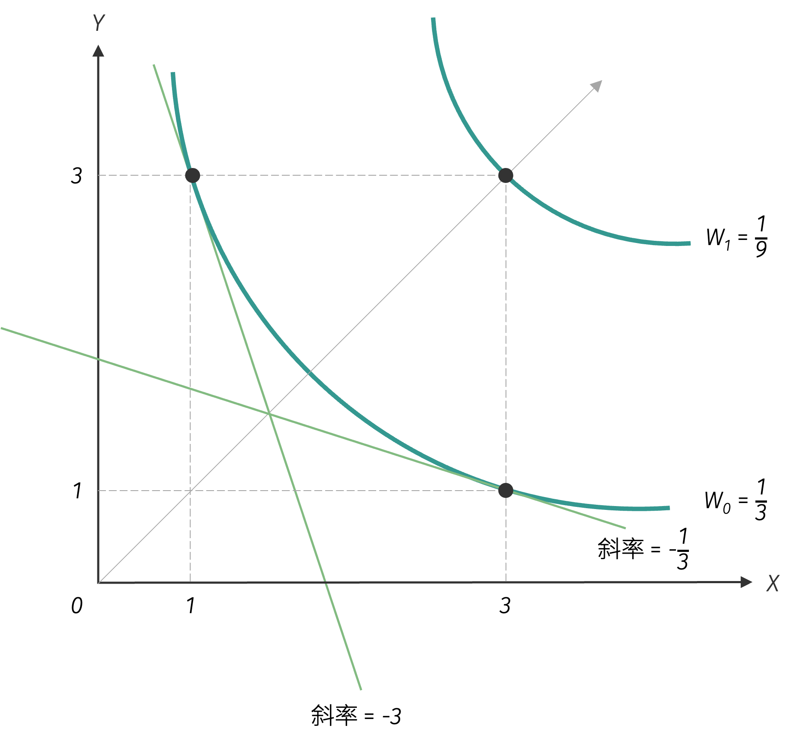{ width="350" }

我們可以發現三位消費者的無異曲線群完全相同，僅效用水準值有異，因此三者的效用函數互為彼此的單調遞增轉換。如下表所示，前述 A、B 與 C 三位消費者，在不同消費組合下的效用水準如下：

| 商品組合 $(x, y)$ | A的效用水準 | B的效用水準 | C的效用水準 |
|-------------------|-------------|-------------|-------------|
| $(x, y) = (1, 1)$ | $U_1 = 1$ util | $V_1 = 2$ util | $W_1 = 1$ util |
| $(x, y) = (2, 2)$ | $U_2 = 4$ util | $V_2 = 8$ util | $W_2 = 1/4$ util |
| $(x, y) = (3, 3)$ | $U_3 = 9$ util | $V_3 = 18$ util | $W_3 = 1/9$ util |

!!! question "單調遞增轉換函數"
    下列那些效用函數為效用函數 $U(x, y) = xy$ 的單調遞增轉換函數？

    1. $V(x, y) = 2xy$
    2. $W(x, y) = \frac{1}{xy}$
    3. $Z(x, y) = xy + 10$
    4. $A(x, y) = xy - 10$
    5. $B(x, y) = 10 - xy$
    6. $C(x, y) = x^2y^2$
    7. $D(x, y) = x^{\frac{1}{2}}y^{\frac{1}{2}}$
    8. $E(x, y) = \ln(xy)$
    9. $F(x, y) = x^3y^3$
    10. $H(x, y) = \ln x + \ln y$

Table: 原效用函數、單調遞增轉換的函數與單調遞減轉換函數之間的關係

| 與原效用函數比較 | 單調遞增轉換 | 單調遞減轉換 |
|------------------|-------------|-------------|
| 效用函數 | 不同 | 不同 |
| 邊際效用函數 | 不同 | 不同 |
| 邊際替代率函數 | 相同 | 相同 |
| 無異曲線的形狀 | 相同 | 相同 |
| 偏好方向 | 相同 | 相反 |

!!! note "齊序函數"
    若效用函數 $U = U(x, y)$ 為一階齊次函數，則效用函數透過單調遞增轉換所構成的效用函數版稱為齊序函數 (homothetic function)。

    當效用函數 $U = U(x, y)$ 具有一階齊次的數的特性時，則表示下式會成立：
    $$
    \lambda U = U(\lambda x, \lambda y)
    $$

令 $\lambda = \frac{1}{x}$，可得 $\frac{U}{x} = U\left(1, \frac{y}{x}\right)$，或可整理為 $U = x \cdot u\left(\frac{y}{x}\right)$，則我們可計算出

$$
\begin{aligned}
MU_x &= \frac{\partial U}{\partial x} = u\left(\frac{y}{x}\right) + u^{\prime}\left(\frac{y}{x}\right) \cdot \frac{-y}{x^2} \cdot x = u\left(\frac{y}{x}\right) \cdot \frac{y}{x} \cdot u^{\prime}\left(\frac{y}{x}\right)\\
MU_y &= \frac{\partial U}{\partial y} = x \cdot u^{\prime}\left(\frac{y}{x}\right) \cdot \frac{1}{x} = u^{\prime}\left(\frac{y}{x}\right)
\end{aligned}
$$

故可得 $MRS_{xy} = \frac{MU_x}{MU_y} = \frac{u\left(\frac{y}{x}\right) \cdot \frac{y}{x} \cdot u^{\prime}\left(\frac{y}{x}\right)}{u^{\prime}\left(\frac{y}{x}\right)} = f\left(\frac{y}{x}\right)$，此顯示效用函數具有一階齊次的特性時，在相同射線下的不同無異曲線，其 $MRS_{xy}$ 數值會相同的特性。

求算單調遞增轉換之齊序效用函數 $V = F(U) = F[U(x, y)]$ 的 $MRS_{xy}$ 函數，則

$$
MRS_V = \frac{f^{\prime} \frac{\partial U}{\partial x}}{f^{\prime} \frac{\partial U}{\partial y}} = \frac{\frac{\partial U}{\partial x}}{\frac{\partial U}{\partial y}} = \frac{MU_x}{MU_y} = MRS_U$$

我們會發現其 $MRS_{xy}$ 與原效用函數相同，故亦表示齊序效用函數亦具有在相同射線下的不同無異曲線，其 $MRS_{xy}$ 數值會相同的特性。

## 各類效用函數

在現實生活中，不同消費者面對商品選擇時展現出截然不同的偏好模式：有些人認為咖啡與茶完全可以互相替代，有些人則堅持左腳穿左鞋、右腳穿右鞋的固定搭配。
看似個人化的消費習慣，實際上反映了深層的偏好結構差異。經濟學透過構建不同類型的效用函數來精確刻畫這些偏好特徵，每一種效用函數都是理解特定消費行為的數學工具，為消費者理論提供了豐富的分析框架，並奠定後續消費者選擇之理論基礎。

### 飽和效用函數

當消費者對 $x$ 與 $y$ 兩商品的消費組合為 $(x_0, y_0)$ 時的效用達到極大。

- 當任一商品消費數量小於 $x_0$ 或 $y_0$ 時，商品均為喜好品，表示此時若增加任一商品的消費數量皆會增加效用。

- 當任一商品消費數量大於 $x_0$ 或 $y_0$ 時，商品均為厭惡品，表示此時若增加任一商品的消費數量皆會減少效用。

此時稱 $(x_0, y_0)$ 為**極樂點** (bliss point) 或是**飽和點** (satiation point)，效用函數表示為：
$$
U(x, y) = c - a(x - x_{0})^{2} - b(y - y_{0})^{2}, \quad a, b, c \in \mathbb{R}^{+}
$$
效用函數圖形如下圖所示：

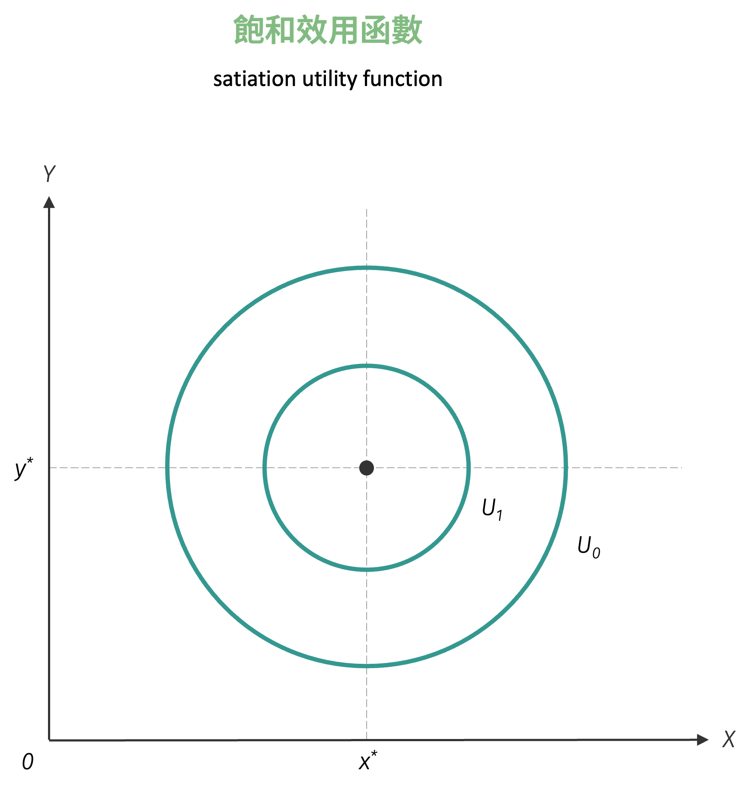{ width="350" }

### 完全替代型效用函數

描述**完全替代** (perfect substitutes) 型之偏好的效用函數可以用下式表達：
$$
U(x, y) = ax + by
$$
其中 $a$、$b$ 為大於零的常數。假設效用水準不變，且固定為常數 $c$，則

- 當 $x = 0$ 時，$y = \frac{c}{b}$
- 當 $y = 0$ 時，$y = \frac{c}{a}$

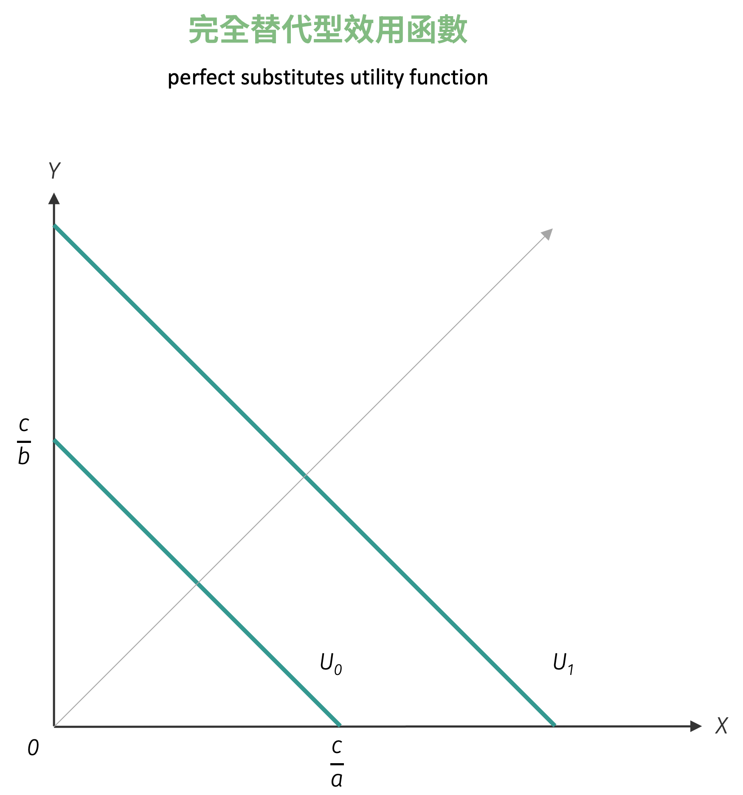{ width="350" }

由圖可以看出，完全替代型效用函數為一直線，故又稱為**線性** (linear) 效用函數。經過簡單計算後，可得完全替代型效用函數之邊際替代率為
$$
MRS_{xy} = \dfrac{a}{b}
$$
邊際替代率為常數，不符合邊際替代率遞減法則。注意到以下效用函數均為效用函數 $U(x, y) = ax + by$ 之單調遞增轉換函數，可自行驗證。

- $V(x, y) = \sqrt{ax + by}$
- $W(x, y) = ax + by - k$
- $Z(x, y) = a^{2}x^{2} + 2abxy + b^{2}y^{2}$

### 完全互補型效用函數

若消費者偏好特殊，喜歡依特定比例搭配 $x$ 與 $y$ 商品，則稱其偏好為**完全互補型** (perfect complement)。以數學式表達如下：
$$
U(x, y) = \min\{ax, by\}
$$
上式效用函數中的 $a$、$b$ 為正的常數，其中 $\min$ 的意義為選取括號中兩數較小者為效用值。例如商品組合 $(10, 10)$、$(10, 11)$ 與 $(11, 10)$ 皆帶給消費者同樣為 10 util 的效用水準。或者換句話說，當 $x = 10$ 且 $y \geq 10$ 或 $y = 10$ 且 $x \geq 10$ 時，無論另一項商品數量為何，均不影響效用值。

如下圖所示，此種消費偏好型態必須滿足 $x$ 與 $y$ 兩商品為特定數量比例消費，超過的部分如圖中所示之垂直或水平線段，不會再增加消費者的效用水準。此外，**拗折點** (kinky point) 必出現在 $ax = by$ 或是 $\frac{y}{x} = \frac{a}{b}$ 之射線上。 

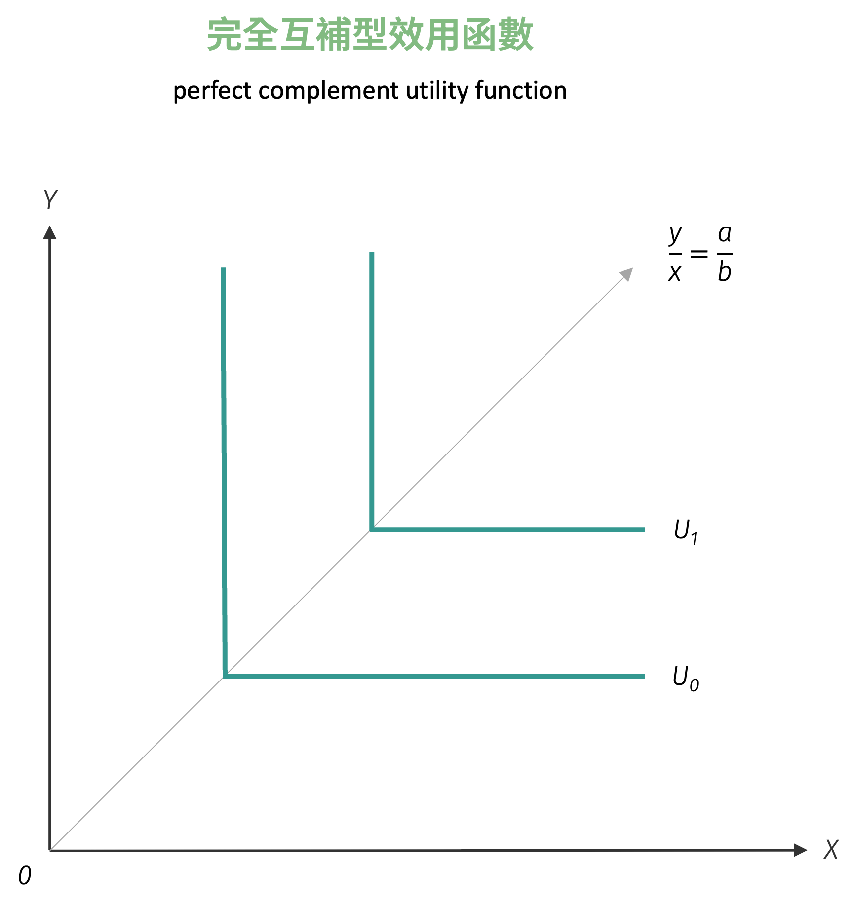{ width="350" }

注意到此種偏好型態之邊際替代率不存在，原因在於拗折點的切線斜率可以為任意數值，或由數學觀點而言，拗折點「不可微分」。

以下效用函數均為效用函數 $U(x, y) = \min\{ax, by\}$ 之單調遞增轉換函數：

- $V(x, y) = k \cdot \min\{ax, by\}$

- $W(x, y) = k \cdot \min\{x, \frac{b}{a}y\}$

- $Z(x, y) = \ln \min\{ax, by\}$

### Cobb-Douglas 效用函數

Cobb-Douglas 效用函數為經濟學中最常見的效用函數之一，其具有良好的特性。利用數學函數表達 Cobb-Douglas 效用函數圖形如下圖所示：
$$
U(x, y) = Ax^{\alpha}y^{\beta}
$$
其中 $A$、$\alpha$ 與 $\beta$ 均為正的常數，$A$ 稱為**效用因子** (utility factor)。經過簡單的計算，可以得到 Cobb-Douglas 效用函數的邊際替代率為
$$
MRS_{xy} = \dfrac{\alpha}{\beta}\cdot \dfrac{y}{x}
$$
根據 Cobb-Douglas 效用函數之邊際替代率可得以下特性：

#### 邊際效用可為遞增、固定或遞減

由兩商品的邊際效用與效用函數對該商品之二次微分：
$$
\begin{aligned}
U_{x} &= \alpha A x^{\alpha - 1}y^{\beta}, U_{xx} = \alpha (\alpha - 1) x^{\alpha - 2}y^{\beta}\\\\
U_{y} &= \beta A x^{\alpha}y^{\beta - 1}, U_{yy} = \beta (\beta - 1) x^{\alpha}y^{\beta - 2}
\end{aligned}
$$
可得以下情況：

- 當 $\alpha > 1$ ($\beta > 1$) 時，則 $U_{xx} > 0$ ($U_{yy} > 0$)，隱含邊際效用遞增。
- 當 $\alpha = 1$ ($\beta = 1$) 時，則 $U_{xx} = 0$ ($U_{yy} = 0$)，隱含邊際效用固定。
- 當 $\alpha < 1$ ($\beta < 1$) 時，則 $U_{xx} < 0$ ($U_{yy} < 0$)，隱含邊際效用遞減。

#### 無異曲線凸向原點[^2]

以 $x$ 商品為例，將邊際替代率對 $x$ 進行微分後，可得
$$
\begin{aligned}
\dfrac{dMRS_{xy}}{dx} &= \dfrac{\alpha}{\beta} \cdot \dfrac{\dfrac{dy}{dx}\cdot x - y}{x^2}\\\\
&= \dfrac{\alpha}{\beta} \cdot \dfrac{- \dfrac{\alpha}{\beta}\dfrac{y}{x}\cdot x - y}{x^2}\\\\
&= - \dfrac{\alpha}{\beta} \cdot \dfrac{\left(1 + \dfrac{\alpha}{\beta}\right)y}{x^2} < 0
\end{aligned}
$$

即可知無異曲線凸向原點。

無論 $x$ 商品與 $y$ 商品的邊際效用呈現遞增、固定或遞減，邊際替代率皆會

以下效用函數均為效用函數 $U(x, y) = Ax^{\alpha}y^{\beta}$ 之單調遞增轉換函數：

- $V(x, y) = x^{\frac{\alpha}{\alpha + \beta}} \cdot x^{\frac{\beta}{\alpha + \beta}}$

- $W(x, y) = \ln(x^{\alpha}y^{\beta})$

- $Z(x, y) = \alpha \ln x + \beta \ln y$

### 準線性效用函數

**準線性效用函數** (quasi-linear utility function) 可以表達如下：
$$
U(x, y) = f(x) + y \quad \text{或} \quad U(x, y) = x + f(y)
$$
以前者說明，其中 $f^{\prime} > 0$ 且 $f^{\prime\prime} < 0$。一般常見形式有：

- $U(x, y) = \ln x + y$

- $U(x, y) = \sqrt{x} + y$

準線性效用函數的邊際替代率為 $f^{\prime}$ 之值，因此有以下特性：

#### 無異曲線凸向原點

由邊際替代率以及二階微分可得證，請自行證明。

#### 邊際替代率僅受一項商品數量影響

已知準線性效用函數之邊際替代率如下：
$$
MRS_{xy} = f^{\prime}(x)
$$
顯示僅受到 $x$ 商品數量的影響，不受 $y$ 商品數量影響。因此當 $x$ 商品數量固定時，所有無異曲線的邊際替代率均相同，如下圖所示：

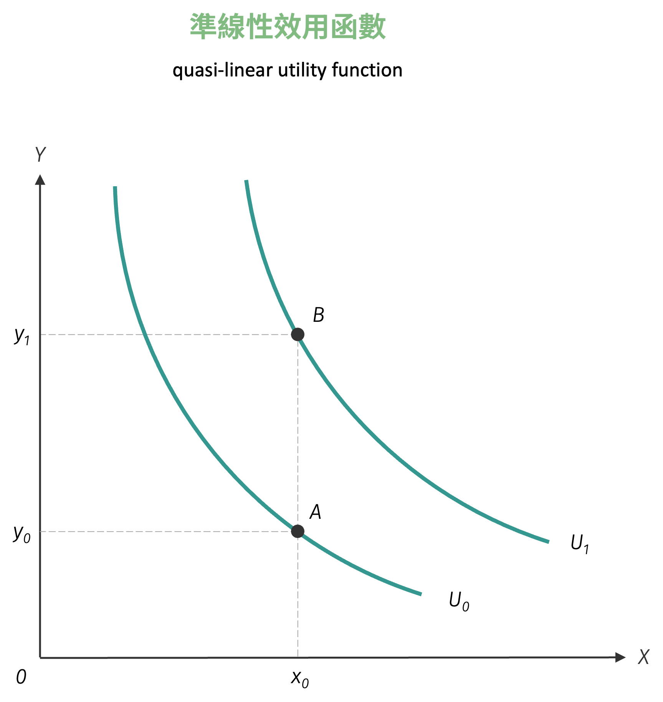{ width="350" }

### 固定替代彈性效用函數

**固定替代彈性效用函數** (constant elasticity of substitution utility function, CES utility function) 是暨 Cobb-Douglas 效用函數，另一個常見的效用函數形式，其效用函數形如：

$$
U(x, y) = A \cdot \left[\delta \cdot x^{-\rho} + (1 - \delta) y^{-\rho}\right]^{-\frac{1}{\rho}}
$$

上式中的 $A > 0$，$\delta \in [0, 1]$，$-1 < \rho \neq 0$，其中 $A$ 為效用因子 (與 Cobb-Douglas 效用函數的相同)，$\delta$ 為**分配因子** (distribution parameter)，$\rho$ 則是**替代因子** (substitution parameter)。由上式可求算出 $x$ 與 $y$ 兩商品的邊際效用為：

$$
\begin{aligned}
MU_{x} &= A \cdot \left(- \dfrac{1}{\rho}\right) \left[\delta \cdot x^{-\rho} + (1 - \delta) y^{-\rho}\right]^{-\frac{1}{\rho} - 1} \cdot \delta \cdot (-\rho) \cdot x^{-\rho - 1}\\\\
MU_{y} &= A \cdot \left(- \dfrac{1}{\rho}\right) \left[\delta \cdot x^{-\rho} + (1 - \delta) y^{-\rho}\right]^{-\frac{1}{\rho} - 1} \cdot (1-\delta) \cdot (-\rho) \cdot y^{-\rho - 1}
\end{aligned}
$$

因此由邊際效用可求算固定替代彈性效用函數之邊際替代率為

$$
MRS_{xy} = \dfrac{\delta}{1 - \delta} \cdot \left(\dfrac{y}{x}\right)^{1 + \rho}
$$

固定替代彈性效用函數的一項特性是，當替代因子 $\rho$ 大小不同時，會轉變成前述已知的效用函數形式。

#### $\rho \to -1$

當 $\rho \to -1$ 時，CES 效用函數轉變為完全替代型效用函數或稱線性效用函數。

$$
\begin{aligned}
\lim_{\rho \to -1} U(x, y) &= \lim_{\rho \to -1} A \cdot \left[\delta \cdot x^{-\rho} + (1 - \delta) y^{-\rho}\right]^{-\frac{1}{\rho}}\\\\
&= \lim_{\rho \to -1} A \cdot \left[\delta \cdot x^{-(-1)} + (1 - \delta) y^{-(-1)}\right]^{-\frac{1}{-1}}\\\\
&= \lim_{\rho \to -1} A \cdot \left[\delta \cdot x + (1 - \delta) y\right]^{1}\\
&= A \cdot [\delta \cdot x + (1 - \delta) y]
\end{aligned}
$$

#### $\rho \to 0$

當 $\rho \to 0$ 時，CES 效用函數轉變為 **Cobb-Douglas 效用函數**。令：

$$
f(\rho) = -\frac{1}{\rho} \ln\left[\delta \cdot x^{-\rho} + (1 - \delta) y^{-\rho}\right]
$$

則原效用函數可寫為 $U(x, y) = A \cdot e^{f(\rho)}$，當 $\rho \to 0$ 時：

$$
\begin{aligned}
\lim_{\rho \to 0} f(\rho) &= \lim_{\rho \to 0} \frac{-\ln\left[\delta \cdot x^{-\rho} + (1 - \delta) y^{-\rho}\right]}{\rho}
\end{aligned}
$$

由於分子分母均趨於 0，使用 L'Hôpital 法則：

$$
\begin{aligned}
&= \lim_{\rho \to 0} \frac{-\frac{d}{d\rho}\ln\left[\delta \cdot x^{-\rho} + (1 - \delta) y^{-\rho}\right]}{1}\\\\
&= \lim_{\rho \to 0} \frac{-\frac{\delta \cdot x^{-\rho}(-\ln x) + (1-\delta) \cdot y^{-\rho}(-\ln y)}{\delta \cdot x^{-\rho} + (1 - \delta) y^{-\rho}}}{1}\\\\
&= \lim_{\rho \to 0} \frac{\delta \cdot x^{-\rho} \ln x + (1-\delta) \cdot y^{-\rho} \ln y}{\delta \cdot x^{-\rho} + (1 - \delta) y^{-\rho}}\\\\
&= \frac{\delta \ln x + (1-\delta) \ln y}{\delta + (1-\delta)}\\\\
&= \delta \ln x + (1-\delta) \ln y\\\\
&= \ln(x^\delta y^{1-\delta})
\end{aligned}
$$

因此：

$$
\begin{aligned}
\lim_{\rho \to 0} U(x, y) &= A \cdot e^{\ln(x^\delta y^{1-\delta})}\\
&= A \cdot x^\delta y^{1-\delta}
\end{aligned}
$$

此即為 Cobb-Douglas 效用函數，表示兩商品具有**單位替代彈性**。

#### $\rho \to \infty$

當 $\rho \to \infty$ 時，CES 效用函數轉變為完全互補型效用函數。當 $\rho \to \infty$ 時，考慮 $x^{-\rho}$ 和 $y^{-\rho}$ 的行為：

$$
\begin{aligned}
\lim_{\rho \to \infty} \left[\delta \cdot x^{-\rho} + (1 - \delta) y^{-\rho}\right]^{-\frac{1}{\rho}}
\end{aligned}
$$

**不失一般性** (without loss of generality, WLOG)，假設 $x < y$，則當 $\rho \to \infty$ 時，$x^{-\rho} \to \infty$ 且 $y^{-\rho} \to 0$。因為 $x^{-\rho}$ 項會主導整個括號內的表達式，所以：

$$
\begin{aligned}
\lim_{\rho \to \infty} \left[\delta \cdot x^{-\rho} + (1 - \delta) y^{-\rho}\right]^{-\frac{1}{\rho}} &= \lim_{\rho \to \infty} \left[\delta \cdot x^{-\rho}\right]^{-\frac{1}{\rho}}\\
&= \lim_{\rho \to \infty} \delta^{-\frac{1}{\rho}} \cdot x\\
&= 1 \cdot x = x
\end{aligned}
$$

類似地，若 $y < x$，則極限為 $y$。因此，當 $\rho \to \infty$ 時：

$$
\begin{aligned}
\lim_{\rho \to \infty} U(x, y) &= A \cdot \min\{x, y\}
\end{aligned}
$$

此即為 Leontief 效用函數，表示兩商品為完全互補品，消費者總是以固定比例消費兩商品。

### Stone-Geary 效用函數

**Stone-Geary 效用函數** 的函數型態為
$$
U(x, y) = (x - x_0)^{\alpha} (y - y_0)^{\beta}
$$
式中的 $(x_0, y_0)$ 可視為消費者維持基本生活的消費商品組合，且消費者對於 $x$ 或 $y$ 商品的消費數量必須超過基本水準方能獲得正效用。經過計算，可得 Stone-Geary 效用函數的邊際替代率為
$$
MRS_{xy} = \dfrac{\alpha}{\beta} \cdot \dfrac{y - y_{0}}{x - x_{0}}
$$

Stone-Geary 效用函數之圖形如下所示：

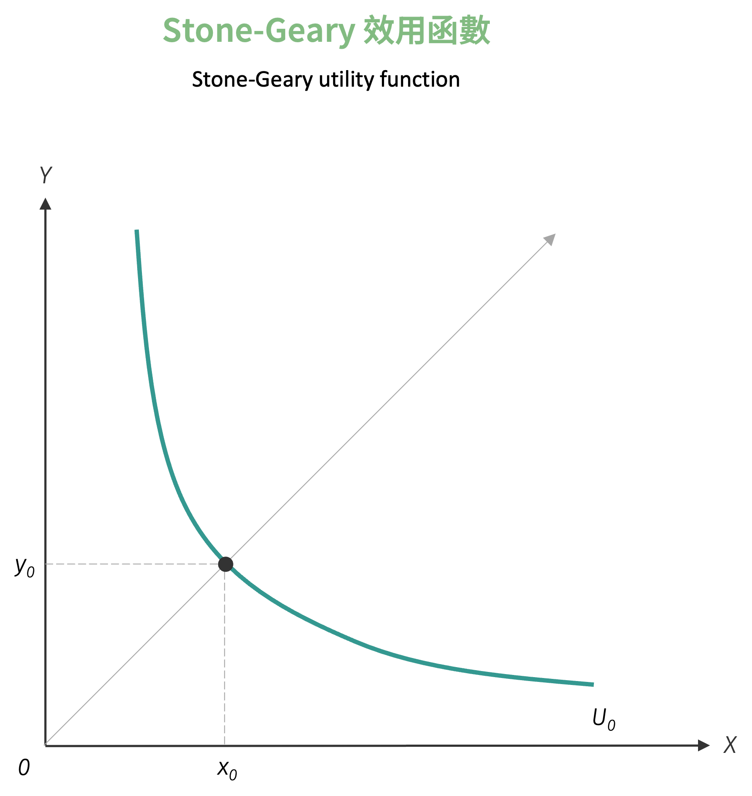{ width="350" }

[^1]: 任兩條無異曲線不可相交，是同一人且在同一時期的無異曲線不可相交。但是針對不同人之間的無異曲線，或同一人但不同時期的無異曲線則可以相交。
[^2]: 在證明邊際替代率是否遞減時，必須將其中一項商品視為另一項商品的函數，而不能將其視為常數。原因是：當某一商品的數量發生變動時，整體商品組合也隨之改變；若錯誤地將另一商品視為常數，則無法正確反映邊際替代率隨商品組合變動而調整的特性。因此下述證明是錯誤的，請牢記於心：
$$
\dfrac{dMRS_{xy}}{dx} = \dfrac{\alpha}{\beta} \cdot \dfrac{0 \cdot x - y}{x^2} = - \dfrac{\alpha}{\beta} \cdot \dfrac{y}{x^2} < 0
$$