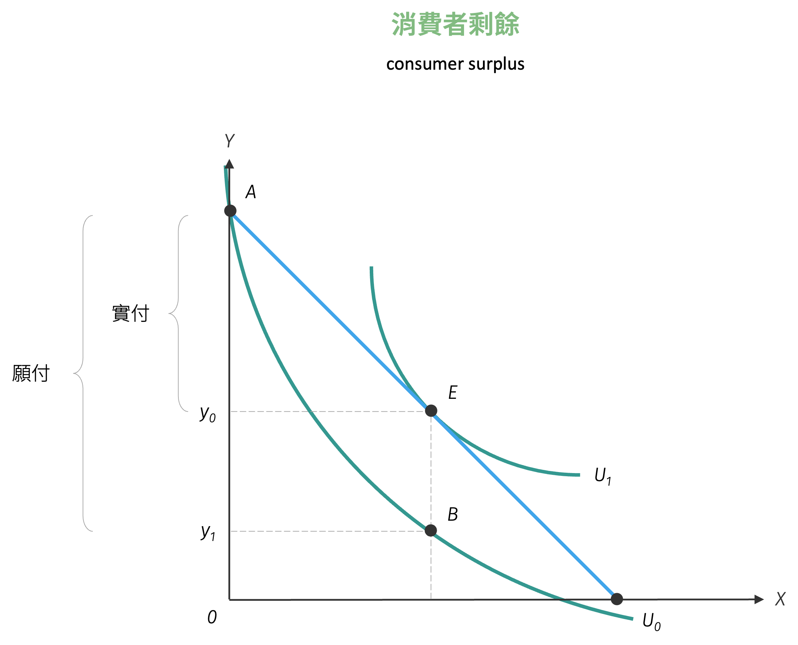
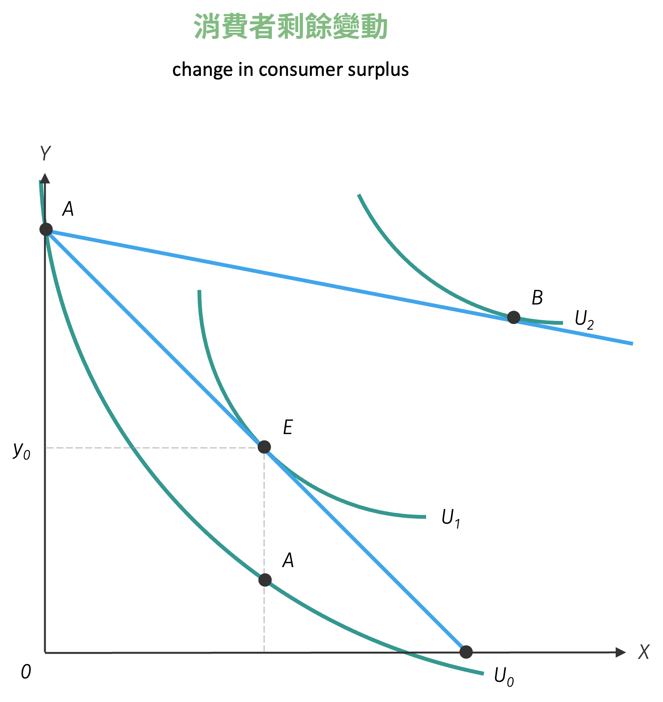
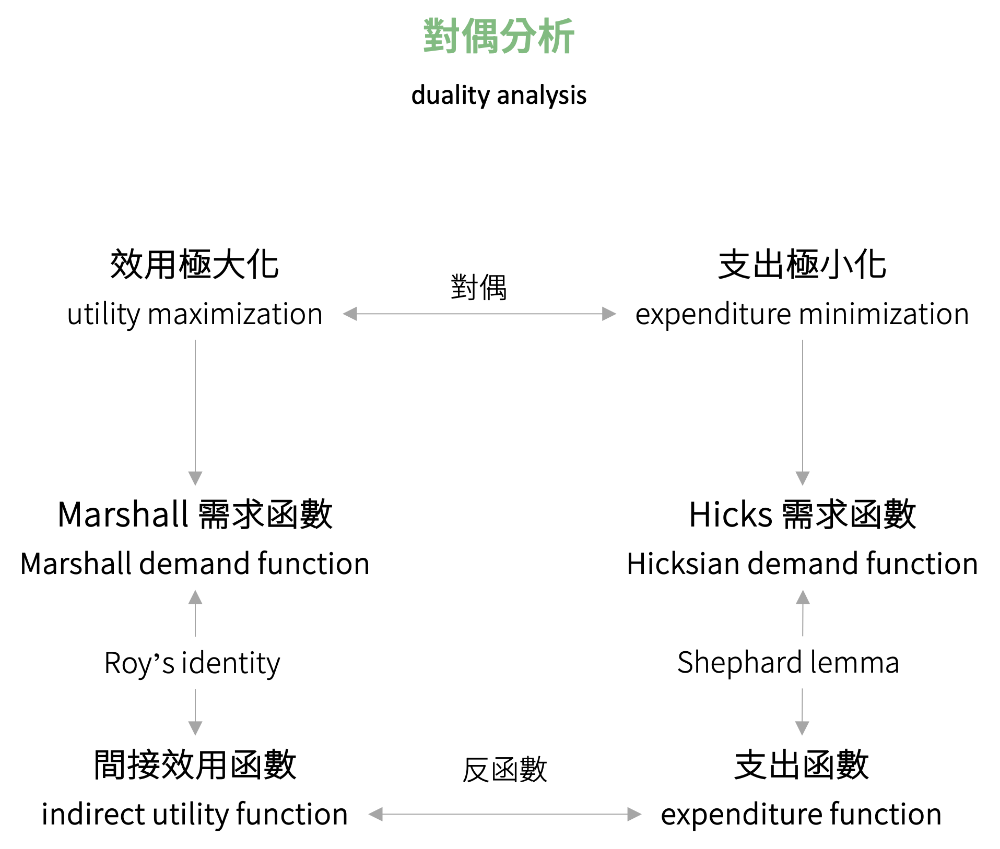
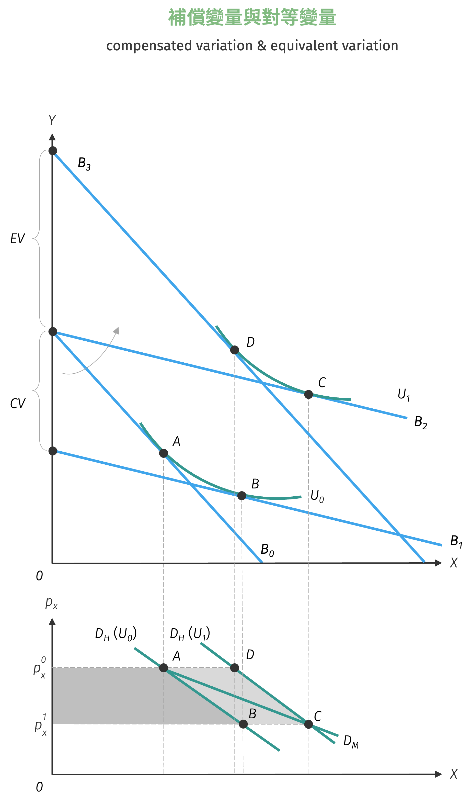

# 消費者福利分析

延續前述的內容，分析當商品相對價格改變後，不同的消費者偏好型態以及效用水準如何互動。而衡量效用水準的目的是量化價格變動對消費者造成的實際損益

## 消費者剩餘

當消費者在既定的商品價格與所得下，若其全部持有標準商品 $y$ (即 $p_y = 1$) 而不購買任何 $x$ 商品，則原效用水準為 $U_0$，如下圖 A 點。若此時消費者轉換商品組合至 B 點，亦即持有 $x$ 與 $y$ 兩商品的數量分別為 $x_0$ 與 $y_1$，此時雖然其效用水準仍維持於 $U_0$，並願意支付 $\overline{Ay_{1}}$ 的所得消費 $x_0$ 單位的 $x$ 商品，但實際上消費者之無異曲線與預算限制式相切之 E 點為最適點，此時效用可達 $U_1$ 水準，較原先的效用水準高，顯示實際購買僅需支付 $\overline{Ay_{0}}$ 即可消費相同數量的 $x$ 商品。
因此消費者消費 $x_0$ 數量之 $x$ 商品，願付數額減去實付數額之差額即是消費者剩餘 ($\overline{y_{0}y_{1}}$)，或可以理解為效用水準 $U_1$ 減去 $U_0$ 的差。

{ width="450" }

由上述對消費者剩餘的定義，可得在 $x$ 價格未下跌下的消費者剩餘為 $U_1 - U_0$，下跌後的消費者剩餘為 $U_2 - U_0$，則
$$
U_2 - U_1 = (U_2 - U_0) - (U_1 - U_0) = CS_2 - CS_1 = \Delta CS
$$
表示不同價格下效用水準差額即為消費者剩餘的變動量。

{ width="350" }

## 對偶分析[^1]

在分解價格效果的過程中，有時求算的是在預算限制之下，不同商品相對價格的最適選擇，有時限制則是來源於效用水準，此即消費者選擇理論之**對偶性** (duality)。

### 效用極大化

根據效用極大化求得的最適消費組合即為 Marshall 需求函數，通常表示為
$$
x^{M} = x(p_x, p_y, M), \quad y^{M} = y(p_x, p_y, M)
$$

將 Marshall 需求函數代入原效用函數，即可求出**間接效用函數** (indirect utility function)：
$$
V(p_x, p_y, M) = U\left(x^{M}, y^{M}\right)
$$
而間接效用函數經過以下運算可反推 Marshal 需求函數，此即 Roy's Identity：
$$
x^{M} = -\dfrac{\dfrac{\partial V}{\partial p_x}}{\dfrac{\partial V}{\partial M}}, \quad y^{M} = -\dfrac{\dfrac{\partial V}{\partial p_y}}{\dfrac{\partial V}{\partial M}}
$$

### 支出極小化

相對於效用極大化，消費者在選擇最適消費組合時，可以轉換為固定效用水準，使得其支出極小。而透過支出極小化求得的需求函數即為 Hicks 需求函數。
將 Hicks 需求函數代回目標函數 (即固定效用水準下的效用函數)，即可求得**支出函數** (expenditure function)：
$$
E(p_x, p_y, \bar{U}) = p_x x^{H}(p_x, p_y, \bar{U}) + p_y y^{H}(p_x, p_y, \bar{U})
$$
由支出函數搭配 Shephard Lemma，可反推 Hicks 需求函數：
$$
x^{H} = \dfrac{\partial E}{\partial p_x}, \quad y^{H} = \dfrac{\partial E}{\partial p_y}
$$

### 對偶分析實際操作

將效用極大化與支出極小化兩個命題合併，可以得到兩者存在諸多重要的函數關係，如下圖所示：

{ width="400" }

- 間接效用函數與支出函數：兩者互為反函數

- 間接效用函數與 Marshall 需求函數：將間接效用函數代入 Hicks 需求函數的固定效用，即可得到 Marshall 需求函數

- 支出函數與 Hicks 需求函數：將支出函數代入 Marshall 需求函數的所得，即可得到 Hicks 需求函數

## 補償變量與對等變量

!!! note "補償變量與對等變量"
    - **補償變量** (compensated variation, CV) 係在商品相對價格變動後，為能以變動後的相對價格維持變動前的效用水準，必須給予補償或扣除的數額。

    - **對等變量** (equivalent variation, EV) 係在商品相對價格變動後，為能以變動前的相對價格維持變動後的效用水準，必須給予補償或扣除的數額。

利用對偶分析所得出的函數關係，補償變量與對等變量可以表示為以下的數學形式：

$$
\begin{aligned}
CV &= \int_{p_x^0}^{p_x^1} x^{H}|_{U_0} = \int_{p_x^0}^{p_x^1} \dfrac{\partial E}{\partial p_x}\Bigg|_{U_0} dp_x = |E(p_x^0, p_y^0, U_0) - E(p_x^1, p_y^0, U_0)|\\\\
EV &= \int_{p_x^0}^{p_x^1} x^{H}|_{U_1} = \int_{p_x^0}^{p_x^1} \dfrac{\partial E}{\partial p_x}\Bigg|_{U_1} dp_x = |E(p_x^0, p_y^0, U_1) - E(p_x^1, p_y^0, U_1)|
\end{aligned}
$$

以 $x$ 商品價格下跌為例。原預算限制式 $B_0$ 下選擇 A 點消費，當 $x$ 價格下跌至預算限制式 $B_2$ 時，消費者選擇 C 點消費，此時對名目所得加以扣除維持原本效用水準 $U_0$，可得預算限制式為 $B_1$，最適消費組合為 B 點。由此即可求出補償變量之大小，即圖中 $p_x^0 ABp_x^1$ 圍成的面積。

若以原本相對價格對名目所得加以補償至變動後的效用水準 $U_1$，可得預算限制式為 $B_3$，最適消費組合為 D 點，由此可求出對等變量之大小，即圖中 $p_x^0 DCp_x^1$ 圍成的面積。。

而由一般需求曲線可得，當 $x$ 商品價格下跌後，消費者剩餘會額外增加 $p_x^0 ACp_x^1$ 的面積，此即 $x$ 商品價格下跌後的福利增量。

{ width="400" }

不過必須注意到，補償變量與對等變量的大小關係是不固定的，必須端視消費者偏好呈現的效用函數之型態，又或者是說消費者對於特定商品所呈現的消費行為是何種商品類型。但無論補償變量與對等變量之關係為何，消費者剩餘變動必定介於兩者之間。

!!! question "補償變量與對等變量"
    延續例題 \@ref(real-income) 對效用函數、所得與商品價格極其變動的假設，試回答下列問題：

    1. 利用效用極大化模型，求算 Marshall 需求函數、間接效用函數，並驗證 Roy's Identity。
    2. 利用支出極小化模型，求算 Hicks 需求函數、支出函數，並驗證 Shephard Lemma。
    3. 根據上述結果，求算補償變量、對等變量，以及消費者剩餘變動量。

[^1]: 對偶分析的證明與數學極為複雜，有興趣的讀者可自行參閱其他進階個體經濟學的書籍。