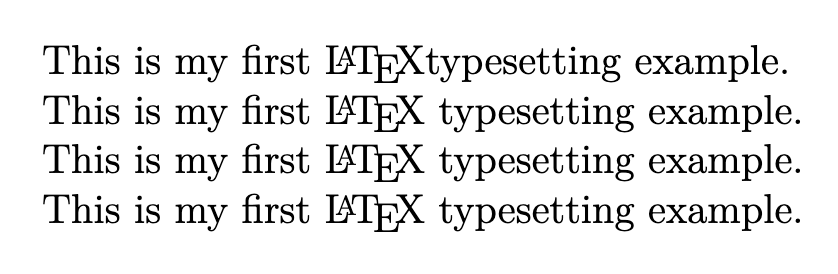

正式開始進入 LaTeX 語法教學之前，我們先來看一下底下的範例。

=== "main.tex"

    ```latex
    \documentclass[12pt]{article}
    \title{My First Document}
    \author{Author}
    \date{\today}

    \begin{document}
    \maketitle

    \end{document}
    ```

這一連串程式碼裡面，不難發現幾乎每一行都是以反斜線 `\` 開頭。事實上這就是 LaTeX 下指令的方式，目的是告訴電腦我要使用該指令來做某些事。

## 指令

通常來說，一個好的指令有以下的形式：

```latex
\commandname[可選參數]{必填參數}
```

我們來一一說明：

- `\commandname`：指令名稱，區分大小寫，如果寫錯則編譯器無法自動辨識或轉換
- `[...]`：可選參數，意思是可以選擇不填寫
- `{...}`：必填參數，也是指令必須對應到的參數，如果對應不到，可能無法完成指令

最簡單的例子就是範例中的 `\today`，編譯器會自動抓取電腦的時間，並轉換成預設日期格式[^1]。LaTeX 的指令是從反斜線後第一個字母開始，到第一個非字母符號為止 （包含空白、標點符號及數字）。因此：

```latex
This is my first \LaTeX typesetting example.
```

這樣的話，空白會被歸屬於指令的一部分，因此會印出如下面輸出範例的結果。若要避免此種情況，就必須使用以下三種方法：

```latex
This is my first {\LaTeX} typesetting example.
This is my first \LaTeX{} typesetting example.
This is my first \LaTeX\ typesetting example.
```



## 註解

日常生活中，當瑣碎的事情堆積起來，要記憶的事情數不勝數。我們會使用便利貼、記事本或是在某個地方加上小註記，提醒自己做了某些事。同樣地，在使用 LaTeX 撰寫文件的過程中，一份文件可能耗時數日甚至數月，待日子一長，回首相望程式碼，只覺「一行一行像天書，一段一段像遺書」。當然此話言過其實，只是要提醒讀者要養成加入註解的習慣。

在 LaTeX 裡，只要在任何地方的前面加上一個百分號 `%`，該行中從 `%` 開始後面的所有內容都會被忽略，不會顯示在輸出的 PDF 中。

```latex
這是正常的文字 % 這是註解，不會顯示
% 整行都是註解，這行整個被略過
```

許多 LaTeX 編輯器（如 Overleaf、VSCode）都會讓註解自動變成灰色或綠色，方便一眼辨認哪些是註解。這讓文件看起來更整齊，自己閱讀時也比較不會迷路。

註解使用的時機當然不只這些，當你在嘗試調整某些參數時，註解可以幫助你保留原始設定，方便來回切換比較差異。

```latex
%\setlength{\parindent}{0pt}  % 取消縮排
\setlength{\parindent}{2em}  % 正常縮排
```

或是留下訊息給自己或共同編輯者：

```latex
% TODO: 記得補上圖片說明！
% FIXME: 表格寬度目前爆框，要調整欄寬
```

!!! note "`%` 符號的額外提醒"

    這個符號原本是用來當作百分比，但如果直接寫在文件中，就會變成註解，因此如果要顯示百分比符號，就必須在前面加上指令符號 `\%`。

[^1]: 預設的日期格式為「英文月份 數字日期, 年份」，如果想要設定其他日期格式，可以手動設定或是仰賴套件。